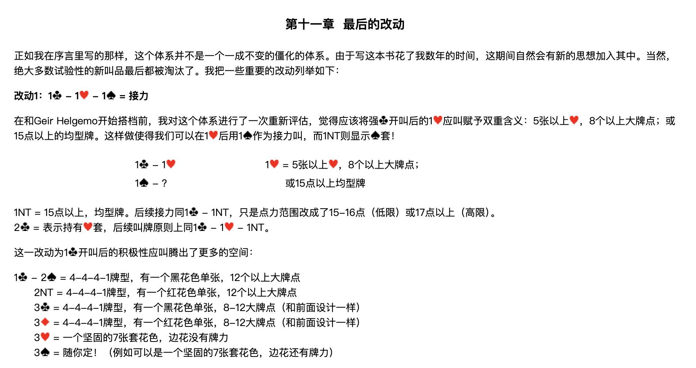
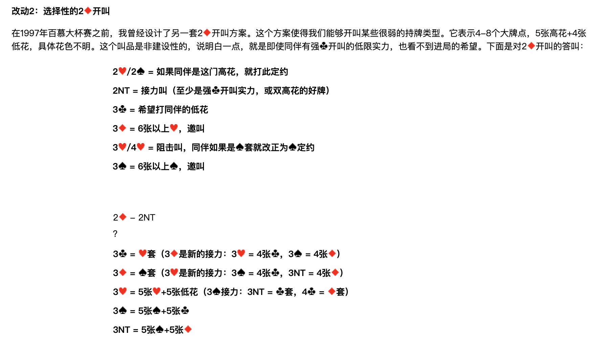
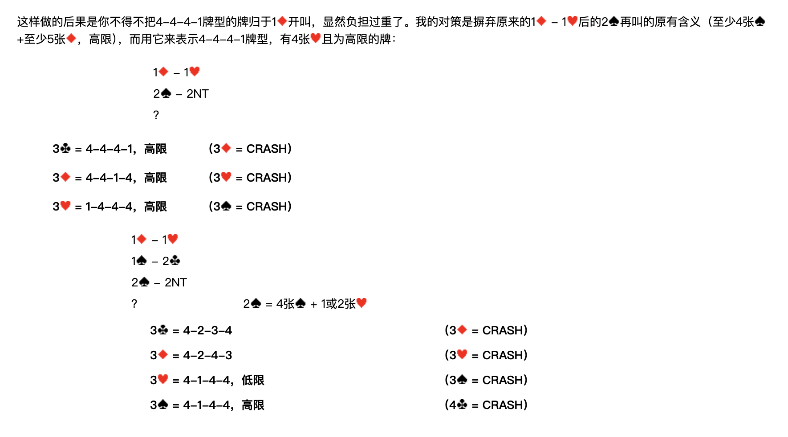
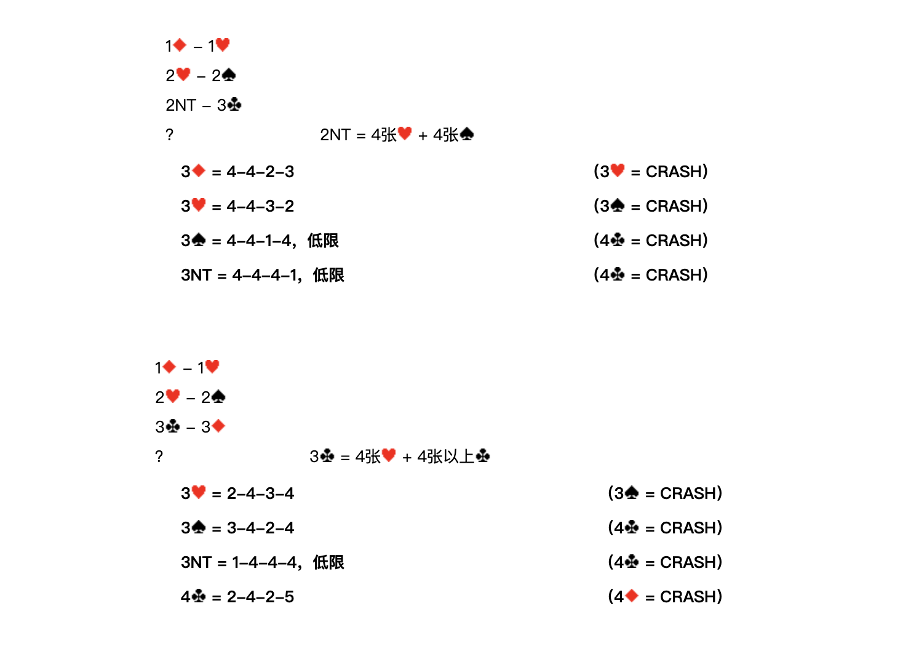

> **整理說明**：原始剪藏在轉存時遺失了全部花色符號（♠♥♦♣）與部分表格結構。
> 本檔已依同資料夾的 4 張截圖逐頁比對還原，嵌入對應截圖，並將內文由簡體翻譯為繁體。
> 各接力工具的正式定義見 `../3基本準則/第三章.md`。
> **牌型數字一律按 ♠-♥-♦-♣ 順序排列。**
>
> **本章會改寫第四章與第七章的既有設計**——受影響的段落已在各節標出。

**北歐接力精確體系**

| [第一章 總論](https://walsson.org/articles/03-jptx/03-jptx-048/03-jptx-048-01.htm) | [第四章 一方塊開叫及其發展](https://walsson.org/articles/03-jptx/03-jptx-048/03-jptx-048-04.htm) | [第七章 一梅花開叫及其發展](https://walsson.org/articles/03-jptx/03-jptx-048/03-jptx-048-07.htm) | [第十章 超級接力](https://walsson.org/articles/03-jptx/03-jptx-048/03-jptx-048-10.htm) |
| --- | --- | --- | --- |
| [第二章 基本滿貫叫牌技巧](https://walsson.org/articles/03-jptx/03-jptx-048/03-jptx-048-02.htm) | [第五章 一階高花開叫及其發展](https://walsson.org/articles/03-jptx/03-jptx-048/03-jptx-048-05.htm) | [第八章 二梅花開叫及其發展](https://walsson.org/articles/03-jptx/03-jptx-048/03-jptx-048-08.htm) | [第十一章 最後的改動](https://walsson.org/articles/03-jptx/03-jptx-048/03-jptx-048-11.htm) |
| [第三章 北歐梅花的問叫和基本準則](https://walsson.org/articles/03-jptx/03-jptx-048/03-jptx-048-03.htm) | [第六章 一無將開叫及其發展](https://walsson.org/articles/03-jptx/03-jptx-048/03-jptx-048-06.htm) | [第九章 二方塊到四黑桃開叫](https://walsson.org/articles/03-jptx/03-jptx-048/03-jptx-048-09.htm) |  |

---

## 第十一章 最後的改動

正如我在序言裡寫的那樣，這個體系並不是一個一成不變的僵化的體系。由於寫這本書花了我數年的時間，這期間自然會有新的思想加入其中。當然，絕大多數試驗性的新叫品最後都被淘汰了。我把一些重要的改動列舉如下：

---

## 改動1：1♣ – 1♥ – 1♠ ＝ 接力

> **影響範圍**：第七章「對 1♣ 開叫的應叫」。

在和 Geir Helgemo 開始搭檔前，我對這個體系進行了一次重新評估，覺得應該將強♣開叫後的 1♥ 應叫賦予**雙重含義**：5張以上♥、8個以上大牌點；**或** 15點以上的均型牌。

這樣做使得我們可以在 1♥ 後用 **1♠ 作為接力叫**，而 **1NT 則顯示♠套**。

**1♣ – 1♥；1♠ – ？**
（1♥ ＝ 5張以上♥，8個以上大牌點；或 15點以上均型牌）

| 應叫者再叫 | 含義 |
| --- | --- |
| **1NT** | 15點以上，均型牌。後續接力同 1♣ – 1NT，只是點力範圍改成了 **15-16點（低限）** 或 **17點以上（高限）**。 |
| **2♣** | 表示持有♥套，後續叫牌原則上同 1♣ – 1♥ – 1NT。 |

### 騰出來的空間：1♣ 開叫後的積極性應叫

這一改動為 1♣ 開叫後的積極性應叫騰出了更多的空間：

| 應叫 | 含義 |
| --- | --- |
| **2♠** | 4-4-4-1牌型，有一個**黑花色**單張，12個以上大牌點 |
| **2NT** | 4-4-4-1牌型，有一個**紅花色**單張，12個以上大牌點 |
| **3♣** | 4-4-4-1牌型，有一個黑花色單張，8-12大牌點（和前面設計一樣） |
| **3♦** | 4-4-4-1牌型，有一個紅花色單張，8-12大牌點（和前面設計一樣） |
| **3♥** | 一個堅固的7張套花色，邊花沒有牌力 |
| **3♠** | 隨你定！（例如可以是一個堅固的7張套花色，邊花還有牌力） |

> **對照第七章的原設計**：原本 2♠ ＝ 均型牌有兩個4張套、15+點；2NT ＝ 均型牌有一個4張套或一個5張低花套、15+點。
> 這兩種均型強牌現在全部併進 1♥ 應叫（再用 1NT 表明），空出來的 2♠／2NT 改給 12+ 點的 4441。
> 原本的 3♠／3NT／4♣／4♦（4441，比應叫花色高一級的花色是單張，12+點）也一併被取代。

---

## 改動2：選擇性的 2♦ 開叫

在1997年百慕大杯賽之前，我曾經設計了另一套 2♦ 開叫方案。這個方案使得我們能夠開叫某些很弱的持牌類型。

**2♦ ＝ 4-8個大牌點，5張高花 + 4張低花，具體花色不明。**

這個叫品是**非建設性**的，說明白一點，就是即使同伴有強♣開叫的低限實力，也看不到進局的希望。

### 對 2♦ 開叫的答叫

| 答叫 | 含義 |
| --- | --- |
| **2♥／2♠** | 如果同伴是這門高花，就打此定約 |
| **2NT** | 接力叫（至少是強♣開叫實力，或雙高花的好牌） |
| **3♣** | 希望打同伴的低花 |
| **3♦** | 6張以上♥，邀叫 |
| **3♥／4♥** | 阻擊叫，同伴如果是♠套就改正為♠定約 |
| **3♠** | 6張以上♠，邀叫 |

### 2♦ – 2NT 之後

| 開叫者再叫 | 含義 | 進一步的接力 |
| --- | --- | --- |
| **3♣** | ♥套 | 3♦ 是新的接力：3♥ ＝ 4張♣，3♠ ＝ 4張♦ |
| **3♦** | ♠套 | 3♥ 是新的接力：3♠ ＝ 4張♣，3NT ＝ 4張♦ |
| **3♥** | 5張♥ + 5張低花 | 3♠ 接力：3NT ＝ ♣套，4♣ ＝ ♦套 |
| **3♠** | 5張♠ + 5張♣ | — |
| **3NT** | 5張♠ + 5張♦ | — |

---

## 改動2 的連鎖後果：1♦ 開叫要吸收 4441

這樣做的後果是你不得不把 **4-4-4-1 牌型的牌歸於 1♦ 開叫**，顯然負擔過重了。

我的對策是**摒棄原來的 1♦ – 1♥ 後的 2♠ 再叫的原有含義**（至少4張♠ + 至少5張♦，高限），而用它來表示 **4-4-4-1牌型、有4張♥且為高限**的牌：

### 修訂 A：1♦ – 1♥；2♠ – 2NT；？

> **2♠ ＝ 4-4-4-1，有4張♥，高限**（取代第四章 F分支原本的「4張以上♠+5張以上♦，高限」）

| 開叫者再叫 | 含義 | 應叫者接力 |
| --- | --- | --- |
| 3♣ | 4-4-4-1，高限（♣單張） | 3♦ = CRASH |
| 3♦ | 4-4-1-4，高限（♦單張） | 3♥ = CRASH |
| 3♥ | 1-4-4-4，高限（♠單張） | 3♠ = CRASH |

> 三個答叫都含4張♥，所以 4-1-4-4（♥單張）不在此列——那一型改由下面的修訂 B 處理。

### 修訂 B：1♦ – 1♥；1♠ – 2♣；2♠ – 2NT；？

> **2♠ ＝ 4張♠ + 1或2張♥**（取代第四章 A分支原本的「2張♥，低花3-4或4-3」）

| 開叫者再叫 | 含義 | 應叫者接力 |
| --- | --- | --- |
| 3♣ | 4-2-3-4 | 3♦ = CRASH |
| 3♦ | 4-2-4-3 | 3♥ = CRASH |
| 3♥ | 4-1-4-4，低限 | 3♠ = CRASH |
| 3♠ | 4-1-4-4，高限 | 4♣ = CRASH |

### 修訂 C：1♦ – 1♥；2♥ – 2♠；2NT – 3♣；？

> **2NT ＝ 4張♥ + 4張♠**（取代第四章 E分支原本的「4張♠」）

| 開叫者再叫 | 含義 | 應叫者接力 |
| --- | --- | --- |
| 3♦ | 4-4-2-3 | 3♥ = CRASH |
| 3♥ | 4-4-3-2 | 3♠ = CRASH |
| 3♠ | 4-4-1-4，低限 | 4♣ = CRASH |
| 3NT | 4-4-4-1，低限 | 4♣ = CRASH |

### 修訂 D：1♦ – 1♥；2♥ – 2♠；3♣ – 3♦；？

> **3♣ ＝ 4張♥ + 4張以上♣**（第四章 E分支同一個叫品，但答叫階梯改寫）

| 開叫者再叫 | 含義 | 應叫者接力 |
| --- | --- | --- |
| 3♥ | 2-4-3-4 | 3♠ = CRASH |
| 3♠ | 3-4-2-4 | 4♣ = CRASH |
| 3NT | 1-4-4-4，低限 | 4♣ = CRASH |
| 4♣ | 2-4-2-5 | 4♦ = CRASH |

> **對照第四章原設計**：原本是 3♥=2-4-3-4、3♠=3-4-2-4、3NT=2-4-2-5、4♣=1-4-3-5、4♦=3-4-1-5。
> 新版在第3級插入 1-4-4-4（低限），2-4-2-5 順延到第4級，原本的 1-4-3-5 與 3-4-1-5 兩級取消。
