> **整理說明**：原始剪藏在轉存時遺失了全部花色符號（♠♥♦♣）與部分表格結構。
> 本檔已依同資料夾的 13 張截圖逐頁比對還原，嵌入對應截圖，並將內文由簡體翻譯為繁體。

**北歐接力精確體系**

| [第一章 總論](https://walsson.org/articles/03-jptx/03-jptx-048/03-jptx-048-01.htm) | [第四章 一方塊開叫及其發展](https://walsson.org/articles/03-jptx/03-jptx-048/03-jptx-048-04.htm) | [第七章 一梅花開叫及其發展](https://walsson.org/articles/03-jptx/03-jptx-048/03-jptx-048-07.htm) | [第十章 超級接力](https://walsson.org/articles/03-jptx/03-jptx-048/03-jptx-048-10.htm) |
| --- | --- | --- | --- |
| [第二章 基本滿貫叫牌技巧](https://walsson.org/articles/03-jptx/03-jptx-048/03-jptx-048-02.htm) | [第五章 一階高花開叫及其發展](https://walsson.org/articles/03-jptx/03-jptx-048/03-jptx-048-05.htm) | [第八章 二梅花開叫及其發展](https://walsson.org/articles/03-jptx/03-jptx-048/03-jptx-048-08.htm) | [第十一章 最後的改動](https://walsson.org/articles/03-jptx/03-jptx-048/03-jptx-048-11.htm) |
| [第三章 北歐梅花的問叫和基本準則](https://walsson.org/articles/03-jptx/03-jptx-048/03-jptx-048-03.htm) | [第六章 一無將開叫及其發展](https://walsson.org/articles/03-jptx/03-jptx-048/03-jptx-048-06.htm) | [第九章 二方塊到四黑桃開叫](https://walsson.org/articles/03-jptx/03-jptx-048/03-jptx-048-09.htm) |  |

---

## 第三章 北歐梅花的問叫和基本準則

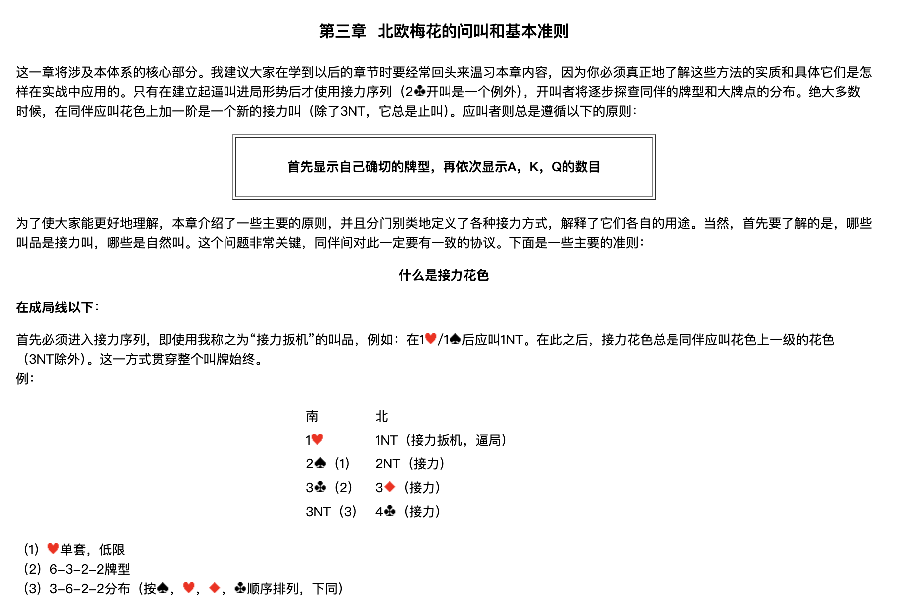

這一章將涉及本體系的核心部分。我建議大家在學到以後的章節時要經常回頭來溫習本章內容，因為你必須真正地了解這些方法的實質和具體它們是怎樣在實戰中應用的。只有在建立起逼叫進局形勢後才使用接力序列（2♣開叫是一個例外），開叫者將逐步探查同伴的牌型和大牌點的分佈。絕大多數時候，在同伴應叫花色上加一階是一個新的接力叫（除了3NT，它總是止叫）。應叫者則總是遵循以下的原則：

> **首先顯示自己確切的牌型，再依次顯示A，K，Q的數目**

為了使大家能更好地理解，本章介紹了一些主要的原則，並且分門別類地定義了各種接力方式，解釋了它們各自的用途。當然，首先要了解的是，哪些叫品是接力叫，哪些是自然叫。這個問題非常關鍵，同伴間對此一定要有一致的協議。下面是一些主要的準則：

### 什麼是接力花色

#### 在成局線以下

首先必須進入接力序列，即使用我稱之為「接力扳機」的叫品，例如：在 1♥／1♠ 後應叫 1NT。在此之後，接力花色總是同伴應叫花色上一級的花色（3NT除外）。這一方式貫穿整個叫牌始終。

例：

| 南 | 北 |
| --- | --- |
| 1♥ | 1NT（接力扳機，逼局） |
| 2♠（1） | 2NT（接力） |
| 3♣（2） | 3♦（接力） |
| 3NT（3） | 4♣（接力） |

（1）♥單套，低限
（2）6-3-2-2牌型
（3）3-6-2-2分佈（按 ♠，♥，♦，♣ 順序排列，下同）

#### 在成局線以上

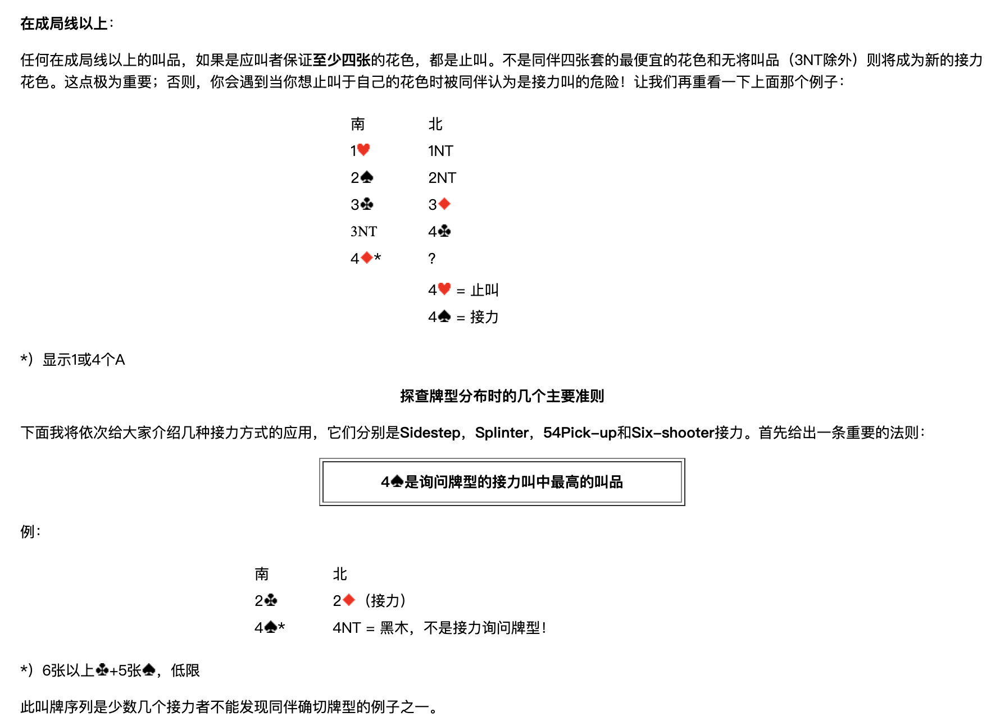

任何在成局線以上的叫品，如果是應叫者保證**至少四張**的花色，都是止叫。不是同伴四張套的最便宜的花色和無將叫品（3NT除外）則將成為新的接力花色。這點極為重要；否則，你會遇到當你想止叫於自己的花色時被同伴認為是接力叫的危險！讓我們再重看一下上面那個例子：

| 南 | 北 |
| --- | --- |
| 1♥ | 1NT |
| 2♠ | 2NT |
| 3♣ | 3♦ |
| 3NT | 4♣ |
| 4♦＊ | ？ |
|  | 4♥ = 止叫 |
|  | 4♠ = 接力 |

＊）顯示1或4個A

### 探查牌型分佈時的幾個主要準則

下面我將依次給大家介紹幾種接力方式的應用，它們分別是 **Sidestep**、**Splinter**、**54Pick-up** 和 **Six-shooter** 接力。首先給出一條重要的法則：

> **4♠是詢問牌型的接力叫中最高的叫品**

例：

| 南 | 北 |
| --- | --- |
| 2♣ | 2♦（接力） |
| 4♠＊ | 4NT = 黑木，不是接力詢問牌型！ |

＊）6張以上♣+5張♠，低限

此叫牌序列是少數幾個接力者不能發現同伴確切牌型的例子之一。

---

## Sidestep接力

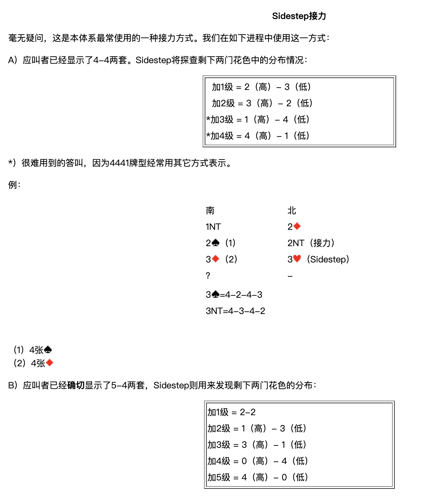

毫無疑問，這是本體系最常使用的一種接力方式。我們在如下進程中使用這一方式：

### A）應叫者已經顯示了4-4兩套

Sidestep將探查剩下兩門花色中的分佈情況：

| 答叫 | 剩下兩門的分佈 |
| --- | --- |
| 加1級 | 2（高）- 3（低） |
| 加2級 | 3（高）- 2（低） |
| ＊加3級 | 1（高）- 4（低） |
| ＊加4級 | 4（高）- 1（低） |

＊）很難用到的答叫，因為4441牌型經常用其他方式表示。

例：

| 南 | 北 |
| --- | --- |
| 1NT | 2♦ |
| 2♠（1） | 2NT（接力） |
| 3♦（2） | 3♥（Sidestep） |
| ？ | － |

- 3♠ = 4-2-4-3
- 3NT = 4-3-4-2

（1）4張♠
（2）4張♦

### B）應叫者已經**確切**顯示了5-4兩套

Sidestep則用來發現剩下兩門花色的分佈：

| 答叫 | 剩下兩門的分佈 |
| --- | --- |
| 加1級 | 2-2 |
| 加2級 | 1（高）- 3（低） |
| 加3級 | 3（高）- 1（低） |
| 加4級 | 0（高）- 4（低） |
| 加5級 | 4（高）- 0（低） |

例：

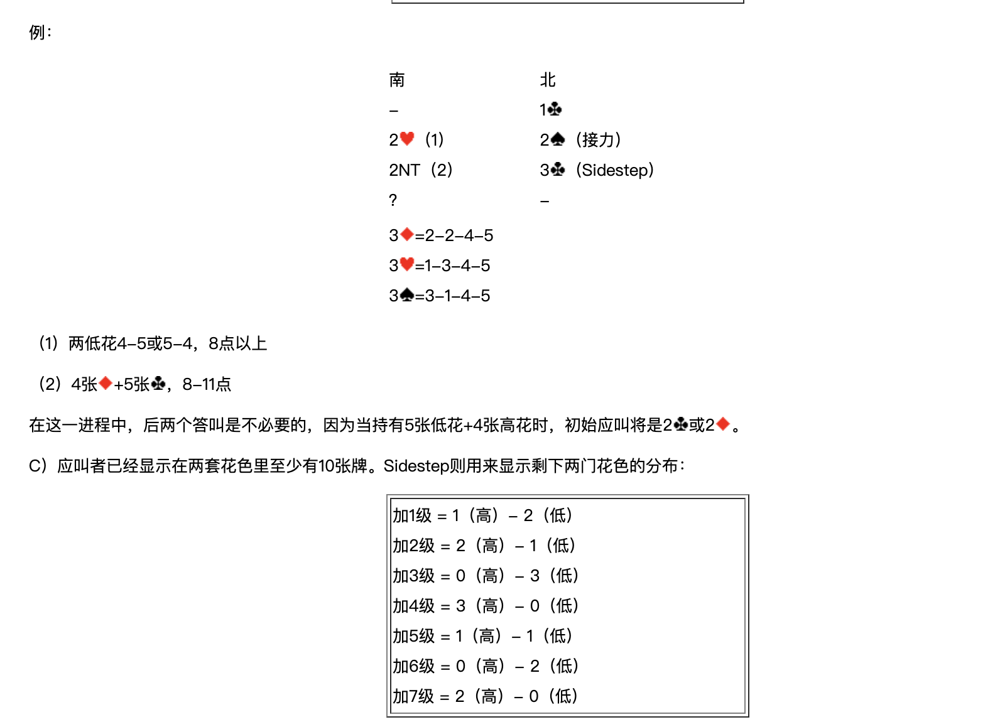

| 南 | 北 |
| --- | --- |
| － | 1♣ |
| 2♥（1） | 2♠（接力） |
| 2NT（2） | 3♣（Sidestep） |
| ？ | － |

- 3♦ = 2-2-4-5
- 3♥ = 1-3-4-5
- 3♠ = 3-1-4-5

（1）兩低花4-5或5-4，8點以上
（2）4張♦+5張♣，8-11點

在這一進程中，後兩個答叫是不必要的，因為當持有5張低花+4張高花時，初始應叫將是 2♣ 或 2♦。

### C）應叫者已經顯示在兩套花色裡至少有10張牌

Sidestep則用來顯示剩下兩門花色的分佈：

| 答叫 | 剩下兩門的分佈 |
| --- | --- |
| 加1級 | 1（高）- 2（低） |
| 加2級 | 2（高）- 1（低） |
| 加3級 | 0（高）- 3（低） |
| 加4級 | 3（高）- 0（低） |
| 加5級 | 1（高）- 1（低） |
| 加6級 | 0（高）- 2（低） |
| 加7級 | 2（高）- 0（低） |

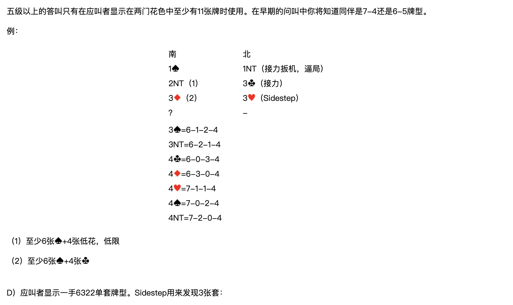

五級以上的答叫只有在應叫者顯示在兩門花色中至少有11張牌時使用。在早期的問叫中你將知道同伴是7-4還是6-5牌型。

例：

| 南 | 北 |
| --- | --- |
| 1♠ | 1NT（接力扳機，逼局） |
| 2NT（1） | 3♣（接力） |
| 3♦（2） | 3♥（Sidestep） |
| ？ | － |

- 3♠ = 6-1-2-4
- 3NT = 6-2-1-4
- 4♣ = 6-0-3-4
- 4♦ = 6-3-0-4
- 4♥ = 7-1-1-4
- 4♠ = 7-0-2-4
- 4NT = 7-2-0-4

（1）至少6張♠+4張低花，低限
（2）至少6張♠+4張♣

### D）應叫者顯示一手6322單套牌型

Sidestep用來發現3張套：

| 答叫 | 3張套所在 |
| --- | --- |
| 加1級 | 最低級別的花色是3張 |
| 加2級 | 中間級別的花色是3張 |
| 加3級 | 最高級別的花色是3張 |

例：

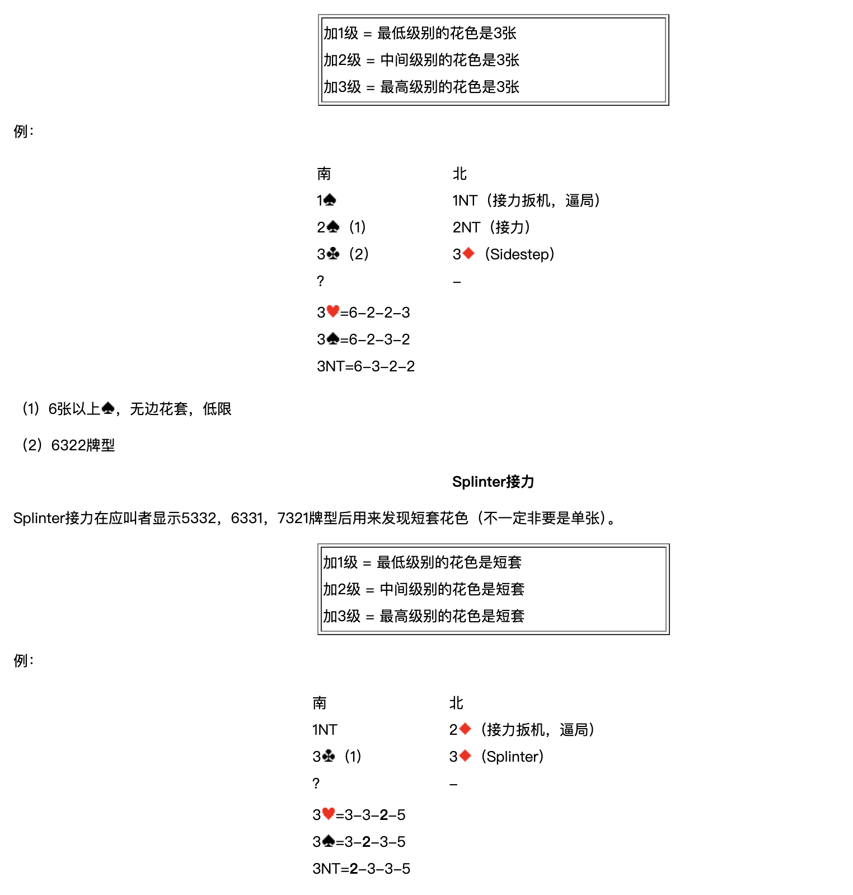

| 南 | 北 |
| --- | --- |
| 1♠ | 1NT（接力扳機，逼局） |
| 2♠（1） | 2NT（接力） |
| 3♣（2） | 3♦（Sidestep） |
| ？ | － |

- 3♥ = 6-2-2-3
- 3♠ = 6-2-3-2
- 3NT = 6-3-2-2

（1）6張以上♠，無邊花套，低限
（2）6322牌型

---

## Splinter接力

Splinter接力在應叫者顯示5332，6331，7321牌型後用來發現短套花色（不一定非要是單張）。

| 答叫 | 短套所在 |
| --- | --- |
| 加1級 | 最低級別的花色是短套 |
| 加2級 | 中間級別的花色是短套 |
| 加3級 | 最高級別的花色是短套 |

例：

| 南 | 北 |
| --- | --- |
| 1NT | 2♦（接力扳機，逼局） |
| 3♣（1） | 3♦（Splinter） |
| ？ | － |

- 3♥ = 3-3-**2**-5
- 3♠ = 3-**2**-3-5
- 3NT = **2**-3-3-5

（1）5-3-3-2牌型，5張♣。

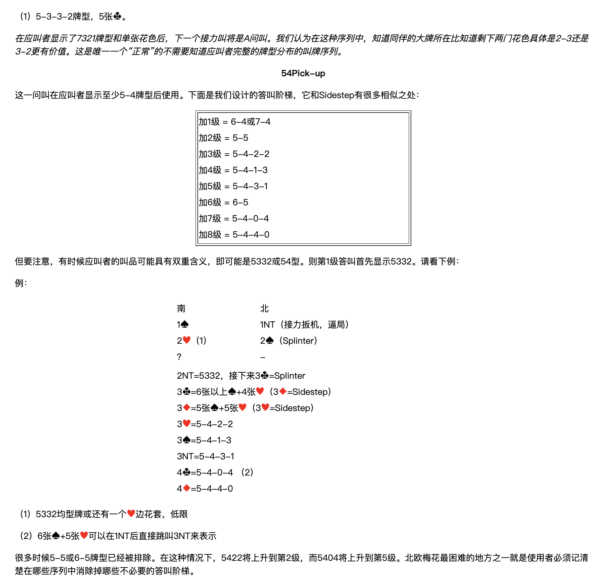

*在應叫者顯示了7321牌型和單張花色後，下一個接力叫將是A問叫。我們認為在這種序列中，知道同伴的大牌所在比知道剩下兩門花色具體是2-3還是3-2更有價值。這是唯一一個「正常」的不需要知道應叫者完整的牌型分佈的叫牌序列。*

---

## 54Pick-up

這一問叫在應叫者顯示至少5-4牌型後使用。下面是我們設計的答叫階梯，它和Sidestep有很多相似之處：

| 答叫 | 牌型 |
| --- | --- |
| 加1級 | 6-4或7-4 |
| 加2級 | 5-5 |
| 加3級 | 5-4-2-2 |
| 加4級 | 5-4-1-3 |
| 加5級 | 5-4-3-1 |
| 加6級 | 6-5 |
| 加7級 | 5-4-0-4 |
| 加8級 | 5-4-4-0 |

但要注意，有時候應叫者的叫品可能具有雙重含義，即可能是5332或54型。則第1級答叫首先顯示5332。請看下例：

例：

| 南 | 北 |
| --- | --- |
| 1♠ | 1NT（接力扳機，逼局） |
| 2♥（1） | 2♠（Splinter） |
| ？ | － |

- 2NT = 5332，接下來 3♣ = Splinter
- 3♣ = 6張以上♠+4張♥（3♦ = Sidestep）
- 3♦ = 5張♠+5張♥（3♥ = Sidestep）
- 3♥ = 5-4-2-2
- 3♠ = 5-4-1-3
- 3NT = 5-4-3-1
- 4♣ = 5-4-0-4（2）
- 4♦ = 5-4-4-0

（1）5332均型牌或還有一個♥邊花套，低限
（2）6張♠+5張♥可以在1NT後直接跳叫3NT來表示

很多時候5-5或6-5牌型已經被排除。在這種情況下，5422將上升到第2級，而5404將上升到第5級。北歐梅花最困難的地方之一就是使用者必須記清楚在哪些序列中消除掉哪些不必要的答叫階梯。

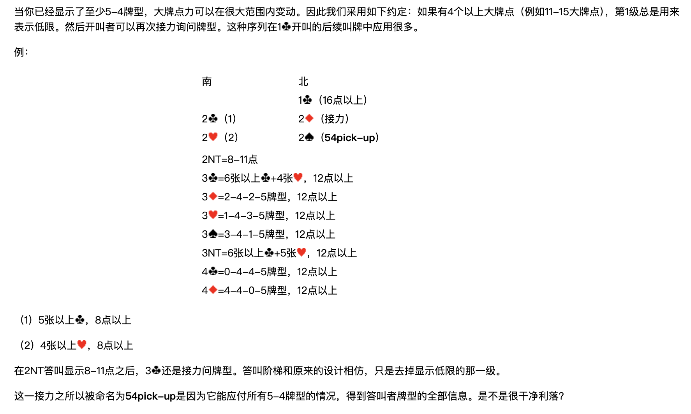

當你已經顯示了至少5-4牌型，大牌點力可以在很大範圍內變動。因此我們採用如下約定：如果有4個以上大牌點（例如11-15大牌點），第1級總是用來表示低限。然後開叫者可以再次接力詢問牌型。這種序列在 1♣ 開叫的後續叫牌中應用很多。

例：

| 南 | 北 |
| --- | --- |
|  | 1♣（16點以上） |
| 2♣（1） | 2♦（接力） |
| 2♥（2） | 2♠（**54pick-up**） |

- 2NT = 8-11點
- 3♣ = 6張以上♣+4張♥，12點以上
- 3♦ = 2-4-2-5牌型，12點以上
- 3♥ = 1-4-3-5牌型，12點以上
- 3♠ = 3-4-1-5牌型，12點以上
- 3NT = 6張以上♣+5張♥，12點以上
- 4♣ = 0-4-4-5牌型，12點以上
- 4♦ = 4-4-0-5牌型，12點以上

（1）5張以上♣，8點以上
（2）4張以上♥，8點以上

在2NT答叫顯示8-11點之後，3♣ 還是接力問牌型。答叫階梯和原來的設計相仿，只是去掉顯示低限的那一級。

這一接力之所以被命名為 **54pick-up** 是因為它能應付所有5-4牌型的情況，得到答叫者牌型的全部資訊。是不是很乾淨俐落？

---

## Six-shooter 接力

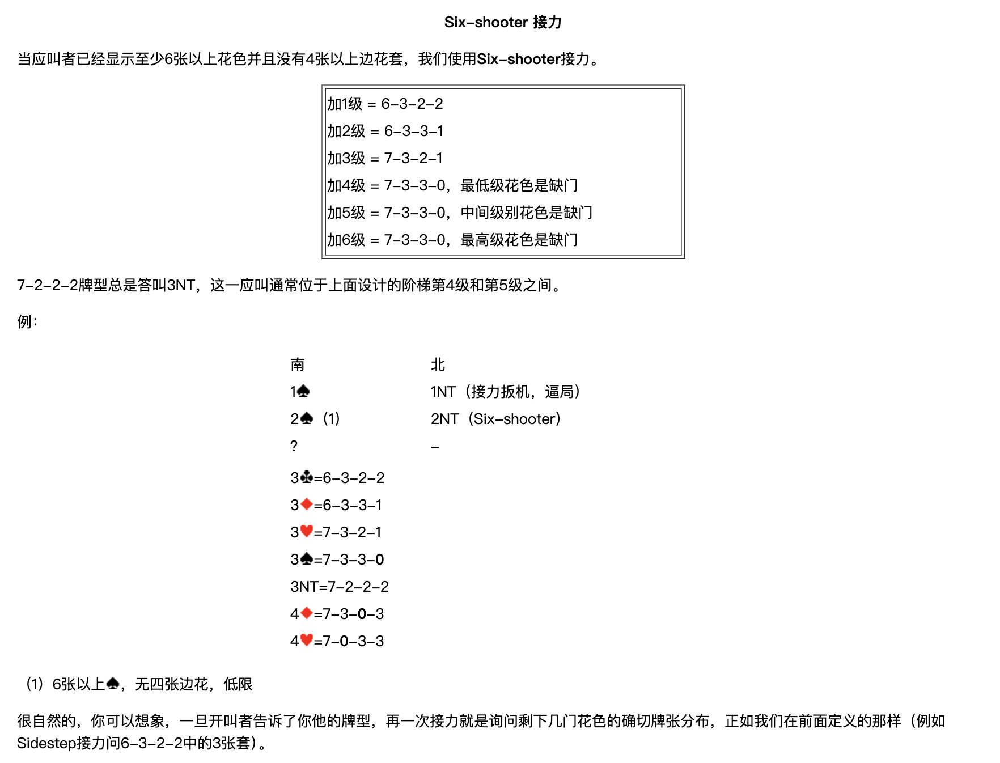

當應叫者已經顯示至少6張以上花色並且沒有4張以上邊花套，我們使用 **Six-shooter** 接力。

| 答叫 | 牌型 |
| --- | --- |
| 加1級 | 6-3-2-2 |
| 加2級 | 6-3-3-1 |
| 加3級 | 7-3-2-1 |
| 加4級 | 7-3-3-0，最低級花色是缺門 |
| 加5級 | 7-3-3-0，中間級別花色是缺門 |
| 加6級 | 7-3-3-0，最高級花色是缺門 |

7-2-2-2牌型總是答叫3NT，這一應叫通常位於上面設計的階梯第4級和第5級之間。

例：

| 南 | 北 |
| --- | --- |
| 1♠ | 1NT（接力扳機，逼局） |
| 2♠（1） | 2NT（Six-shooter） |
| ？ | － |

- 3♣ = 6-3-2-2
- 3♦ = 6-3-3-1
- 3♥ = 7-3-2-1
- 3♠ = 7-3-3-**0**
- 3NT = 7-2-2-2
- 4♦ = 7-3-**0**-3
- 4♥ = 7-**0**-3-3

（1）6張以上♠，無四張邊花，低限

很自然的，你可以想像，一旦開叫者告訴了你他的牌型，再一次接力就是詢問剩下幾門花色的確切牌張分佈，正如我們在前面定義的那樣（例如Sidestep接力問6-3-2-2中的3張套）。

---

## 在全部牌型已經知道後的接力設計

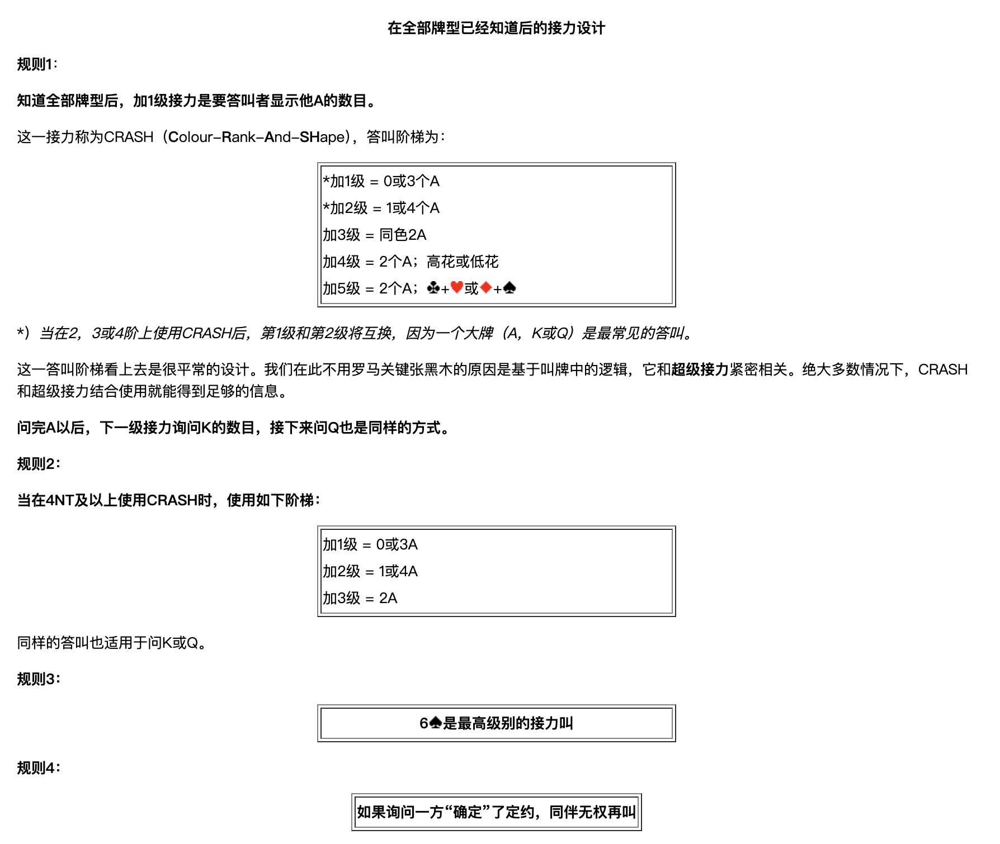

### 規則1

> **知道全部牌型後，加1級接力是要答叫者顯示他A的數目。**

這一接力稱為CRASH（**C**olour-**R**ank-**A**nd-**SH**ape），答叫階梯為：

| 答叫 | 含義 |
| --- | --- |
| ＊加1級 | 0或3個A |
| ＊加2級 | 1或4個A |
| 加3級 | 同色2A |
| 加4級 | 2個A；高花或低花 |
| 加5級 | 2個A；♣+♥ 或 ♦+♠ |

＊）*當在2、3或4階上使用CRASH後，第1級和第2級將互換，因為一個大牌（A，K或Q）是最常見的答叫。*

這一答叫階梯看上去是很平常的設計。我們在此不用羅馬關鍵張黑木的原因是基於叫牌中的邏輯，它和**超級接力**緊密相關。絕大多數情況下，CRASH和超級接力結合使用就能得到足夠的資訊。

> **問完A以後，下一級接力詢問K的數目，接下來問Q也是同樣的方式。**

### 規則2

> **當在4NT及以上使用CRASH時，使用如下階梯：**

| 答叫 | 含義 |
| --- | --- |
| 加1級 | 0或3A |
| 加2級 | 1或4A |
| 加3級 | 2A |

同樣的答叫也適用於問K或Q。

### 規則3

> **6♠是最高級別的接力叫**

### 規則4

> **如果詢問一方「確定」了定約，同伴無權再叫**

例：

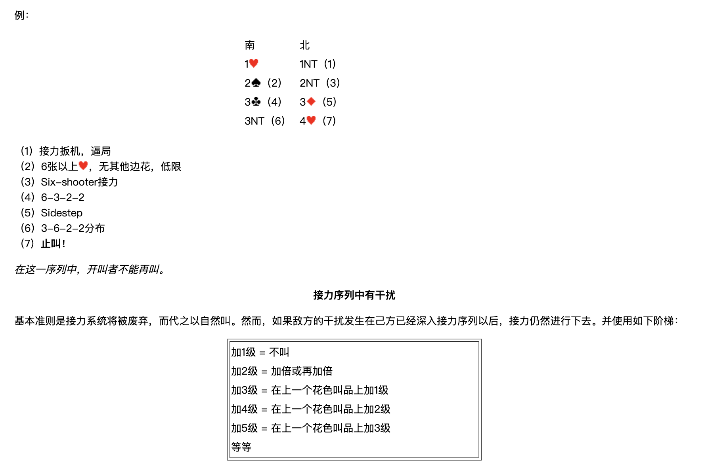

| 南 | 北 |
| --- | --- |
| 1♥ | 1NT（1） |
| 2♠（2） | 2NT（3） |
| 3♣（4） | 3♦（5） |
| 3NT（6） | 4♥（7） |

（1）接力扳機，逼局
（2）6張以上♥，無其他邊花，低限
（3）Six-shooter接力
（4）6-3-2-2
（5）Sidestep
（6）3-6-2-2分佈
（7）**止叫！**

*在這一序列中，開叫者不能再叫。*

---

## 接力序列中有干擾

基本準則是接力系統將被廢棄，而代之以自然叫。然而，如果敵方的干擾發生在己方已經深入接力序列以後，接力仍然進行下去。並使用如下階梯：

| 答叫 | 表示 |
| --- | --- |
| 加1級 | 不叫 |
| 加2級 | 加倍或再加倍 |
| 加3級 | 在上一個花色叫品上加1級 |
| 加4級 | 在上一個花色叫品上加2級 |
| 加5級 | 在上一個花色叫品上加3級 |
| … | 等等 |

下面這個例子取自歐洲錦標賽，挪威對土耳其：

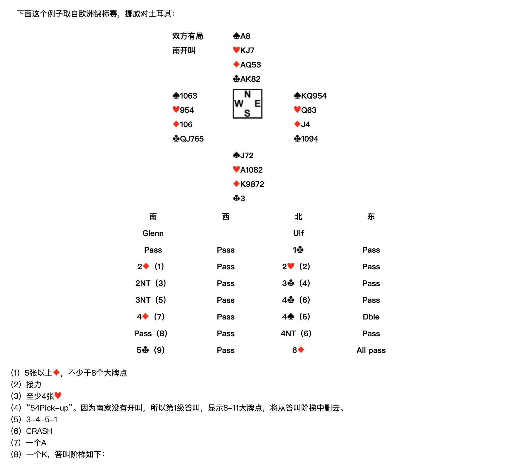

**雙方有局，南開叫**

|  | 北 |  |
| --- | --- | --- |
|  | ♠A8　♥KJ7　♦AQ53　♣AK82 |  |
| **西**　♠1063　♥954　♦106　♣QJ765 |  | **東**　♠KQ954　♥Q63　♦J4　♣1094 |
|  | **南**　♠J72　♥A1082　♦K9872　♣3 |  |

| 南（Glenn） | 西 | 北（Ulf） | 東 |
| --- | --- | --- | --- |
| Pass | Pass | 1♣ | Pass |
| 2♦（1） | Pass | 2♥（2） | Pass |
| 2NT（3） | Pass | 3♣（4） | Pass |
| 3NT（5） | Pass | 4♣（6） | Pass |
| 4♦（7） | Pass | 4♠（6） | Dble |
| Pass（8） | Pass | 4NT（6） | Pass |
| 5♣（9） | Pass | 6♦ | All pass |

（1）5張以上♦，不少於8個大牌點
（2）接力
（3）至少4張♥
（4）「54Pick-up」。因為南家沒有開叫，所以第1級答叫，顯示8-11大牌點，將從答叫階梯中刪去。
（5）3-4-5-1
（6）CRASH
（7）一個A
（8）一個K，答叫階梯如下：

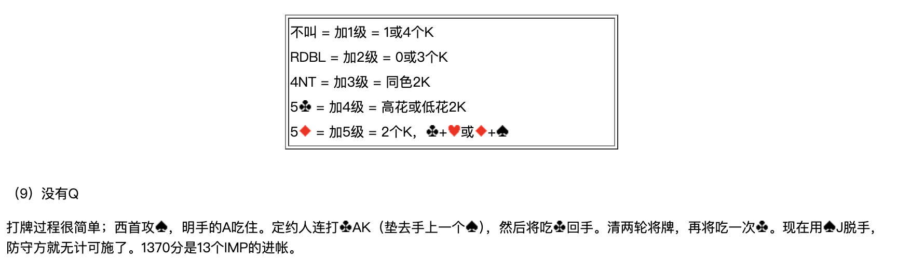

| 叫品 | 級別 | 含義 |
| --- | --- | --- |
| 不叫 | 加1級 | 1或4個K |
| RDBL | 加2級 | 0或3個K |
| 4NT | 加3級 | 同色2K |
| 5♣ | 加4級 | 高花或低花2K |
| 5♦ | 加5級 | 2個K，♣+♥ 或 ♦+♠ |

（9）沒有Q

打牌過程很簡單；西首攻♠，明手的A吃住。定約人連打♣AK（墊去手上一個♠），然後將吃♣回手。清兩輪將牌，再將吃一次♣。現在用♠J脫手，防守方就無計可施了。1370分是13個IMP的進帳。
