> **整理說明**：原始剪藏在轉存時遺失了全部花色符號（♠♥♦♣）與部分表格結構。
> 本檔已依同資料夾的 13 張截圖逐頁比對還原，嵌入對應截圖，並將內文由簡體翻譯為繁體。
> 各接力工具（Sidestep／Splinter／54Pick-up／Six-shooter／CRASH）的正式定義見 `../3基本準則/第三章.md`。
> **牌型數字一律按 ♠-♥-♦-♣ 順序排列。**

**北歐接力精確體系**

| [第一章 總論](https://walsson.org/articles/03-jptx/03-jptx-048/03-jptx-048-01.htm) | [第四章 一方塊開叫及其發展](https://walsson.org/articles/03-jptx/03-jptx-048/03-jptx-048-04.htm) | [第七章 一梅花開叫及其發展](https://walsson.org/articles/03-jptx/03-jptx-048/03-jptx-048-07.htm) | [第十章 超級接力](https://walsson.org/articles/03-jptx/03-jptx-048/03-jptx-048-10.htm) |
| --- | --- | --- | --- |
| [第二章 基本滿貫叫牌技巧](https://walsson.org/articles/03-jptx/03-jptx-048/03-jptx-048-02.htm) | [第五章 一階高花開叫及其發展](https://walsson.org/articles/03-jptx/03-jptx-048/03-jptx-048-05.htm) | [第八章 二梅花開叫及其發展](https://walsson.org/articles/03-jptx/03-jptx-048/03-jptx-048-08.htm) | [第十一章 最後的改動](https://walsson.org/articles/03-jptx/03-jptx-048/03-jptx-048-11.htm) |
| [第三章 北歐梅花的問叫和基本準則](https://walsson.org/articles/03-jptx/03-jptx-048/03-jptx-048-03.htm) | [第六章 一無將開叫及其發展](https://walsson.org/articles/03-jptx/03-jptx-048/03-jptx-048-06.htm) | [第九章 二方塊到四黑桃開叫](https://walsson.org/articles/03-jptx/03-jptx-048/03-jptx-048-09.htm) |  |

---

## 第四章 一方塊開叫及其發展

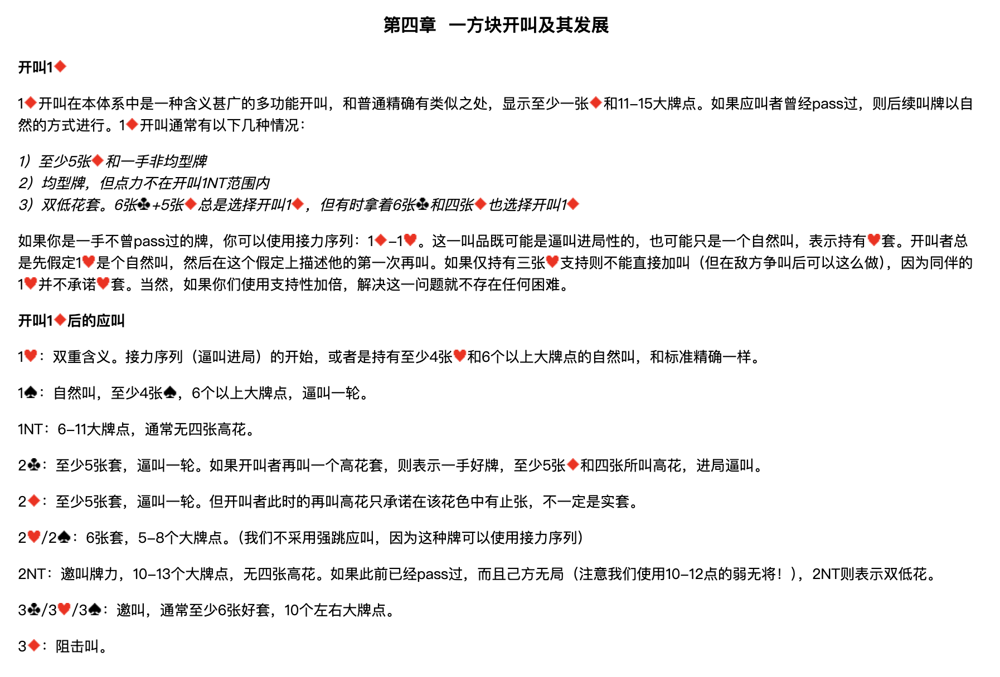

### 開叫 1♦

1♦ 開叫在本體系中是一種含義甚廣的多功能開叫，和普通精確有類似之處，顯示至少一張♦和11-15大牌點。如果應叫者曾經 pass 過，則後續叫牌以自然的方式進行。1♦ 開叫通常有以下幾種情況：

> *1）至少5張♦和一手非均型牌*
> *2）均型牌，但點力不在開叫 1NT 範圍內*
> *3）雙低花套。6張♣+5張♦ 總是選擇開叫 1♦，但有時拿著6張♣和四張♦ 也選擇開叫 1♦*

如果你是一手不曾 pass 過的牌，你可以使用接力序列：1♦–1♥。這一叫品既可能是逼叫進局性的，也可能只是一個自然叫，表示持有♥套。開叫者總是先假定 1♥ 是個自然叫，然後在這個假定上描述他的第一次再叫。如果僅持有三張♥支持則不能直接加叫（但在敵方爭叫後可以這麼做），因為同伴的 1♥ 並不承諾♥套。當然，如果你們使用支持性加倍，解決這一問題就不存在任何困難。

### 開叫 1♦ 後的應叫

| 應叫 | 含義 |
| --- | --- |
| **1♥** | 雙重含義。接力序列（逼叫進局）的開始，或者是持有至少4張♥和6個以上大牌點的自然叫，和標準精確一樣。 |
| **1♠** | 自然叫，至少4張♠，6個以上大牌點，逼叫一輪。 |
| **1NT** | 6-11大牌點，通常無四張高花。 |
| **2♣** | 至少5張♣套，逼叫一輪。如果開叫者再叫一個高花套，則表示一手好牌，至少5張♦和四張所叫高花，進局逼叫。 |
| **2♦** | 至少5張♦套，逼叫一輪。但開叫者此時的再叫高花只承諾在該花色中有止張，不一定是實套。 |
| **2♥／2♠** | 6張套，5-8個大牌點。（我們不採用強跳應叫，因為這種牌可以使用接力序列） |
| **2NT** | 邀叫牌力，10-13個大牌點，無四張高花。如果此前已經 pass 過，而且己方無局（注意我們使用10-12點的弱無將！），2NT 則表示雙低花。 |
| **3♣／3♥／3♠** | 邀叫，通常至少6張好套，10個左右大牌點。 |
| **3♦** | 阻擊叫。 |

---

## 1♦–1♥ 後的接力叫牌

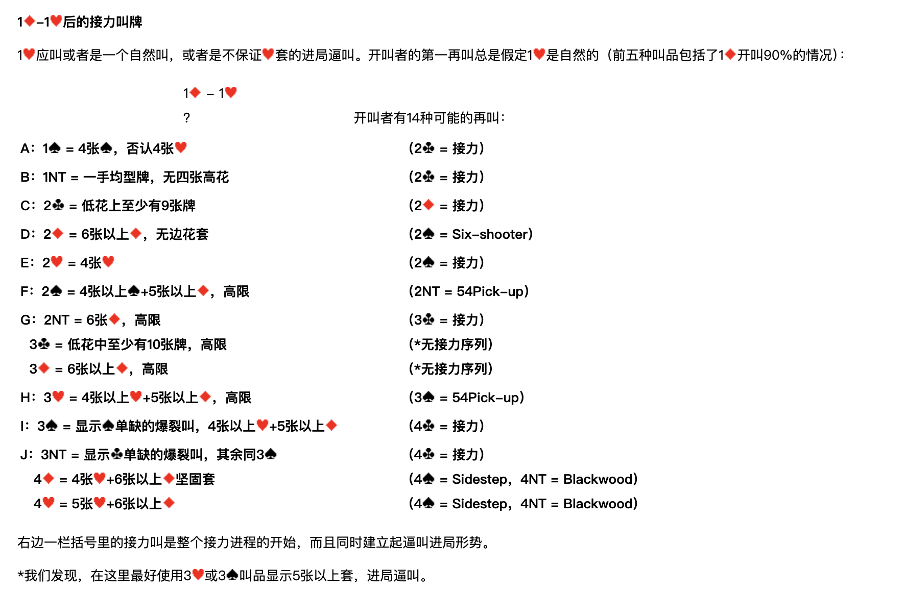

1♥ 應叫或者是一個自然叫，或者是不保證♥套的進局逼叫。開叫者的第一再叫總是假定 1♥ 是自然的（前五種叫品包括了 1♦ 開叫90%的情況）：

**1♦ – 1♥；？　開叫者有14種可能的再叫：**

| 代號 | 開叫者再叫 | 含義 | 應叫者接力 |
| --- | --- | --- | --- |
| **A** | 1♠ | 4張♠，否認4張♥ | 2♣ = 接力 |
| **B** | 1NT | 一手均型牌，無四張高花 | 2♣ = 接力 |
| **C** | 2♣ | 低花上至少有9張牌 | 2♦ = 接力 |
| **D** | 2♦ | 6張以上♦，無邊花套 | 2♠ = Six-shooter |
| **E** | 2♥ | 4張♥ | 2♠ = 接力 |
| **F** | 2♠ | 4張以上♠+5張以上♦，高限 | 2NT = 54Pick-up |
| **G** | 2NT | 6張♦，高限 | 3♣ = 接力 |
|  | 3♣ | 低花中至少有10張牌，高限 | ＊無接力序列 |
|  | 3♦ | 6張以上♦，高限 | ＊無接力序列 |
| **H** | 3♥ | 4張以上♥+5張以上♦，高限 | 3♠ = 54Pick-up |
| **I** | 3♠ | 顯示♠單缺的爆裂叫，4張以上♥+5張以上♦ | 4♣ = 接力 |
| **J** | 3NT | 顯示♣單缺的爆裂叫，其餘同 3♠ | 4♣ = 接力 |
|  | 4♦ | 4張♥+6張以上♦堅固套 | 4♠ = Sidestep，4NT = Blackwood |
|  | 4♥ | 5張♥+6張以上♦ | 4♠ = Sidestep，4NT = Blackwood |

右邊一欄括號裡的接力叫是整個接力進程的開始，而且同時建立起逼叫進局形勢。

＊我們發現，在這裡最好使用 3♥ 或 3♠ 叫品顯示5張以上套，進局逼叫。

---

## 開叫者在第二次接力後的再叫

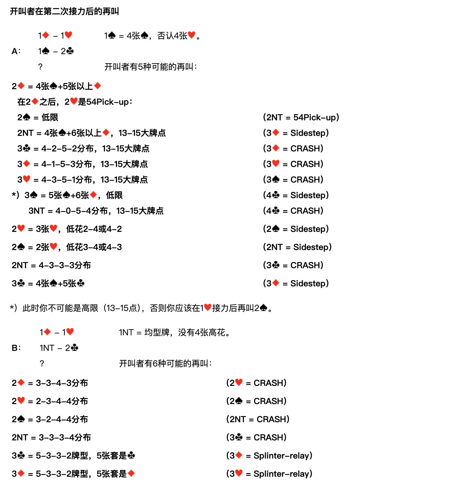

### A：1♦ – 1♥；1♠ – 2♣；？

**1♠ = 4張♠，否認4張♥。開叫者有5種可能的再叫：**

| 開叫者再叫 | 含義 | 應叫者接力 |
| --- | --- | --- |
| **2♦** | **4張♠+5張以上♦** | — |
| 　*在 2♦ 之後，2♥ 是 54Pick-up：* |  |  |
| 　2♠ | 低限 | 2NT = 54Pick-up |
| 　2NT | 4張♠+6張以上♦，13-15大牌點 | 3♦ = Sidestep |
| 　3♣ | 4-2-5-2分佈，13-15大牌點 | 3♦ = CRASH |
| 　3♦ | 4-1-5-3分佈，13-15大牌點 | 3♥ = CRASH |
| 　3♥ | 4-3-5-1分佈，13-15大牌點 | 3♠ = CRASH |
| 　3♠　＊ | 5張♠+6張♦，低限 | 4♣ = Sidestep |
| 　3NT | 4-0-5-4分佈，13-15大牌點 | 4♣ = CRASH |
| **2♥** | 3張♥，低花2-4或4-2 | 2♠ = Sidestep |
| **2♠** | 2張♥，低花3-4或4-3 | 2NT = Sidestep |
| **2NT** | 4-3-3-3分佈 | 3♣ = CRASH |
| **3♣** | 4張♠+5張♣ | 3♦ = Sidestep |

＊）此時你不可能是高限（13-15點），否則你應該在 1♥ 接力後再叫 2♠。

### B：1♦ – 1♥；1NT – 2♣；？

**1NT = 均型牌，沒有4張高花。開叫者有6種可能的再叫：**

| 開叫者再叫 | 含義 | 應叫者接力 |
| --- | --- | --- |
| 2♦ | 3-3-4-3分佈 | 2♥ = CRASH |
| 2♥ | 2-3-4-4分佈 | 2♠ = CRASH |
| 2♠ | 3-2-4-4分佈 | 2NT = CRASH |
| 2NT | 3-3-3-4分佈 | 3♣ = CRASH |
| 3♣ | 5-3-3-2牌型，5張套是♣ | 3♦ = Splinter-relay |
| 3♦ | 5-3-3-2牌型，5張套是♦ | 3♥ = Splinter-relay |

### C：1♦ – 1♥；2♣ – 2♦；？

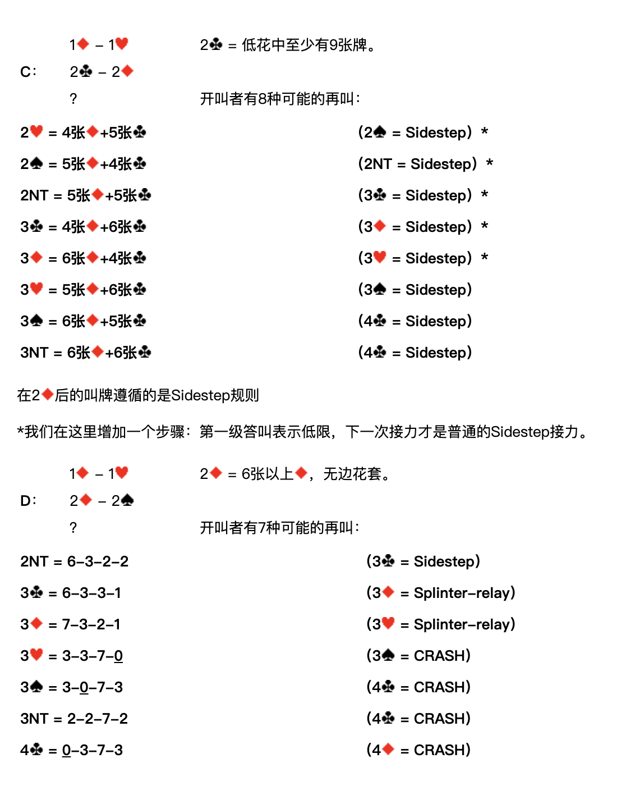

**2♣ = 低花中至少有9張牌。開叫者有8種可能的再叫：**

| 開叫者再叫 | 含義 | 應叫者接力 |
| --- | --- | --- |
| 2♥ | 4張♦+5張♣ | 2♠ = Sidestep　＊ |
| 2♠ | 5張♦+4張♣ | 2NT = Sidestep　＊ |
| 2NT | 5張♦+5張♣ | 3♣ = Sidestep　＊ |
| 3♣ | 4張♦+6張♣ | 3♦ = Sidestep　＊ |
| 3♦ | 6張♦+4張♣ | 3♥ = Sidestep　＊ |
| 3♥ | 5張♦+6張♣ | 3♠ = Sidestep |
| 3♠ | 6張♦+5張♣ | 4♣ = Sidestep |
| 3NT | 6張♦+6張♣ | 4♣ = Sidestep |

在 2♦ 後的叫牌遵循的是 Sidestep 規則。

＊我們在這裡增加一個步驟：第一級答叫表示低限，下一次接力才是普通的 Sidestep 接力。

### D：1♦ – 1♥；2♦ – 2♠；？

**2♦ = 6張以上♦，無邊花套。開叫者有7種可能的再叫：**

| 開叫者再叫 | 含義 | 應叫者接力 |
| --- | --- | --- |
| 2NT | 6-3-2-2 | 3♣ = Sidestep |
| 3♣ | 6-3-3-1 | 3♦ = Splinter-relay |
| 3♦ | 7-3-2-1 | 3♥ = Splinter-relay |
| 3♥ | 3-3-7-**0** | 3♠ = CRASH |
| 3♠ | 3-**0**-7-3 | 4♣ = CRASH |
| 3NT | 2-2-7-2 | 4♣ = CRASH |
| 4♣ | **0**-3-7-3 | 4♦ = CRASH |

### E：1♦ – 1♥；2♥ – 2♠；？

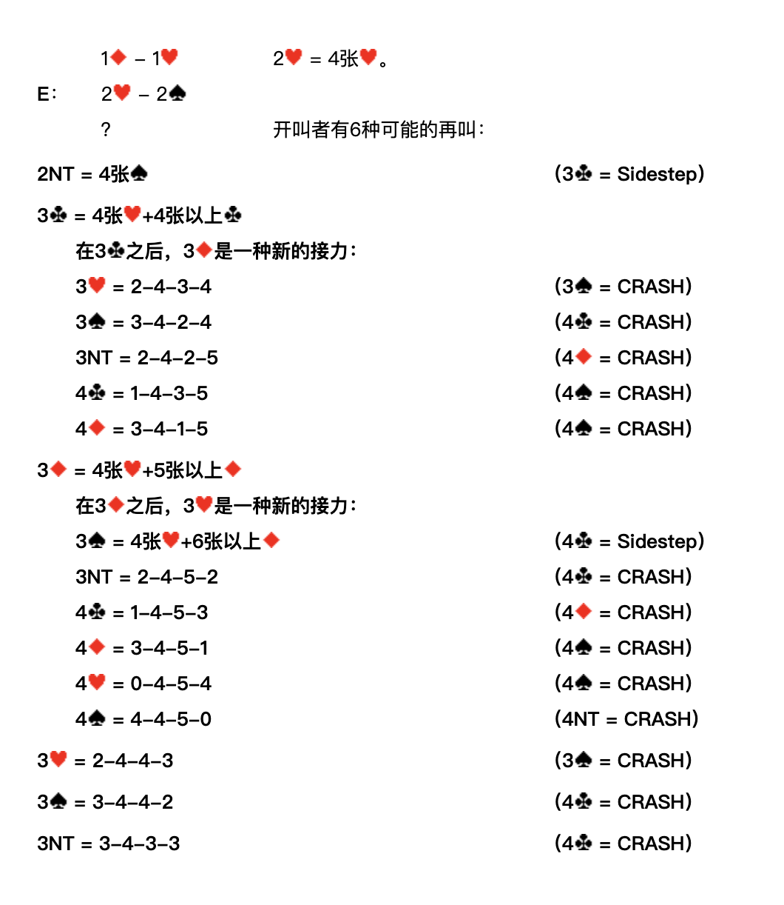

**2♥ = 4張♥。開叫者有6種可能的再叫：**

| 開叫者再叫 | 含義 | 應叫者接力 |
| --- | --- | --- |
| **2NT** | 4張♠ | 3♣ = Sidestep |
| **3♣** | **4張♥+4張以上♣** | — |
| 　*在 3♣ 之後，3♦ 是一種新的接力：* |  |  |
| 　3♥ | 2-4-3-4 | 3♠ = CRASH |
| 　3♠ | 3-4-2-4 | 4♣ = CRASH |
| 　3NT | 2-4-2-5 | 4♦ = CRASH |
| 　4♣ | 1-4-3-5 | 4♠ = CRASH |
| 　4♦ | 3-4-1-5 | 4♠ = CRASH |
| **3♦** | **4張♥+5張以上♦** | — |
| 　*在 3♦ 之後，3♥ 是一種新的接力：* |  |  |
| 　3♠ | 4張♥+6張以上♦ | 4♣ = Sidestep |
| 　3NT | 2-4-5-2 | 4♣ = CRASH |
| 　4♣ | 1-4-5-3 | 4♦ = CRASH |
| 　4♦ | 3-4-5-1 | 4♠ = CRASH |
| 　4♥ | 0-4-5-4 | 4♠ = CRASH |
| 　4♠ | 4-4-5-0 | 4NT = CRASH |
| **3♥** | 2-4-4-3 | 3♠ = CRASH |
| **3♠** | 3-4-4-2 | 4♣ = CRASH |
| **3NT** | 3-4-3-3 | 4♣ = CRASH |

### F：1♦ – 1♥；2♠ – 2NT；？

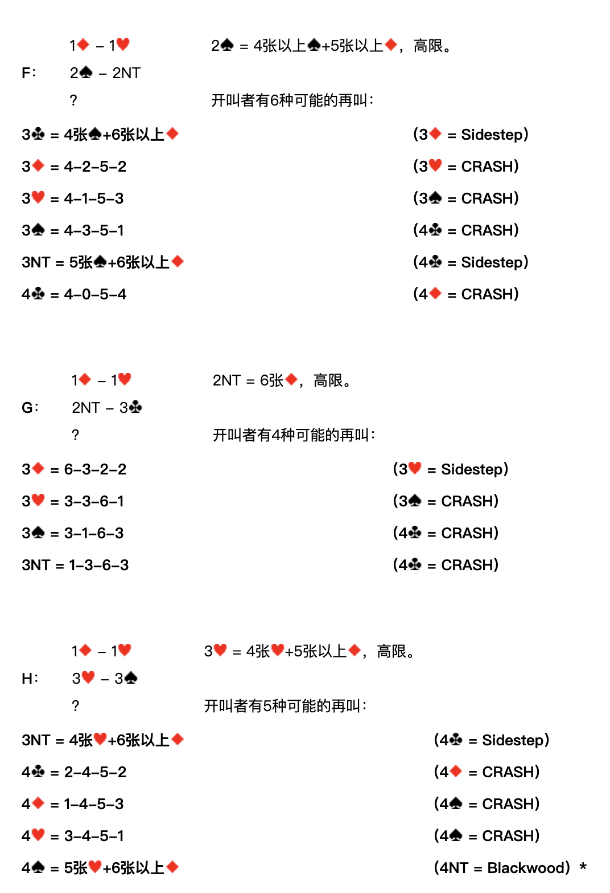

**2♠ = 4張以上♠+5張以上♦，高限。開叫者有6種可能的再叫：**

| 開叫者再叫 | 含義 | 應叫者接力 |
| --- | --- | --- |
| 3♣ | 4張♠+6張以上♦ | 3♦ = Sidestep |
| 3♦ | 4-2-5-2 | 3♥ = CRASH |
| 3♥ | 4-1-5-3 | 3♠ = CRASH |
| 3♠ | 4-3-5-1 | 4♣ = CRASH |
| 3NT | 5張♠+6張以上♦ | 4♣ = Sidestep |
| 4♣ | 4-0-5-4 | 4♦ = CRASH |

### G：1♦ – 1♥；2NT – 3♣；？

**2NT = 6張♦，高限。開叫者有4種可能的再叫：**

| 開叫者再叫 | 含義 | 應叫者接力 |
| --- | --- | --- |
| 3♦ | 6-3-2-2 | 3♥ = Sidestep |
| 3♥ | 3-3-6-1 | 3♠ = CRASH |
| 3♠ | 3-1-6-3 | 4♣ = CRASH |
| 3NT | 1-3-6-3 | 4♣ = CRASH |

### H：1♦ – 1♥；3♥ – 3♠；？

**3♥ = 4張以上♥+5張以上♦，高限。開叫者有5種可能的再叫：**

| 開叫者再叫 | 含義 | 應叫者接力 |
| --- | --- | --- |
| 3NT | 4張♥+6張以上♦ | 4♣ = Sidestep |
| 4♣ | 2-4-5-2 | 4♦ = CRASH |
| 4♦ | 1-4-5-3 | 4♠ = CRASH |
| 4♥ | 3-4-5-1 | 4♠ = CRASH |
| 4♠ | 5張♥+6張以上♦ | 4NT = Blackwood　＊ |

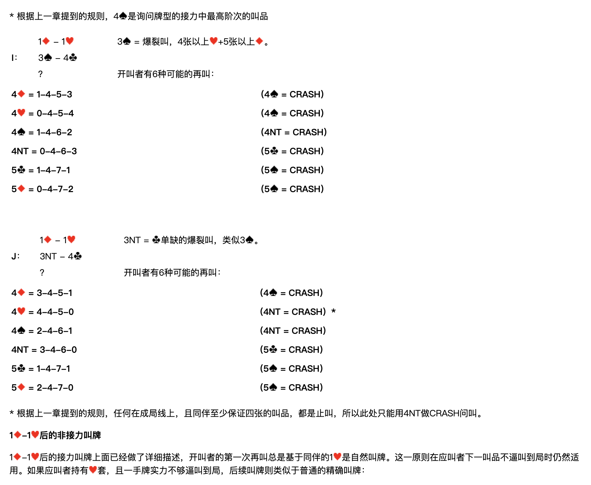

＊ 根據上一章提到的規則，4♠ 是詢問牌型的接力中最高階次的叫品。

### I：1♦ – 1♥；3♠ – 4♣；？

**3♠ = 爆裂叫，4張以上♥+5張以上♦。開叫者有6種可能的再叫：**

| 開叫者再叫 | 含義 | 應叫者接力 |
| --- | --- | --- |
| 4♦ | 1-4-5-3 | 4♠ = CRASH |
| 4♥ | 0-4-5-4 | 4♠ = CRASH |
| 4♠ | 1-4-6-2 | 4NT = CRASH |
| 4NT | 0-4-6-3 | 5♣ = CRASH |
| 5♣ | 1-4-7-1 | 5♠ = CRASH |
| 5♦ | 0-4-7-2 | 5♠ = CRASH |

### J：1♦ – 1♥；3NT – 4♣；？

**3NT = ♣單缺的爆裂叫，類似 3♠。開叫者有6種可能的再叫：**

| 開叫者再叫 | 含義 | 應叫者接力 |
| --- | --- | --- |
| 4♦ | 3-4-5-1 | 4♠ = CRASH |
| 4♥ | 4-4-5-0 | 4NT = CRASH　＊ |
| 4♠ | 2-4-6-1 | 4NT = CRASH |
| 4NT | 3-4-6-0 | 5♣ = CRASH |
| 5♣ | 1-4-7-1 | 5♠ = CRASH |
| 5♦ | 2-4-7-0 | 5♠ = CRASH |

＊ 根據上一章提到的規則，任何在成局線上、且同伴至少保證四張的叫品，都是止叫，所以此處只能用 4NT 做 CRASH 問叫。

---

## 1♦–1♥ 後的非接力叫牌

1♦–1♥ 後的接力叫牌上面已經做了詳細描述，開叫者的第一次再叫總是基於同伴的 1♥ 是自然叫牌。這一原則在應叫者下一叫品不逼叫到局時仍然適用。如果應叫者持有♥套，且一手牌實力不夠逼叫到局，後續叫牌則類似於普通的精確叫牌：

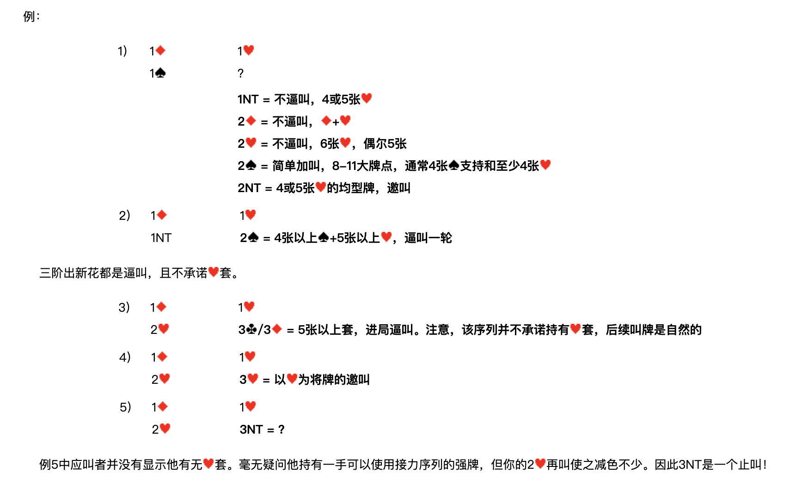

**例1）**

| 南 | 北 |
| --- | --- |
| 1♦ | 1♥ |
| 1♠ | ？ |

- **1NT** = 不逼叫，4或5張♥
- **2♦** = 不逼叫，♦+♥
- **2♥** = 不逼叫，6張♥，偶爾5張
- **2♠** = 簡單加叫，8-11大牌點，通常4張♠支持和至少4張♥
- **2NT** = 4或5張♥的均型牌，邀叫

**例2）**

| 南 | 北 |
| --- | --- |
| 1♦ | 1♥ |
| 1NT | **2♠ = 4張以上♠+5張以上♥，逼叫一輪** |

三階出新花都是逼叫，且不承諾♥套。

**例3）**

| 南 | 北 |
| --- | --- |
| 1♦ | 1♥ |
| 2♥ | **3♣／3♦ = 5張以上套，進局逼叫。注意，該序列並不承諾持有♥套，後續叫牌是自然的** |

**例4）**

| 南 | 北 |
| --- | --- |
| 1♦ | 1♥ |
| 2♥ | **3♥ = 以♥為將牌的邀叫** |

**例5）**

| 南 | 北 |
| --- | --- |
| 1♦ | 1♥ |
| 2♥ | **3NT = ？** |

例5中應叫者並沒有顯示他有無♥套。毫無疑問他持有一手可以使用接力序列的強牌，但你的 2♥ 再叫使之減色不少。因此 3NT 是一個止叫！

---

## 1♦–1♥ 後的叫牌示例

### 例1

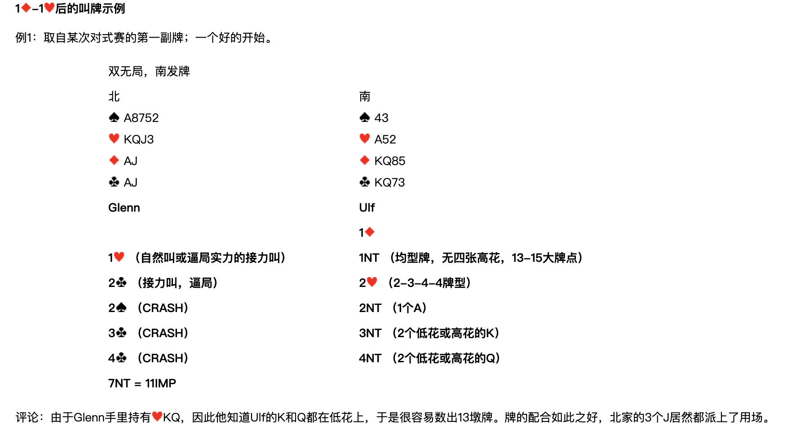

取自某次對式賽的第一副牌；一個好的開始。

**雙無局，南發牌**

| 北 | 南 |
| --- | --- |
| ♠A8752　♥KQJ3　♦AJ　♣AJ | ♠43　♥A52　♦KQ85　♣KQ73 |

| Glenn（北） | Ulf（南） |
| --- | --- |
|  | 1♦ |
| 1♥（自然叫或逼局實力的接力叫） | 1NT（均型牌，無四張高花，13-15大牌點） |
| 2♣（接力叫，逼局） | 2♥（2-3-4-4牌型） |
| 2♠（CRASH） | 2NT（1個A） |
| 3♣（CRASH） | 3NT（2個低花或高花的K） |
| 4♣（CRASH） | 4NT（2個低花或高花的Q） |
| **7NT = 11IMP** |  |

**評論**：由於 Glenn 手裡持有♥KQ，因此他知道 Ulf 的K和Q都在低花上，於是很容易數出13墩牌。牌的配合如此之好，北家的3個J居然都派上了用場。

### 例2

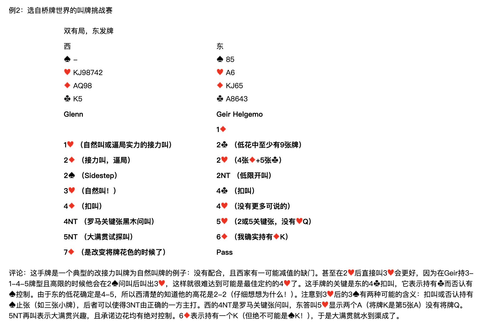

選自橋牌世界的叫牌挑戰賽。

**雙有局，東發牌**

| 西 | 東 |
| --- | --- |
| ♠—　♥KJ98742　♦AQ98　♣K5 | ♠85　♥A6　♦KJ65　♣A8643 |

| Glenn（西） | Geir Helgemo（東） |
| --- | --- |
|  | 1♦ |
| 1♥（自然叫或逼局實力的接力叫） | 2♣（低花中至少有9張牌） |
| 2♦（接力叫，逼局） | 2♥（4張♦+5張♣） |
| 2♠（Sidestep） | 2NT（低限開叫） |
| 3♥（自然叫！） | 4♣（扣叫） |
| 4♦（扣叫） | 4♥（沒有更多可說的） |
| 4NT（羅馬關鍵張黑木問叫） | 5♥（2或5關鍵張，沒有♥Q） |
| 5NT（大滿貫試探叫） | 6♦（我確實持有♦K） |
| 7♦（是改變將牌花色的時候了） | Pass |

**評論**：這手牌是一個典型的改接力叫牌為自然叫牌的例子：沒有配合，且西家有一可能減值的缺門。甚至在 2♥ 後直接叫 3♥ 會更好，因為在 Geir 持 3-1-4-5 牌型且高限的時候他會在 2♠ 問叫後叫出 3♥，這樣就很難達到可能是最佳定約的 4♥ 了。這手牌的關鍵是東的 4♣ 扣叫，它表示持有♣而否認有♠控制。由於東的低花確定是4-5，所以西清楚地知道他的高花是2-2（仔細想想為什麼！）。注意到 3♥ 後的 3♠ 有兩種可能的含義：扣叫或否認持有♠止張（如三張小牌），後者可以使得 3NT 由正確的一方主打。西的 4NT 是羅馬關鍵張問叫，東答叫 5♥ 顯示兩個A（將牌K是第5張A）沒有將牌Q。5NT 再叫表示大滿貫興趣，且承諾邊花均有絕對控制。6♦ 表示持有一個K（但絕不可能是♠K！），於是大滿貫就水到渠成了。

### 例3

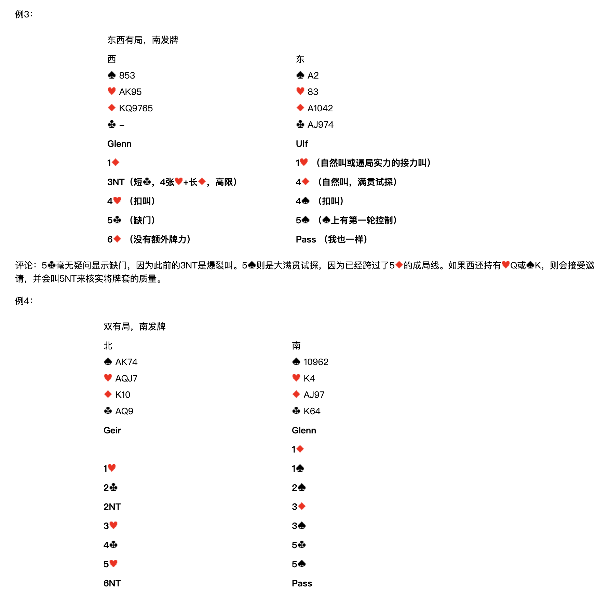

**東西有局，南發牌**

| 西 | 東 |
| --- | --- |
| ♠853　♥AK95　♦KQ9765　♣— | ♠A2　♥83　♦A1042　♣AJ974 |

| Glenn（西） | Ulf（東） |
| --- | --- |
| 1♦ | 1♥（自然叫或逼局實力的接力叫） |
| 3NT（短♣，4張♥+長♦，高限） | 4♦（自然叫，滿貫試探） |
| 4♥（扣叫） | 4♠（扣叫） |
| 5♣（缺門） | 5♠（♠上有第一輪控制） |
| 6♦（沒有額外牌力） | Pass（我也一樣） |

**評論**：5♣ 毫無疑問顯示缺門，因為此前的 3NT 是爆裂叫。5♠ 則是大滿貫試探，因為已經跨過了 5♦ 的成局線。如果西還持有♥Q或♠K，則會接受邀請，並會叫 5NT 來核實將牌套的質量。

### 例4

**雙有局，南發牌**

| 北 | 南 |
| --- | --- |
| ♠AK74　♥AQJ7　♦K10　♣AQ9 | ♠10962　♥K4　♦AJ97　♣K64 |

| Geir（北） | Glenn（南） |
| --- | --- |
|  | 1♦ |
| 1♥ | 1♠ |
| 2♣ | 2♠ |
| 2NT | 3♦ |
| 3♥ | 3♠ |
| 4♣ | 5♣ |
| 5♥ | 5♠ |
| 6NT | Pass |

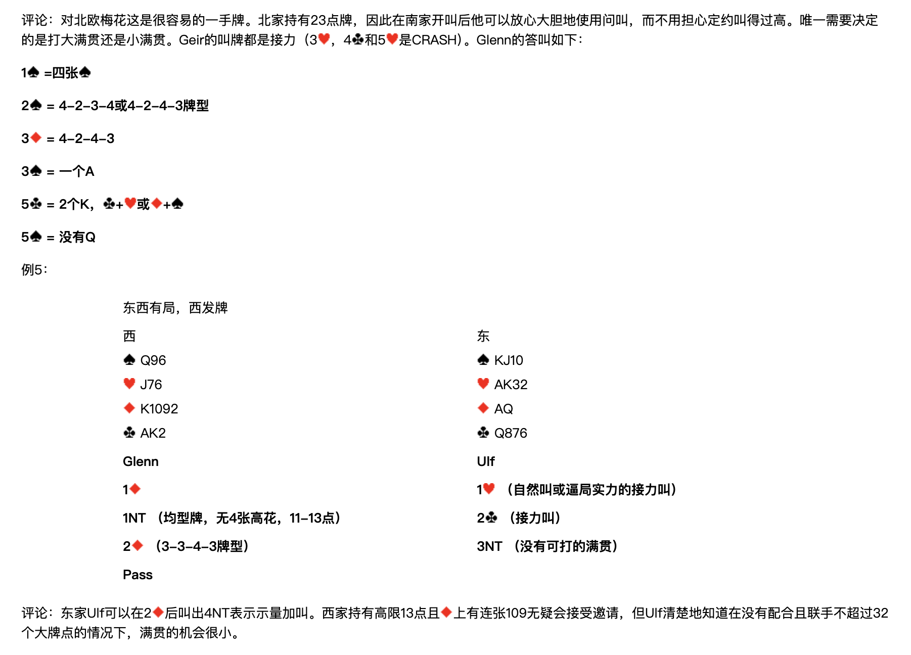

**評論**：對北歐梅花這是很容易的一手牌。北家持有23點牌，因此在南家開叫後他可以放心大膽地使用問叫，而不用擔心定約叫得過高。唯一需要決定的是打大滿貫還是小滿貫。Geir 的叫牌都是接力（3♥、4♣ 和 5♥ 是 CRASH）。Glenn 的答叫如下：

- **1♠** = 四張♠
- **2♠** = 4-2-3-4 或 4-2-4-3 牌型
- **3♦** = 4-2-4-3
- **3♠** = 一個A
- **5♣** = 2個K，♣+♥ 或 ♦+♠
- **5♠** = 沒有Q

### 例5

**東西有局，西發牌**

| 西 | 東 |
| --- | --- |
| ♠Q96　♥J76　♦K1092　♣AK2 | ♠KJ10　♥AK32　♦AQ　♣Q876 |

| Glenn（西） | Ulf（東） |
| --- | --- |
| 1♦ | 1♥（自然叫或逼局實力的接力叫） |
| 1NT（均型牌，無4張高花，11-13點） | 2♣（接力叫） |
| 2♦（3-3-4-3牌型） | 3NT（沒有可打的滿貫） |
| Pass |  |

**評論**：東家 Ulf 可以在 2♦ 後叫出 4NT 表示示量加叫。西家持有高限13點且♦上有連張109無疑會接受邀請，但 Ulf 清楚地知道在沒有配合且聯手不超過32個大牌點的情況下，滿貫的機會很小。

### 例6

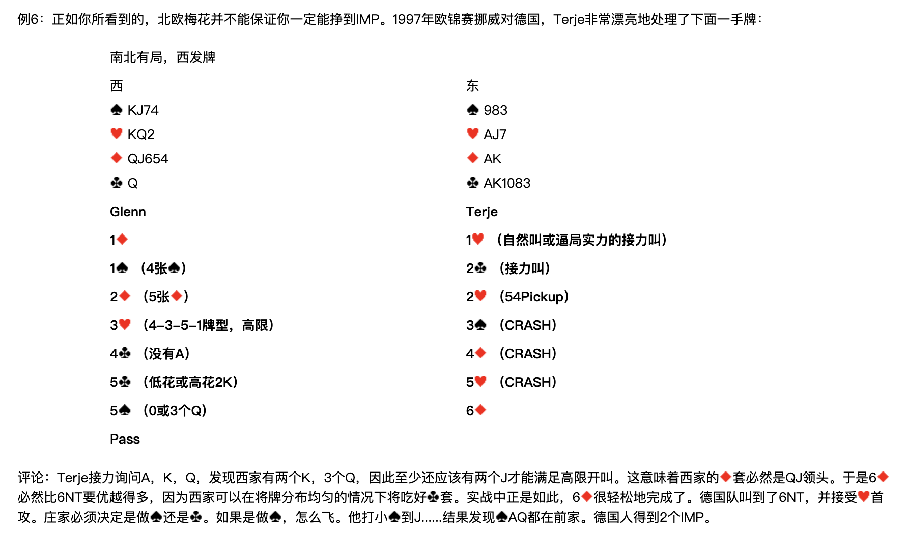

正如你所看到的，北歐梅花並不能保證你一定能掙到 IMP。1997年歐錦賽挪威對德國，Terje 非常漂亮地處理了下面一手牌：

**南北有局，西發牌**

| 西 | 東 |
| --- | --- |
| ♠KJ74　♥KQ2　♦QJ654　♣Q | ♠983　♥AJ7　♦AK　♣AK1083 |

| Glenn（西） | Terje（東） |
| --- | --- |
| 1♦ | 1♥（自然叫或逼局實力的接力叫） |
| 1♠（4張♠） | 2♣（接力叫） |
| 2♦（5張♦） | 2♥（54Pickup） |
| 3♥（4-3-5-1牌型，高限） | 3♠（CRASH） |
| 4♣（沒有A） | 4♦（CRASH） |
| 5♣（低花或高花2K） | 5♥（CRASH） |
| 5♠（0或3個Q） | 6♦ |
| Pass |  |

**評論**：Terje 接力詢問A、K、Q，發現西家有兩個K，3個Q，因此至少還應該有兩個J才能滿足高限開叫。這意味著西家的♦套必然是QJ領頭。於是 6♦ 必然比 6NT 要優越得多，因為西家可以在將牌分佈均勻的情況下將吃好♣套。實戰中正是如此，6♦ 很輕鬆地完成了。德國隊叫到了 6NT，並接受♥首攻。莊家必須決定是做♠還是♣。如果是做♠，怎麼飛。他打小♠到J……結果發現♠AQ都在前家。德國人得到2個IMP。
