> **整理說明**：原始剪藏在轉存時遺失了全部花色符號（♠♥♦♣）與部分表格結構。
> 本檔已依同資料夾的 14 張截圖逐頁比對還原，嵌入對應截圖，並將內文由簡體翻譯為繁體。
> 各接力工具（Sidestep／Splinter／54Pick-up／Six-shooter／CRASH）的正式定義見 `../3基本準則/第三章.md`。

**北歐接力精確體系**

| [第一章 總論](https://walsson.org/articles/03-jptx/03-jptx-048/03-jptx-048-01.htm) | [第四章 一方塊開叫及其發展](https://walsson.org/articles/03-jptx/03-jptx-048/03-jptx-048-04.htm) | [第七章 一梅花開叫及其發展](https://walsson.org/articles/03-jptx/03-jptx-048/03-jptx-048-07.htm) | [第十章 超級接力](https://walsson.org/articles/03-jptx/03-jptx-048/03-jptx-048-10.htm) |
| --- | --- | --- | --- |
| [第二章 基本滿貫叫牌技巧](https://walsson.org/articles/03-jptx/03-jptx-048/03-jptx-048-02.htm) | [第五章 一階高花開叫及其發展](https://walsson.org/articles/03-jptx/03-jptx-048/03-jptx-048-05.htm) | [第八章 二梅花開叫及其發展](https://walsson.org/articles/03-jptx/03-jptx-048/03-jptx-048-08.htm) | [第十一章 最後的改動](https://walsson.org/articles/03-jptx/03-jptx-048/03-jptx-048-11.htm) |
| [第三章 北歐梅花的問叫和基本準則](https://walsson.org/articles/03-jptx/03-jptx-048/03-jptx-048-03.htm) | [第六章 一無將開叫及其發展](https://walsson.org/articles/03-jptx/03-jptx-048/03-jptx-048-06.htm) | [第九章 二方塊到四黑桃開叫](https://walsson.org/articles/03-jptx/03-jptx-048/03-jptx-048-09.htm) |  |

---

## 第五章 一階高花開叫及其發展

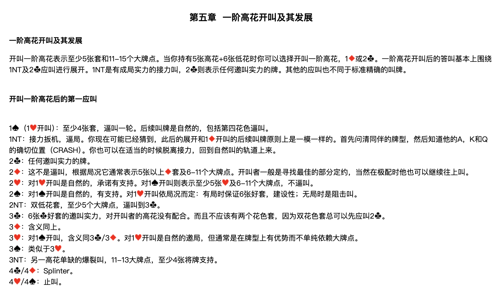

開叫一階高花表示至少5張套和11-15個大牌點。當你持有5張高花+6張低花時你可以選擇開叫一階高花、1♦ 或 2♣。一階高花開叫後的答叫基本上圍繞 1NT 及 2♣ 應叫進行展開。1NT 是有成局實力的接力叫，2♣ 則表示任何邀叫實力的牌。其他的應叫也不同於標準精確的叫牌。

### 開叫一階高花後的第一應叫

| 應叫 | 含義 |
| --- | --- |
| **1♠**（1♥開叫） | 至少4張♠套，逼叫一輪。後續叫牌是自然的，包括第四花色逼叫。 |
| **1NT** | 接力扳機，逼局。你現在可能已經猜到，此後的展開和 1♦ 開叫的後續叫牌原則上是一模一樣的。首先問清同伴的牌型，然後知道他的A、K和Q的確切位置（CRASH）。你也可以在適當的時候脫離接力，回到自然叫的軌道上來。 |
| **2♣** | 任何邀叫實力的牌。 |
| **2♦** | 這不是逼叫，根據局況它通常表示5張以上♦套及6-11個大牌點。開叫者一般是尋找最佳的部分定約，當然在極配時他也可以繼續往上叫。 |
| **2♥** | 對1♥開叫是自然的，承諾有支持。對1♠開叫則表示至少5張♥及6-11個大牌點，不逼叫。 |
| **2♠** | 對1♠開叫是自然的，有支持。對1♥開叫依局況而定：有局時保證6張好套，建設性；無局時是阻擊叫。 |
| **2NT** | 雙低花套，至少5個大牌點，逼叫到 3♣。 |
| **3♣** | 6張♣好套的邀叫實力，對開叫者的高花沒有配合。而且不應該有兩個花色套，因為雙花色套總可以先應叫 2♣。 |
| **3♦** | 含義同上。 |
| **3♥** | 對1♠開叫，含義同 3♣／3♦。對1♥開叫是自然的邀局，但通常是在牌型上有優勢而不單純依賴大牌點。 |
| **3♠** | 類似於 3♥。 |
| **3NT** | 另一高花單缺的爆裂叫，11-13大牌點，至少4張將牌支持。 |
| **4♣／4♦** | Splinter。 |
| **4♥／4♠** | 止叫。 |

---

## 1♥／1♠ – 1NT 的後續叫牌

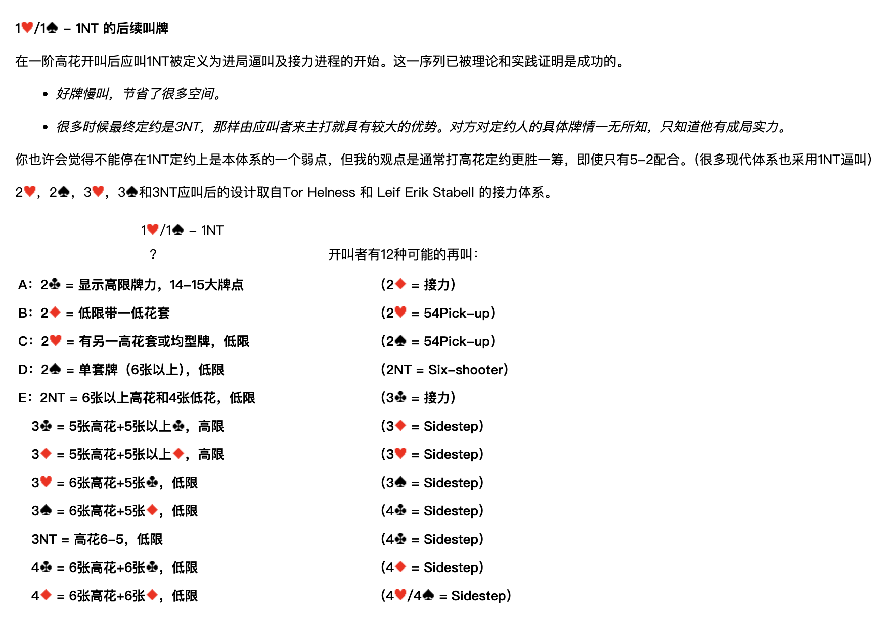

在一階高花開叫後應叫 1NT 被定義為進局逼叫及接力進程的開始。這一序列已被理論和實踐證明是成功的。

- *好牌慢叫，節省了很多空間。*
- *很多時候最終定約是 3NT，那樣由應叫者來主打就具有較大的優勢。對方對定約人的具體牌情一無所知，只知道他有成局實力。*

你也許會覺得不能停在 1NT 定約上是本體系的一個弱點，但我的觀點是通常打高花定約更勝一籌，即使只有 5-2 配合。（很多現代體系也採用 1NT 逼叫）

2♥、2♠、3♥、3♠ 和 3NT 應叫後的設計取自 Tor Helness 和 Leif Erik Stabell 的接力體系。

**1♥／1♠ – 1NT；？　開叫者有12種可能的再叫：**

| 代號 | 開叫者再叫 | 含義 | 應叫者接力 |
| --- | --- | --- | --- |
| **A** | 2♣ | 顯示高限牌力，14-15大牌點 | 2♦ = 接力 |
| **B** | 2♦ | 低限帶一低花套 | 2♥ = 54Pick-up |
| **C** | 2♥ | 有另一高花套或均型牌，低限 | 2♠ = 54Pick-up |
| **D** | 2♠ | 單套牌（6張以上），低限 | 2NT = Six-shooter |
| **E** | 2NT | 6張以上高花和4張低花，低限 | 3♣ = 接力 |
|  | 3♣ | 5張高花+5張以上♣，高限 | 3♦ = Sidestep |
|  | 3♦ | 5張高花+5張以上♦，高限 | 3♥ = Sidestep |
|  | 3♥ | 6張高花+5張♣，低限 | 3♠ = Sidestep |
|  | 3♠ | 6張高花+5張♦，低限 | 4♣ = Sidestep |
|  | 3NT | 高花6-5，低限 | 4♣ = Sidestep |
|  | 4♣ | 6張高花+6張♣，低限 | 4♦ = Sidestep |
|  | 4♦ | 6張高花+6張♦，低限 | 4♥／4♠ = Sidestep |

---

## 開叫者在第二次接力後的再叫

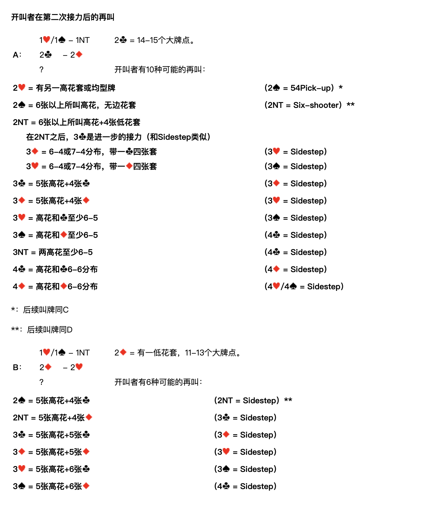

### A：1♥／1♠ – 1NT；2♣ – 2♦；？

**2♣ = 14-15個大牌點。開叫者有10種可能的再叫：**

| 開叫者再叫 | 含義 | 應叫者接力 |
| --- | --- | --- |
| 2♥ | 有另一高花套或均型牌 | 2♠ = 54Pick-up　＊ |
| 2♠ | 6張以上所叫高花，無邊花套 | 2NT = Six-shooter　＊＊ |
| 2NT | 6張以上所叫高花+4張低花套 | 3♣ = 進一步的接力（和Sidestep類似） |
| 　└ 3♦ | 6-4或7-4分佈，帶一♣四張套 | 3♥ = Sidestep |
| 　└ 3♥ | 6-4或7-4分佈，帶一♦四張套 | 3♠ = Sidestep |
| 3♣ | 5張高花+4張♣ | 3♦ = Sidestep |
| 3♦ | 5張高花+4張♦ | 3♥ = Sidestep |
| 3♥ | 高花和♣至少6-5 | 3♠ = Sidestep |
| 3♠ | 高花和♦至少6-5 | 4♣ = Sidestep |
| 3NT | 兩高花至少6-5 | 4♣ = Sidestep |
| 4♣ | 高花和♣6-6分佈 | 4♦ = Sidestep |
| 4♦ | 高花和♦6-6分佈 | 4♥／4♠ = Sidestep |

＊：後續叫牌同 C
＊＊：後續叫牌同 D

### B：1♥／1♠ – 1NT；2♦ – 2♥；？

**2♦ = 有一低花套，11-13個大牌點。開叫者有6種可能的再叫：**

| 開叫者再叫 | 含義 | 應叫者接力 |
| --- | --- | --- |
| 2♠ | 5張高花+4張♣ | 2NT = Sidestep　＊＊ |
| 2NT | 5張高花+4張♦ | 3♣ = Sidestep |
| 3♣ | 5張高花+5張♣ | 3♦ = Sidestep |
| 3♦ | 5張高花+5張♦ | 3♥ = Sidestep |
| 3♥ | 5張高花+6張♣ | 3♠ = Sidestep |
| 3♠ | 5張高花+6張♦ | 4♣ = Sidestep |

### C：1♥／1♠ – 1NT；2♥ – 2♠；？

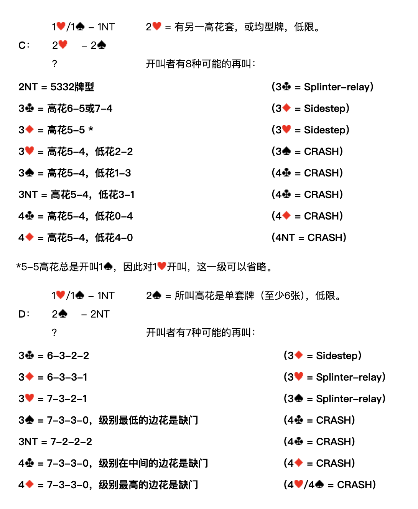

**2♥ = 有另一高花套，或均型牌，低限。開叫者有8種可能的再叫：**

| 開叫者再叫 | 含義 | 應叫者接力 |
| --- | --- | --- |
| 2NT | 5332牌型 | 3♣ = Splinter-relay |
| 3♣ | 高花6-5或7-4 | 3♦ = Sidestep |
| 3♦ | 高花5-5　＊ | 3♥ = Sidestep |
| 3♥ | 高花5-4，低花2-2 | 3♠ = CRASH |
| 3♠ | 高花5-4，低花1-3 | 4♣ = CRASH |
| 3NT | 高花5-4，低花3-1 | 4♣ = CRASH |
| 4♣ | 高花5-4，低花0-4 | 4♦ = CRASH |
| 4♦ | 高花5-4，低花4-0 | 4NT = CRASH |

＊5-5高花總是開叫 1♠，因此對1♥開叫，這一級可以省略。

### D：1♥／1♠ – 1NT；2♠ – 2NT；？

**2♠ = 所叫高花是單套牌（至少6張），低限。開叫者有7種可能的再叫：**

| 開叫者再叫 | 含義 | 應叫者接力 |
| --- | --- | --- |
| 3♣ | 6-3-2-2 | 3♦ = Sidestep |
| 3♦ | 6-3-3-1 | 3♥ = Splinter-relay |
| 3♥ | 7-3-2-1 | 3♠ = Splinter-relay |
| 3♠ | 7-3-3-0，級別最低的邊花是缺門 | 4♣ = CRASH |
| 3NT | 7-2-2-2 | 4♣ = CRASH |
| 4♣ | 7-3-3-0，級別在中間的邊花是缺門 | 4♦ = CRASH |
| 4♦ | 7-3-3-0，級別最高的邊花是缺門 | 4♥／4♠ = CRASH |

### E：1♥／1♠ – 1NT；2NT – 3♣；？

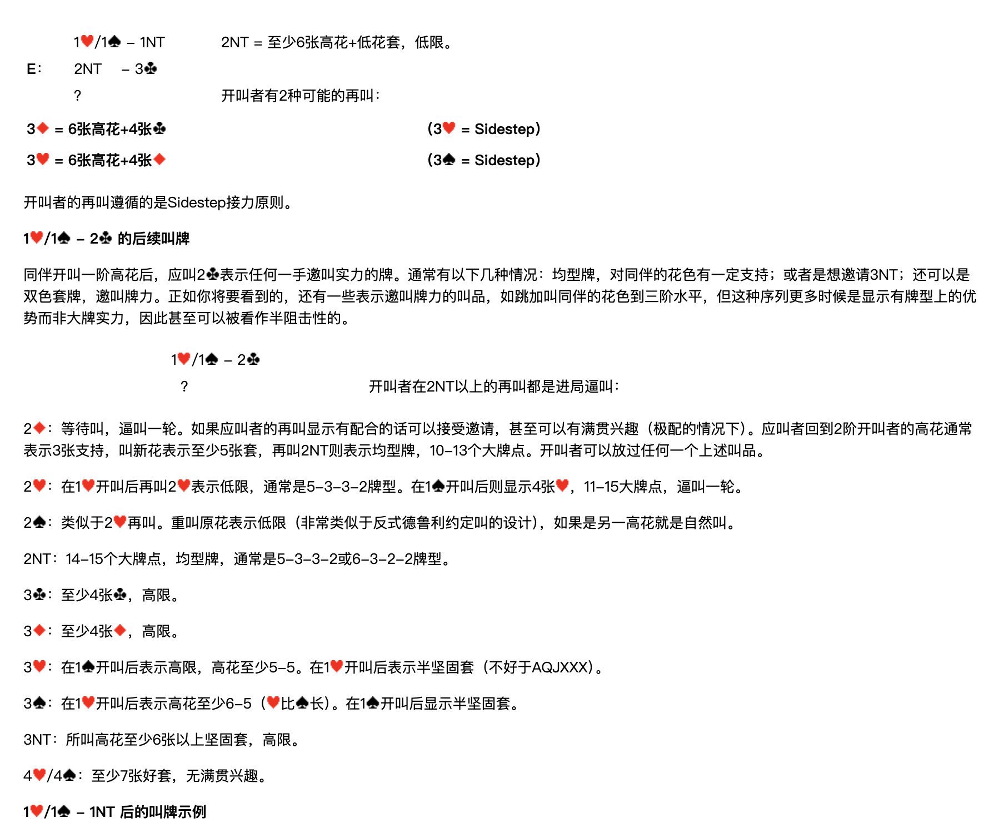

**2NT = 至少6張高花+低花套，低限。開叫者有2種可能的再叫：**

| 開叫者再叫 | 含義 | 應叫者接力 |
| --- | --- | --- |
| 3♦ | 6張高花+4張♣ | 3♥ = Sidestep |
| 3♥ | 6張高花+4張♦ | 3♠ = Sidestep |

開叫者的再叫遵循的是 Sidestep 接力原則。

---

## 1♥／1♠ – 2♣ 的後續叫牌

同伴開叫一階高花後，應叫 2♣ 表示任何一手邀叫實力的牌。通常有以下幾種情況：均型牌，對同伴的花色有一定支持；或者是想邀請 3NT；還可以是雙色套牌，邀叫牌力。正如你將要看到的，還有一些表示邀叫牌力的叫品，如跳加叫同伴的花色到三階水平，但這種序列更多時候是顯示有牌型上的優勢而非大牌實力，因此甚至可以被看作半阻擊性的。

**1♥／1♠ – 2♣；？　開叫者在 2NT 以上的再叫都是進局逼叫：**

| 開叫者再叫 | 含義 |
| --- | --- |
| **2♦** | 等待叫，逼叫一輪。如果應叫者的再叫顯示有配合的話可以接受邀請，甚至可以有滿貫興趣（極配的情況下）。應叫者回到2階開叫者的高花通常表示3張支持，叫新花表示至少5張套，再叫 2NT 則表示均型牌，10-13個大牌點。開叫者可以放過任何一個上述叫品。 |
| **2♥** | 在1♥開叫後再叫 2♥ 表示低限，通常是 5-3-3-2 牌型。在1♠開叫後則顯示4張♥，11-15大牌點，逼叫一輪。 |
| **2♠** | 類似於 2♥ 再叫。重叫原花表示低限（非常類似於反式德魯利約定叫的設計），如果是另一高花就是自然叫。 |
| **2NT** | 14-15個大牌點，均型牌，通常是 5-3-3-2 或 6-3-2-2 牌型。 |
| **3♣** | 至少4張♣，高限。 |
| **3♦** | 至少4張♦，高限。 |
| **3♥** | 在1♠開叫後表示高限，高花至少5-5。在1♥開叫後表示半堅固套（不好於 AQJXXX）。 |
| **3♠** | 在1♥開叫後表示高花至少6-5（♥比♠長）。在1♠開叫後顯示半堅固套。 |
| **3NT** | 所叫高花至少6張以上堅固套，高限。 |
| **4♥／4♠** | 至少7張好套，無滿貫興趣。 |

---

## 1♥／1♠ – 1NT 後的叫牌示例

### 例1

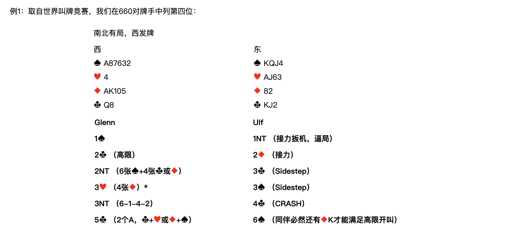

取自世界叫牌競賽，我們在660對牌手中列第四位：

**南北有局，西發牌**

| 西 | 東 |
| --- | --- |
| ♠A87632　♥4　♦AK105　♣Q8 | ♠KQJ4　♥AJ63　♦82　♣KJ2 |

| Glenn（西） | Ulf（東） |
| --- | --- |
| 1♠ | 1NT（接力扳機，逼局） |
| 2♣（高限） | 2♦（接力） |
| 2NT（6張♠+4張♣或♦） | 3♣（Sidestep） |
| 3♥（4張♦）＊ | 3♠（Sidestep） |
| 3NT（6-1-4-2） | 4♣（CRASH） |
| 5♣（2個A，♣+♥ 或 ♦+♠） | 6♠（同伴必然還有♦K才能滿足高限開叫） |

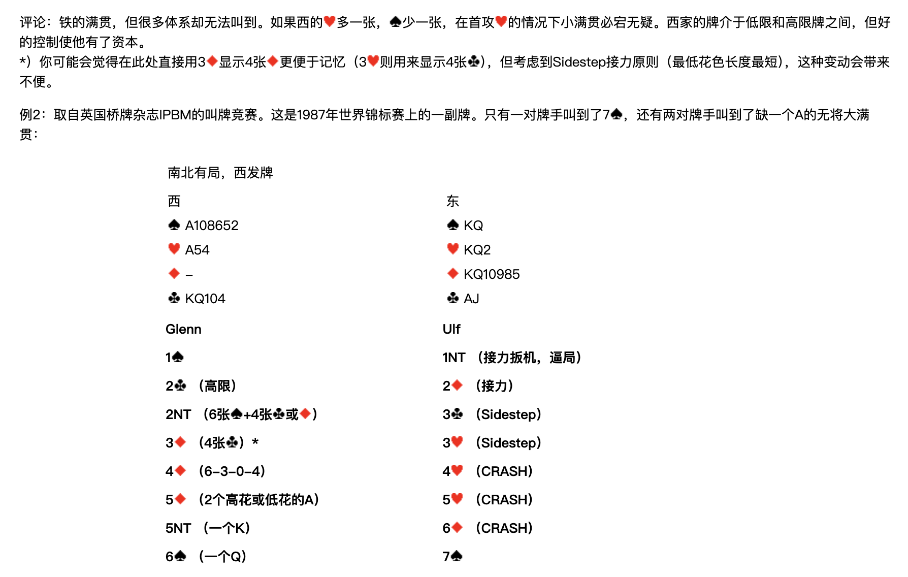

**評論**：鐵的滿貫，但很多體系卻無法叫到。如果西的♥多一張，♠少一張，在首攻♥的情況下小滿貫必宕無疑。西家的牌介於低限和高限牌之間，但好的控制使他有了資本。

＊）你可能會覺得在此處直接用 3♦ 顯示4張♦ 更便於記憶（3♥ 則用來顯示4張♣），但考慮到 Sidestep 接力原則（最低花色長度最短），這種變動會帶來不便。

### 例2

取自英國橋牌雜誌 IPBM 的叫牌競賽。這是1987年世界錦標賽上的一副牌。只有一對牌手叫到了 7♠，還有兩對牌手叫到了缺一個A的無將大滿貫：

**南北有局，西發牌**

| 西 | 東 |
| --- | --- |
| ♠A108652　♥A54　♦—　♣KQ104 | ♠KQ　♥KQ2　♦KQ10985　♣AJ |

| Glenn（西） | Ulf（東） |
| --- | --- |
| 1♠ | 1NT（接力扳機，逼局） |
| 2♣（高限） | 2♦（接力） |
| 2NT（6張♠+4張♣或♦） | 3♣（Sidestep） |
| 3♦（4張♣）＊ | 3♥（Sidestep） |
| 4♦（6-3-0-4） | 4♥（CRASH） |
| 5♦（2個高花或低花的A） | 5♥（CRASH） |
| 5NT（一個K） | 6♦（CRASH） |
| 6♠（一個Q） | 7♠ |

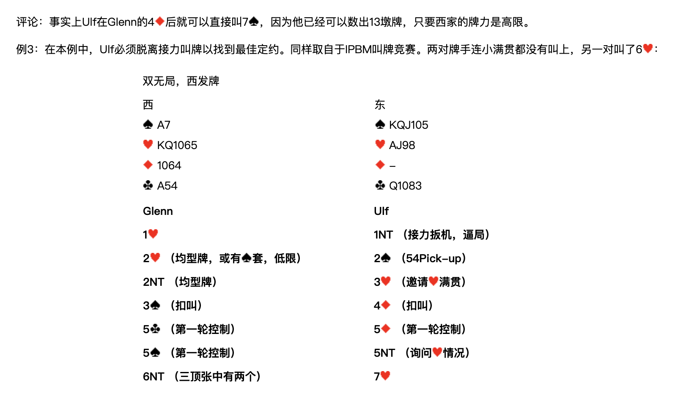

**評論**：事實上 Ulf 在 Glenn 的 4♦ 後就可以直接叫 7♠，因為他已經可以數出13墩牌，只要西家的牌力是高限。

### 例3

在本例中，Ulf 必須脫離接力叫牌以找到最佳定約。同樣取自於 IPBM 叫牌競賽。兩對牌手連小滿貫都沒有叫上，另一對叫了 6♥：

**雙無局，西發牌**

| 西 | 東 |
| --- | --- |
| ♠A7　♥KQ1065　♦1064　♣A54 | ♠KQJ105　♥AJ98　♦—　♣Q1083 |

| Glenn（西） | Ulf（東） |
| --- | --- |
| 1♥ | 1NT（接力扳機，逼局） |
| 2♥（均型牌，或有♠套，低限） | 2♠（54Pick-up） |
| 2NT（均型牌） | 3♥（邀請♥滿貫） |
| 3♠（扣叫） | 4♦（扣叫） |
| 5♣（第一輪控制） | 5♦（第一輪控制） |
| 5♠（第一輪控制） | 5NT（詢問♥情況） |
| 6NT（三頂張中有兩個） | 7♥ |

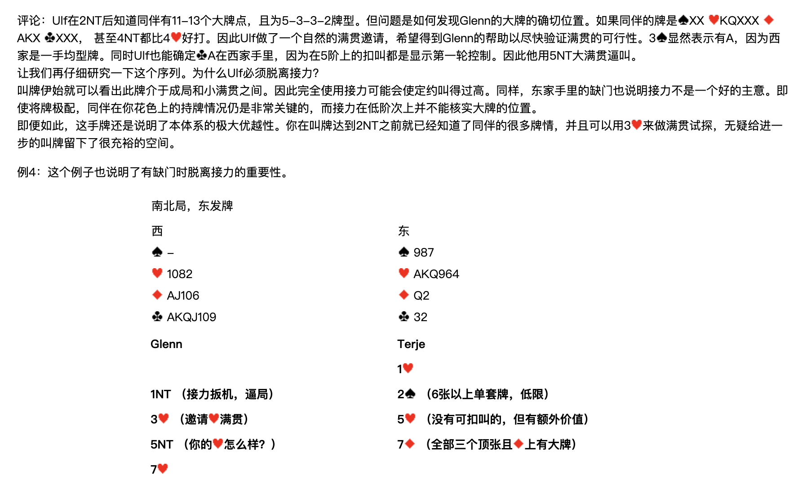

**評論**：Ulf 在 2NT 後知道同伴有11-13個大牌點，且為 5-3-3-2 牌型。但問題是如何發現 Glenn 的大牌的確切位置。如果同伴的牌是 ♠XX ♥KQXXX ♦AKX ♣XXX，甚至 4NT 都比 4♥ 好打。因此 Ulf 做了一個自然的滿貫邀請，希望得到 Glenn 的幫助以盡快驗證滿貫的可行性。3♠ 顯然表示有♠A，因為西家是一手均型牌。同時 Ulf 也能確定♣A在西家手裡，因為在5階上的扣叫都是顯示第一輪控制。因此他用 5NT 大滿貫逼叫。

讓我們再仔細研究一下這個序列。為什麼 Ulf 必須脫離接力？

叫牌伊始就可以看出此牌介於成局和小滿貫之間。因此完全使用接力可能會使定約叫得過高。同樣，東家手裡的缺門也說明接力不是一個好的主意。即使將牌極配，同伴在你花色上的持牌情況仍是非常關鍵的，而接力在低階次上並不能核實大牌的位置。

即便如此，這手牌還是說明了本體系的極大優越性。你在叫牌達到 2NT 之前就已經知道了同伴的很多牌情，並且可以用 3♥ 來做滿貫試探，無疑給進一步的叫牌留下了很充裕的空間。

### 例4

這個例子也說明了有缺門時脫離接力的重要性。

**南北局，東發牌**

| 西 | 東 |
| --- | --- |
| ♠—　♥1082　♦AJ106　♣AKQJ109 | ♠987　♥AKQ964　♦Q2　♣32 |

| Glenn（西） | Terje（東） |
| --- | --- |
|  | 1♥ |
| 1NT（接力扳機，逼局） | 2♠（6張以上單套牌，低限） |
| 3♥（邀請♥滿貫） | 5♥（沒有可扣叫的，但有額外價值） |
| 5NT（你的♥怎麼樣？） | 7♦（全部三個頂張且♦上有大牌） |
| 7♥ |  |

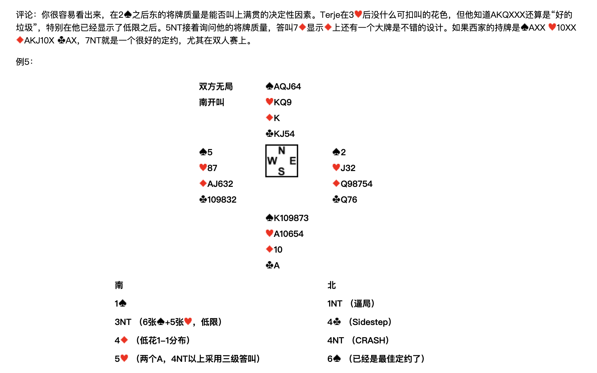

**評論**：你很容易看出來，在 2♠ 之後東的將牌質量是能否叫上滿貫的決定性因素。Terje 在 3♥ 後沒什麼可扣叫的花色，但他知道 AKQXXX 還算是「好的垃圾」，特別在他已經顯示了低限之後。5NT 接著詢問他的將牌質量，答叫 7♦ 顯示♦上還有一個大牌是不錯的設計。如果西家的持牌是 ♠AXX ♥10XX ♦AKJ10X ♣AX，7NT 就是一個很好的定約，尤其在雙人賽上。

### 例5

**雙方無局，南開叫**

|  | 北 |  |
| --- | --- | --- |
|  | ♠AQJ64　♥KQ9　♦K　♣KJ54 |  |
| **西**　♠5　♥87　♦AJ632　♣109832 |  | **東**　♠2　♥J32　♦Q98754　♣Q76 |
|  | **南**　♠K109873　♥A10654　♦10　♣A |  |

| 南 | 北 |
| --- | --- |
| 1♠ | 1NT（逼局） |
| 3NT（6張♠+5張♥，低限） | 4♣（Sidestep） |
| 4♦（低花1-1分佈） | 4NT（CRASH） |
| 5♥（兩個A，4NT以上採用三級答叫） | 6♠（已經是最佳定約了） |

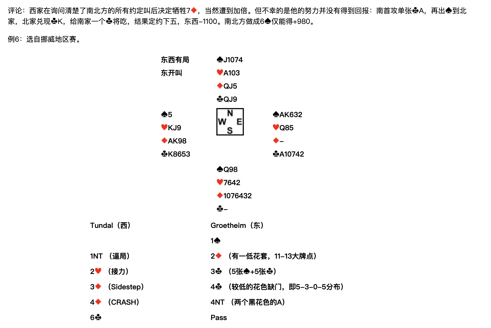

**評論**：西家在詢問清楚了南北方的所有約定叫後決定犧牲 7♦，當然遭到加倍。但不幸的是他的努力並沒有得到回報：南首攻單張♣A，再出♠到北家，北家兌現♣K，給南家一個♣將吃，結果定約下五，東西 -1100。南北方做成 6♠ 僅能得 +980。

### 例6

選自挪威地區賽。

**東西有局，東開叫**

|  | 北 |  |
| --- | --- | --- |
|  | ♠J1074　♥A103　♦QJ5　♣QJ9 |  |
| **西**　♠5　♥KJ9　♦AK98　♣K8653 |  | **東**　♠AK632　♥Q85　♦—　♣A10742 |
|  | **南**　♠Q98　♥7642　♦1076432　♣— |  |

| Tundal（西） | Groetheim（東） |
| --- | --- |
|  | 1♠ |
| 1NT（逼局） | 2♦（有一低花套，11-13大牌點） |
| 2♥（接力） | 3♣（5張♠+5張♣） |
| 3♦（Sidestep） | 4♣（較低的花色缺門，即 5-3-0-5 分佈） |
| 4♦（CRASH） | 4NT（兩個黑花色的A） |
| 6♣ | Pass |

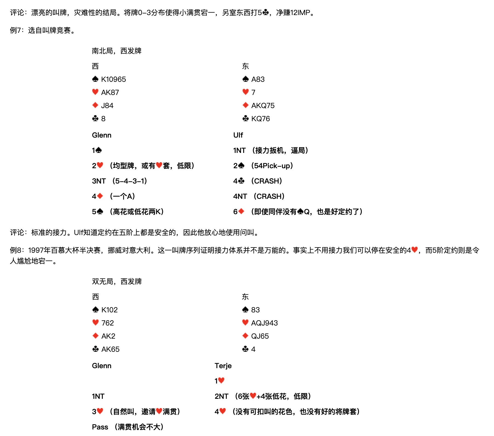

**評論**：漂亮的叫牌，災難性的結局。將牌 0-3 分佈使得小滿貫宕一，另室東西打 5♣，淨賺 12 IMP。

### 例7

選自叫牌競賽。

**南北局，西發牌**

| 西 | 東 |
| --- | --- |
| ♠K10965　♥AK87　♦J84　♣8 | ♠A83　♥7　♦AKQ75　♣KQ76 |

| Glenn（西） | Ulf（東） |
| --- | --- |
| 1♠ | 1NT（接力扳機，逼局） |
| 2♥（均型牌，或有♥套，低限） | 2♠（54Pick-up） |
| 3NT（5-4-3-1） | 4♣（CRASH） |
| 4♦（一個A） | 4NT（CRASH） |
| 5♠（高花或低花兩K） | 6♦（即使同伴沒有♠Q，也是好定約了） |

**評論**：標準的接力。Ulf 知道定約在五階上都是安全的，因此他放心地使用問叫。

### 例8

1997年百慕大杯半決賽，挪威對意大利。這一叫牌序列證明接力體系並不是萬能的。事實上不用接力我們可以停在安全的 4♥，而5階定約則是令人尷尬地宕一。

**雙無局，西發牌**

| 西 | 東 |
| --- | --- |
| ♠K102　♥762　♦AK2　♣AK65 | ♠83　♥AQJ943　♦QJ65　♣4 |

| Glenn（西） | Terje（東） |
| --- | --- |
|  | 1♥ |
| 1NT | 2NT（6張♥+4張低花，低限） |
| 3♥（自然叫，邀請♥滿貫） | 4♥（沒有可扣叫的花色，也沒有好的將牌套） |
| Pass（滿貫機會不大） |  |

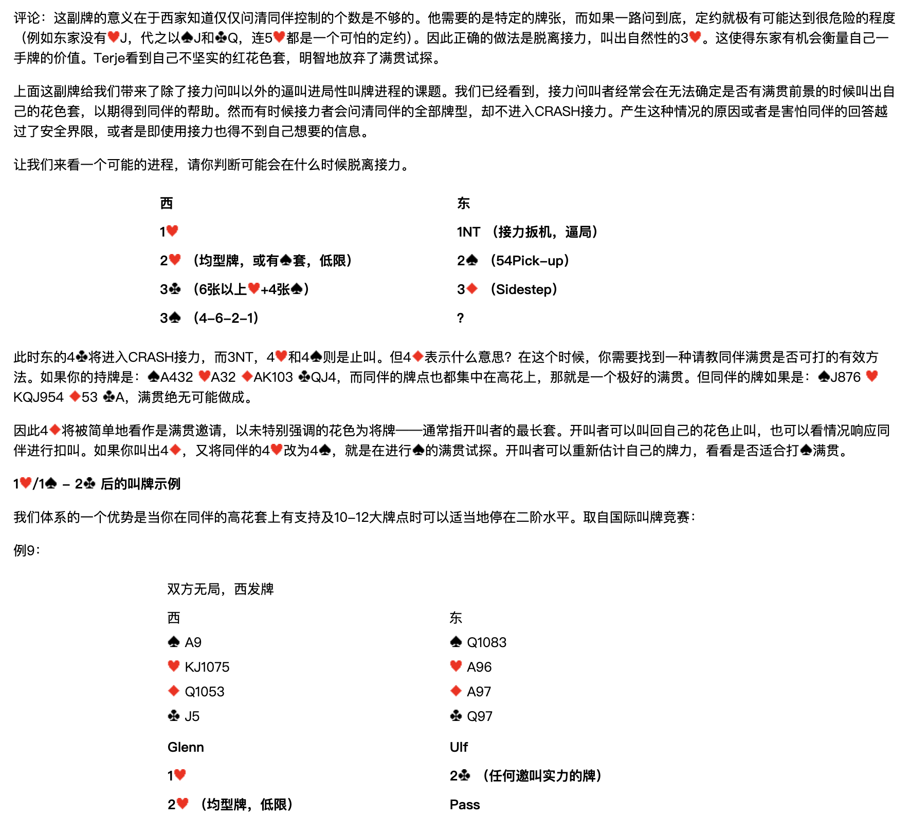

**評論**：這副牌的意義在於西家知道僅僅問清同伴控制的個數是不夠的。他需要的是特定的牌張，而如果一路問到底，定約就極有可能達到很危險的程度（例如東家沒有♥J，代之以♠J和♣Q，連 5♥ 都是一個可怕的定約）。因此正確的做法是脫離接力，叫出自然性的 3♥。這使得東家有機會衡量自己一手牌的價值。Terje 看到自己不堅實的紅花色套，明智地放棄了滿貫試探。

### 示範進程：判斷何時脫離接力

上面這副牌給我們帶來了除了接力問叫以外的逼叫進局性叫牌進程的課題。我們已經看到，接力問叫者經常會在無法確定是否有滿貫前景的時候叫出自己的花色套，以期得到同伴的幫助。然而有時候接力者會問清同伴的全部牌型，卻不進入 CRASH 接力。產生這種情況的原因或者是害怕同伴的回答越過了安全界限，或者是即使用接力也得不到自己想要的資訊。

讓我們來看一個可能的進程，請你判斷可能會在什麼時候脫離接力。

| 西 | 東 |
| --- | --- |
| 1♥ | 1NT（接力扳機，逼局） |
| 2♥（均型牌，或有♠套，低限） | 2♠（54Pick-up） |
| 3♣（6張以上♥+4張♠） | 3♦（Sidestep） |
| 3♠（4-6-2-1） | ？ |

此時東的 4♣ 將進入 CRASH 接力，而 3NT、4♥ 和 4♠ 則是止叫。但 4♦ 表示什麼意思？在這個時候，你需要找到一種請教同伴滿貫是否可打的有效方法。如果你的持牌是 ♠A432 ♥A32 ♦AK103 ♣QJ4，而同伴的牌點也都集中在高花上，那就是一個極好的滿貫。但同伴的牌如果是 ♠J876 ♥KQJ954 ♦53 ♣A，滿貫絕無可能做成。

因此 4♦ 將被簡單地看作是滿貫邀請，以未特別強調的花色為將牌——通常指開叫者的最長套。開叫者可以叫回自己的花色止叫，也可以看情況響應同伴進行扣叫。如果你叫出 4♦，又將同伴的 4♥ 改為 4♠，就是在進行♠的滿貫試探。開叫者可以重新估計自己的牌力，看看是否適合打♠滿貫。

---

## 1♥／1♠ – 2♣ 後的叫牌示例

我們體系的一個優勢是當你在同伴的高花套上有支持及10-12大牌點時可以適當地停在二階水平。取自國際叫牌競賽：

### 例9

**雙方無局，西發牌**

| 西 | 東 |
| --- | --- |
| ♠A9　♥KJ1075　♦Q1053　♣J5 | ♠Q1083　♥A96　♦A97　♣Q97 |

| Glenn（西） | Ulf（東） |
| --- | --- |
| 1♥ | 2♣（任何邀叫實力的牌） |
| 2♥（均型牌，低限） | Pass |

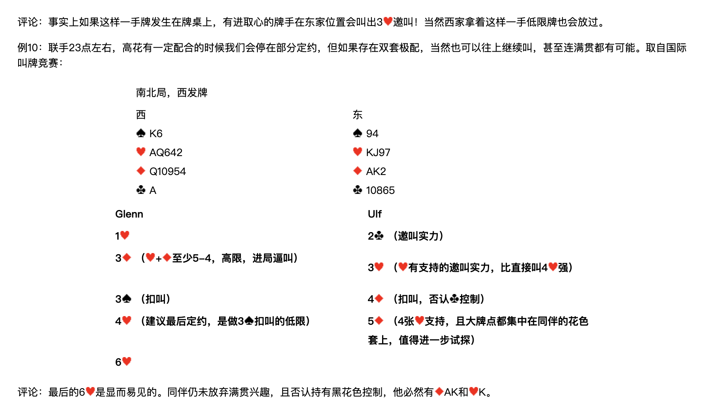

**評論**：事實上如果這樣一手牌發生在牌桌上，有進取心的牌手在東家位置會叫出 3♥ 邀叫！當然西家拿著這樣一手低限牌也會放過。

### 例10

聯手23點左右，高花有一定配合的時候我們會停在部分定約，但如果存在雙套極配，當然也可以往上繼續叫，甚至連滿貫都有可能。取自國際叫牌競賽：

**南北局，西發牌**

| 西 | 東 |
| --- | --- |
| ♠K6　♥AQ642　♦Q10954　♣A | ♠94　♥KJ97　♦AK2　♣10865 |

| Glenn（西） | Ulf（東） |
| --- | --- |
| 1♥ | 2♣（邀叫實力） |
| 3♦（♥+♦至少5-4，高限，進局逼叫） | 3♥（♥有支持的邀叫實力，比直接叫 4♥ 強） |
| 3♠（扣叫） | 4♦（扣叫，否認♣控制） |
| 4♥（建議最後定約，是做 3♠ 扣叫的低限） | 5♦（4張♥支持，且大牌點都集中在同伴的花色套上，值得進一步試探） |
| 6♥ |  |

**評論**：最後的 6♥ 是顯而易見的。同伴仍未放棄滿貫興趣，且否認持有黑花色控制，他必然有♦AK和♥K。
