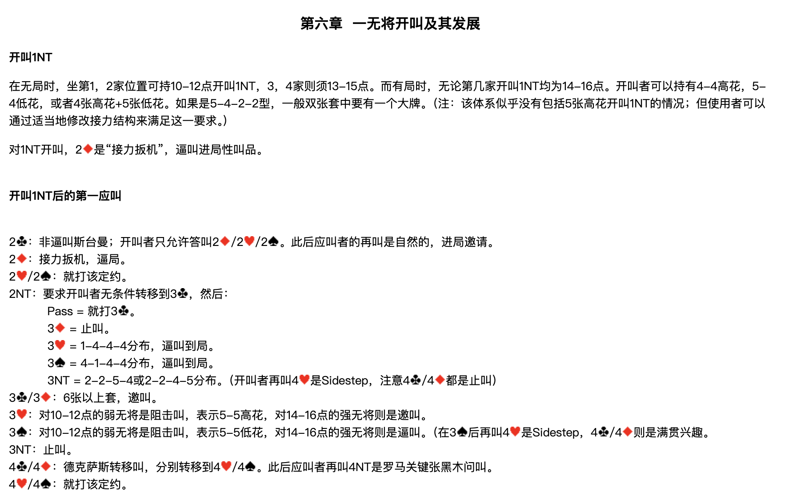
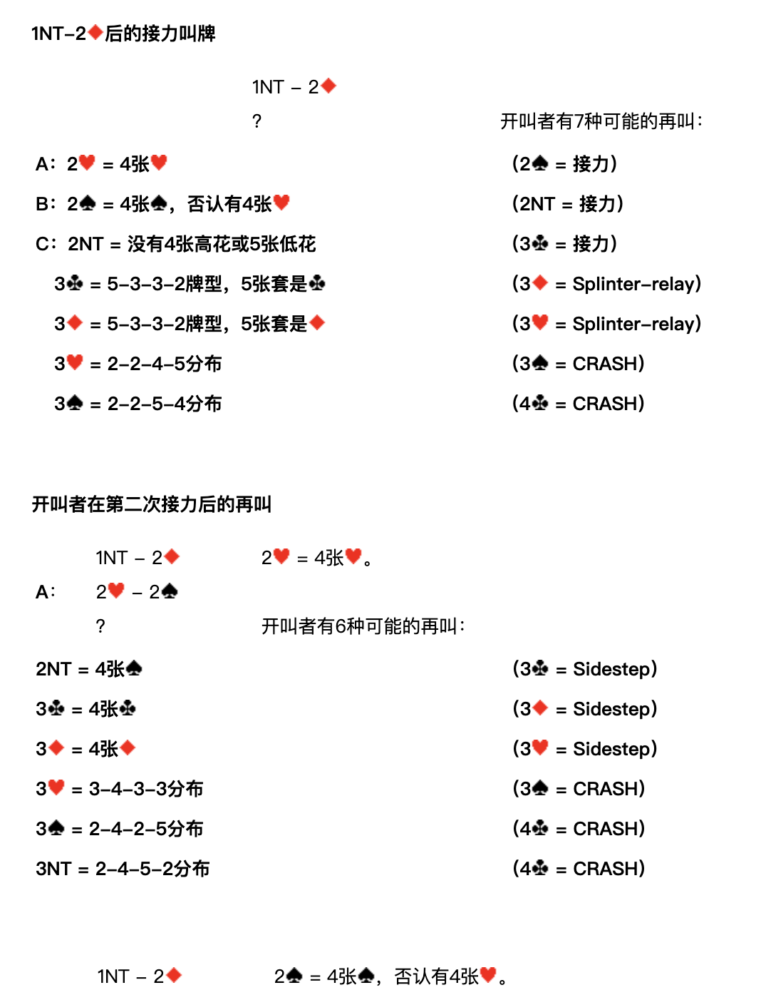
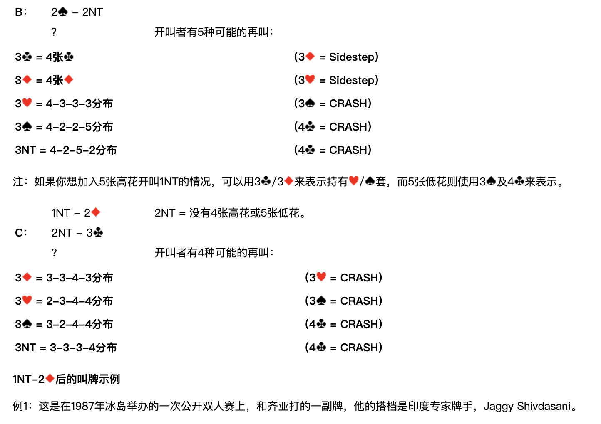
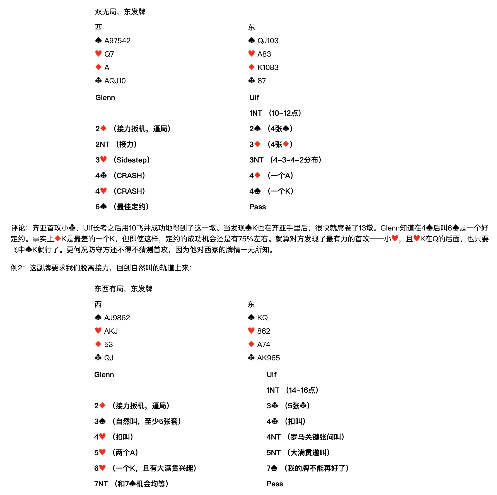
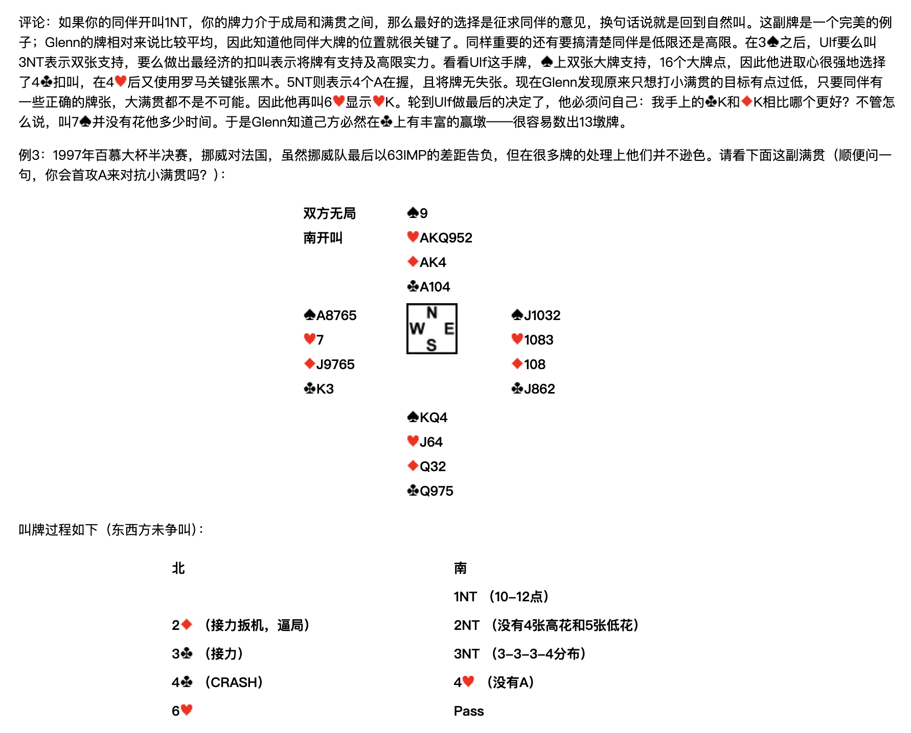
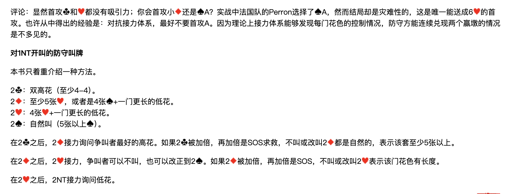

> **整理說明**：原始剪藏在轉存時遺失了全部花色符號（♠♥♦♣）與部分表格結構。
> 本檔已依同資料夾的 6 張截圖逐頁比對還原，嵌入對應截圖，並將內文由簡體翻譯為繁體。
> 各接力工具（Sidestep／Splinter-relay／54Pick-up／Six-shooter／CRASH）的正式定義見 `../3基本準則/第三章.md`。
> **牌型數字一律按 ♠-♥-♦-♣ 順序排列。**

**北歐接力精確體系**

| [第一章 總論](https://walsson.org/articles/03-jptx/03-jptx-048/03-jptx-048-01.htm) | [第四章 一方塊開叫及其發展](https://walsson.org/articles/03-jptx/03-jptx-048/03-jptx-048-04.htm) | [第七章 一梅花開叫及其發展](https://walsson.org/articles/03-jptx/03-jptx-048/03-jptx-048-07.htm) | [第十章 超級接力](https://walsson.org/articles/03-jptx/03-jptx-048/03-jptx-048-10.htm) |
| --- | --- | --- | --- |
| [第二章 基本滿貫叫牌技巧](https://walsson.org/articles/03-jptx/03-jptx-048/03-jptx-048-02.htm) | [第五章 一階高花開叫及其發展](https://walsson.org/articles/03-jptx/03-jptx-048/03-jptx-048-05.htm) | [第八章 二梅花開叫及其發展](https://walsson.org/articles/03-jptx/03-jptx-048/03-jptx-048-08.htm) | [第十一章 最後的改動](https://walsson.org/articles/03-jptx/03-jptx-048/03-jptx-048-11.htm) |
| [第三章 北歐梅花的問叫和基本準則](https://walsson.org/articles/03-jptx/03-jptx-048/03-jptx-048-03.htm) | [第六章 一無將開叫及其發展](https://walsson.org/articles/03-jptx/03-jptx-048/03-jptx-048-06.htm) | [第九章 二方塊到四黑桃開叫](https://walsson.org/articles/03-jptx/03-jptx-048/03-jptx-048-09.htm) |  |

---

## 第六章 一無將開叫及其發展

### 開叫 1NT

在無局時，坐第1、2家位置可持 **10-12點** 開叫 1NT，3、4家則須 **13-15點**。而有局時，無論第幾家開叫 1NT 均為 **14-16點**。

開叫者可以持有 4-4 高花、5-4 低花，或者 4張高花+5張低花。如果是 5-4-2-2 型，一般雙張套中要有一個大牌。

> **注**：該體系似乎沒有包括 5張高花開叫 1NT 的情況；但使用者可以透過適當地修改接力結構來滿足這一要求。

對 1NT 開叫，**2♦ 是「接力扳機」**，逼叫進局性叫品。

### 開叫 1NT 後的第一應叫

| 應叫 | 含義 |
| --- | --- |
| **2♣** | 非逼叫斯台曼；開叫者只允許答叫 2♦／2♥／2♠。此後應叫者的再叫是自然的，進局邀請。 |
| **2♦** | 接力扳機，逼局。 |
| **2♥／2♠** | 就打該定約。 |
| **2NT** | 要求開叫者無條件轉移到 3♣，然後見下表。 |
| **3♣／3♦** | 6張以上套，邀叫。 |
| **3♥** | 對10-12點的弱無將是阻擊叫，表示 5-5 高花；對14-16點的強無將則是邀叫。 |
| **3♠** | 對10-12點的弱無將是阻擊叫，表示 5-5 低花；對14-16點的強無將則是逼叫。（在 3♠ 後再叫 4♥ 是 Sidestep，4♣／4♦ 則是滿貫興趣） |
| **3NT** | 止叫。 |
| **4♣／4♦** | 德克薩斯轉移叫，分別轉移到 4♥／4♠。此後應叫者再叫 4NT 是羅馬關鍵張黑木問叫。 |
| **4♥／4♠** | 就打該定約。 |

**2NT 轉移到 3♣ 之後，應叫者的再叫：**

| 再叫 | 含義 |
| --- | --- |
| Pass | 就打 3♣。 |
| 3♦ | 止叫。 |
| 3♥ | 1-4-4-4分佈，逼叫到局。 |
| 3♠ | 4-1-4-4分佈，逼叫到局。 |
| 3NT | 2-2-5-4 或 2-2-4-5 分佈。（開叫者再叫 4♥ 是 Sidestep，注意 4♣／4♦ 都是止叫） |

---

## 1NT – 2♦ 後的接力叫牌

**1NT – 2♦；？　開叫者有 7 種可能的再叫：**

| 代號 | 開叫者再叫 | 含義 | 應叫者接力 |
| --- | --- | --- | --- |
| **A** | 2♥ | 4張♥ | 2♠ = 接力 |
| **B** | 2♠ | 4張♠，否認有4張♥ | 2NT = 接力 |
| **C** | 2NT | 沒有4張高花或5張低花 | 3♣ = 接力 |
|  | 3♣ | 5-3-3-2牌型，5張套是♣ | 3♦ = Splinter-relay |
|  | 3♦ | 5-3-3-2牌型，5張套是♦ | 3♥ = Splinter-relay |
|  | 3♥ | 2-2-4-5分佈 | 3♠ = CRASH |
|  | 3♠ | 2-2-5-4分佈 | 4♣ = CRASH |

---

## 開叫者在第二次接力後的再叫

### A：1NT – 2♦；2♥ – 2♠；？

**2♥ = 4張♥。開叫者有 6 種可能的再叫：**

| 開叫者再叫 | 含義 | 應叫者接力 |
| --- | --- | --- |
| 2NT | 4張♠ | 3♣ = Sidestep |
| 3♣ | 4張♣ | 3♦ = Sidestep |
| 3♦ | 4張♦ | 3♥ = Sidestep |
| 3♥ | 3-4-3-3分佈 | 3♠ = CRASH |
| 3♠ | 2-4-2-5分佈 | 4♣ = CRASH |
| 3NT | 2-4-5-2分佈 | 4♣ = CRASH |

### B：1NT – 2♦；2♠ – 2NT；？

**2♠ = 4張♠，否認有4張♥。開叫者有 5 種可能的再叫：**

| 開叫者再叫 | 含義 | 應叫者接力 |
| --- | --- | --- |
| 3♣ | 4張♣ | 3♦ = Sidestep |
| 3♦ | 4張♦ | 3♥ = Sidestep |
| 3♥ | 4-3-3-3分佈 | 3♠ = CRASH |
| 3♠ | 4-2-2-5分佈 | 4♣ = CRASH |
| 3NT | 4-2-5-2分佈 | 4♣ = CRASH |

> **注**：如果你想加入 5張高花開叫 1NT 的情況，可以用 3♣／3♦ 來表示持有 ♥／♠ 套，而 5張低花則使用 3♠ 及 4♣ 來表示。

### C：1NT – 2♦；2NT – 3♣；？

**2NT = 沒有4張高花或5張低花。開叫者有 4 種可能的再叫：**

| 開叫者再叫 | 含義 | 應叫者接力 |
| --- | --- | --- |
| 3♦ | 3-3-4-3分佈 | 3♥ = CRASH |
| 3♥ | 2-3-4-4分佈 | 3♠ = CRASH |
| 3♠ | 3-2-4-4分佈 | 4♣ = CRASH |
| 3NT | 3-3-3-4分佈 | 4♣ = CRASH |

---

## 1NT – 2♦ 後的叫牌示例

### 例1

這是在1987年冰島舉辦的一次公開雙人賽上，和齊亞打的一副牌，他的搭檔是印度專家牌手 Jaggy Shivdasani。

**雙無局，東發牌**

| 西 | 東 |
| --- | --- |
| ♠A97542　♥Q7　♦A　♣AQJ10 | ♠QJ103　♥A83　♦K1083　♣87 |

| Glenn（西） | Ulf（東） |
| --- | --- |
|  | 1NT（10-12點） |
| 2♦（接力扳機，逼局） | 2♠（4張♠） |
| 2NT（接力） | 3♦（4張♦） |
| 3♥（Sidestep） | 3NT（4-3-4-2分佈） |
| 4♣（CRASH） | 4♦（一個A） |
| 4♥（CRASH） | 4♠（一個K） |
| 6♠（最佳定約） | Pass |

**評論**：齊亞首攻小♣，Ulf 長考之後用 10 飛並成功地得到了這一墩。當發現♠K也在齊亞手裡後，很快就席捲了13墩。Glenn 知道在 4♠ 後叫 6♠ 是一個好定約。事實上♦K是最差的一個K，但即使這樣，定約的成功機會還是有75%左右。就算對方發現了最有力的首攻——小♥，且♥K在Q的後面，也只要飛中♠K就行了。更何況防守方還不得不猜測首攻，因為他對西家的牌情一無所知。

### 例2

這副牌要求我們脫離接力，回到自然叫的軌道上來：

**東西有局，東發牌**

| 西 | 東 |
| --- | --- |
| ♠AJ9862　♥AKJ　♦53　♣QJ | ♠KQ　♥862　♦A74　♣AK965 |

| Glenn（西） | Ulf（東） |
| --- | --- |
|  | 1NT（14-16點） |
| 2♦（接力扳機，逼局） | 3♣（5張♣） |
| 3♠（自然叫，至少5張套） | 4♣（扣叫） |
| 4♥（扣叫） | 4NT（羅馬關鍵張問叫） |
| 5♥（兩個A） | 5NT（大滿貫邀叫） |
| 6♥（一個K，且有大滿貫興趣） | 7♠（我的牌不能再好了） |
| 7NT（和 7♠ 機會均等） | Pass |

**評論**：如果你的同伴開叫 1NT，你的牌力介於成局和滿貫之間，那麼最好的選擇是徵求同伴的意見，換句話說就是回到自然叫。這副牌是一個完美的例子；Glenn 的牌相對來說比較平均，因此知道他同伴大牌的位置就很關鍵了。同樣重要的還有要搞清楚同伴是低限還是高限。

在 3♠ 之後，Ulf 要麼叫 3NT 表示雙張支持，要麼做出最經濟的扣叫表示將牌有支持及高限實力。看看 Ulf 這手牌，♠上雙張大牌支持，16個大牌點，因此他進取心很強地選擇了 4♣ 扣叫，在 4♥ 後又使用羅馬關鍵張黑木。5NT 則表示4個A在握，且將牌無失張。現在 Glenn 發現原來只想打小滿貫的目標有點過低，只要同伴有一些正確的牌張，大滿貫都不是不可能。因此他再叫 6♥ 顯示♥K。輪到 Ulf 做最後的決定了，他必須問自己：我手上的♣K和♦K相比哪個更好？不管怎麼說，叫 7♠ 並沒有花他多少時間。於是 Glenn 知道己方必然在♣上有豐富的贏墩——很容易數出13墩牌。

### 例3

1997年百慕大杯半決賽，挪威對法國。雖然挪威隊最後以 63 IMP 的差距告負，但在很多牌的處理上他們並不遜色。請看下面這副滿貫（順便問一句，你會首攻A來對抗小滿貫嗎？）：

**雙方無局，南開叫**

|  | 北 |  |
| --- | --- | --- |
|  | ♠9　♥AKQ952　♦AK4　♣A104 |  |
| **西**　♠A8765　♥7　♦J9765　♣K3 |  | **東**　♠J1032　♥1083　♦108　♣J862 |
|  | **南**　♠KQ4　♥J64　♦Q32　♣Q975 |  |

叫牌過程如下（東西方未爭叫）：

| 北 | 南 |
| --- | --- |
|  | 1NT（10-12點） |
| 2♦（接力扳機，逼局） | 2NT（沒有4張高花和5張低花） |
| 3♣（接力） | 3NT（3-3-3-4分佈） |
| 4♣（CRASH） | 4♥（沒有A） |
| 6♥ | Pass |

**評論**：顯然首攻♣和♥都沒有吸引力；你會首攻小♦還是♠A？實戰中法國隊的 Perron 選擇了♠A，然而結局卻是災難性的，**這是唯一能送成 6♥ 的首攻**。

也許從中得出的經驗是：**對抗接力體系，最好不要首攻A**。因為理論上接力體系能夠發現每門花色的控制情況，防守方能連續兌現兩個贏墩的情況是不多見的。

---

## 對 1NT 開叫的防守叫牌

本書只著重介紹一種方法。

| 爭叫 | 含義 |
| --- | --- |
| **2♣** | 雙高花（至少 4-4）。 |
| **2♦** | 至少5張♥，或者是 4張♠ + 一門更長的低花。 |
| **2♥** | 4張♥ + 一門更長的低花。 |
| **2♠** | 自然叫（5張以上♠）。 |

**後續處理：**

- 在 **2♣** 之後，2♦ 接力詢問爭叫者最好的高花。如果 2♣ 被加倍，再加倍是 SOS 求救，不叫或改叫 2♦ 都是自然的，表示該套至少5張以上。
- 在 **2♦** 之後，2♥ 接力，爭叫者可以不叫，也可以改正到 2♠。如果 2♦ 被加倍，再加倍是 SOS，不叫或改叫 2♥ 表示該門花色有長度。
- 在 **2♥** 之後，2NT 接力詢問低花。
