> **整理說明**：原始剪藏在轉存時遺失了全部花色符號（♠♥♦♣）與部分表格結構。
> 本檔已依同資料夾的 12 張截圖逐頁比對還原，嵌入對應截圖，並將內文由簡體翻譯為繁體。
> 各接力工具（Sidestep／Splinter／54Pick-up／Six-shooter／CRASH）的正式定義見 `../3基本準則/第三章.md`。
> **牌型數字一律按 ♠-♥-♦-♣ 順序排列。**

**北歐接力精確體系**

| [第一章 總論](https://walsson.org/articles/03-jptx/03-jptx-048/03-jptx-048-01.htm) | [第四章 一方塊開叫及其發展](https://walsson.org/articles/03-jptx/03-jptx-048/03-jptx-048-04.htm) | [第七章 一梅花開叫及其發展](https://walsson.org/articles/03-jptx/03-jptx-048/03-jptx-048-07.htm) | [第十章 超級接力](https://walsson.org/articles/03-jptx/03-jptx-048/03-jptx-048-10.htm) |
| --- | --- | --- | --- |
| [第二章 基本滿貫叫牌技巧](https://walsson.org/articles/03-jptx/03-jptx-048/03-jptx-048-02.htm) | [第五章 一階高花開叫及其發展](https://walsson.org/articles/03-jptx/03-jptx-048/03-jptx-048-05.htm) | [第八章 二梅花開叫及其發展](https://walsson.org/articles/03-jptx/03-jptx-048/03-jptx-048-08.htm) | [第十一章 最後的改動](https://walsson.org/articles/03-jptx/03-jptx-048/03-jptx-048-11.htm) |
| [第三章 北歐梅花的問叫和基本準則](https://walsson.org/articles/03-jptx/03-jptx-048/03-jptx-048-03.htm) | [第六章 一無將開叫及其發展](https://walsson.org/articles/03-jptx/03-jptx-048/03-jptx-048-06.htm) | [第九章 二方塊到四黑桃開叫](https://walsson.org/articles/03-jptx/03-jptx-048/03-jptx-048-09.htm) |  |

---

## 第七章 一梅花開叫及其發展

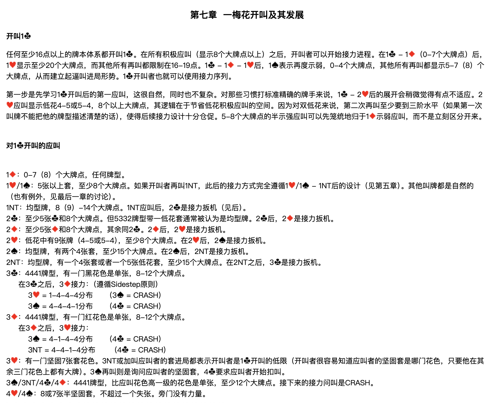

### 開叫 1♣

任何至少16點以上的牌本體系都開叫 1♣。在所有積極應叫（顯示8個大牌點以上）之後，開叫者可以開始接力進程。在 1♣ – 1♦（0-7個大牌點）後，1♥ 顯示至少20個大牌點，而其他所有再叫都限制在16-19點。1♣ – 1♦ – 1♥ 後，1♠ 表示再度示弱，0-4個大牌點，其他所有再叫都顯示5-7（8）個大牌點，從而建立起逼叫進局形勢。1♣ 開叫者也就可以使用接力序列。

第一步是先學習 1♣ 開叫後的第一應叫，這很自然，同時也不複雜。對那些習慣打標準精確的牌手來說，1♣ – 2♥ 後的展開會稍微覺得有點不適應。2♥ 應叫顯示低花4-5或5-4，8個以上大牌點，其邏輯在於節省低花積極應叫的空間。因為對雙低花來說，第二次再叫至少要到三階水平（如果第一次叫牌不能把他的牌型描述清楚的話），使得後續接力設計十分倉促。5-8個大牌點的半示強應叫可以先籠統地歸於 1♦ 示弱應叫，而不是立刻區分開來。

### 對 1♣ 開叫的應叫

| 應叫 | 含義 |
| --- | --- |
| **1♦** | 0-7（8）個大牌點，任何牌型。 |
| **1♥／1♠** | 5張以上套，至少8個大牌點。如果開叫者再叫 1NT，此後的接力方式完全遵循 1♥／1♠ – 1NT 後的設計（見第五章）。其他叫牌都是自然的（也有例外，見最後一章的討論）。 |
| **1NT** | 均型牌，8（9）-14個大牌點。1NT 應叫後，2♣ 是接力扳機（見後）。 |
| **2♣** | 至少5張♣和8個大牌點。但5332牌型帶一低花套通常被認為是均型牌。2♣ 後，2♦ 是接力扳機。 |
| **2♦** | 至少5張♦和8個大牌點，其餘同 2♣。2♦ 後，2♥ 是接力扳機。 |
| **2♥** | 低花中有9張牌（4-5或5-4），至少8個大牌點。在 2♥ 後，2♠ 是接力扳機。 |
| **2♠** | 均型牌，有兩個4張套，至少15個大牌點。在 2♠ 後，2NT 是接力扳機。 |
| **2NT** | 均型牌，有一個4張套或者一個5張低花套，至少15個大牌點。在 2NT 之後，3♣ 是接力扳機。 |
| **3♣** | 4441牌型，有一門黑花色是單張，8-12個大牌點。 |
| **3♦** | 4441牌型，有一門紅花色是單張，8-12個大牌點。 |
| **3♥** | 有一門堅固7張套花色。3NT 或加叫應叫者的套進局都表示開叫者是 1♣ 開叫的低限（開叫者很容易知道應叫者的堅固套是哪門花色，只要他在其餘三門花色上都有大牌）。3♠ 再叫則是詢問應叫者的堅固套，4♣ 要求應叫者開始扣叫。 |
| **3♠／3NT／4♣／4♦** | 4441牌型，比應叫花色高一級的花色是單張，至少12個大牌點。接下來的接力問叫是 CRASH。 |
| **4♥／4♠** | 8或7張半堅固套，不超過一個失張。旁門沒有力量。 |

**3♣ 之後，3♦ 接力（遵循 Sidestep 原則）：**

| 答叫 | 分佈 | 下一步 |
| --- | --- | --- |
| 3♥ | 1-4-4-4 | 3♠ = CRASH |
| 3♠ | 4-4-4-1 | 4♣ = CRASH |

**3♦ 之後，3♥ 接力：**

| 答叫 | 分佈 | 下一步 |
| --- | --- | --- |
| 3♠ | 4-1-4-4 | 4♣ = CRASH |
| 3NT | 4-4-1-4 | 4♣ = CRASH |

---

## 1♣ – 1♦ 後開叫者的再叫

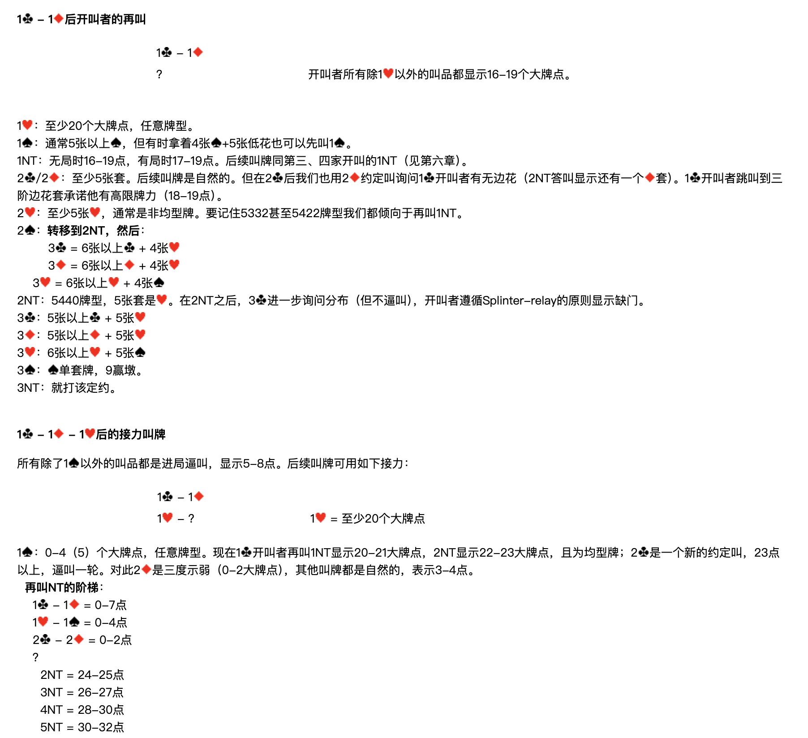

**1♣ – 1♦；？　開叫者所有除 1♥ 以外的叫品都顯示16-19個大牌點。**

| 開叫者再叫 | 含義 |
| --- | --- |
| **1♥** | 至少20個大牌點，任意牌型。 |
| **1♠** | 通常5張以上♠，但有時拿著4張♠+5張低花也可以先叫 1♠。 |
| **1NT** | 無局時16-19點，有局時17-19點。後續叫牌同第三、四家開叫的 1NT（見第六章）。 |
| **2♣／2♦** | 至少5張套。後續叫牌是自然的。但在 2♣ 後我們也用 2♦ 約定叫詢問 1♣ 開叫者有無邊花（2NT 答叫顯示還有一個♦套）。1♣ 開叫者跳叫到三階邊花套承諾他有高限牌力（18-19點）。 |
| **2♥** | 至少5張♥，通常是非均型牌。要記住5332甚至5422牌型我們都傾向於再叫 1NT。 |
| **2♠** | **轉移到 2NT**，然後：<br>　3♣ = 6張以上♣ + 4張♥<br>　3♦ = 6張以上♦ + 4張♥<br>　3♥ = 6張以上♥ + 4張♠ |
| **2NT** | 5440牌型，5張套是♥。在 2NT 之後，3♣ 進一步詢問分佈（但不逼叫），開叫者遵循 Splinter-relay 的原則顯示缺門。 |
| **3♣** | 5張以上♣ + 5張♥ |
| **3♦** | 5張以上♦ + 5張♥ |
| **3♥** | 6張以上♥ + 5張♠ |
| **3♠** | ♠單套牌，9贏墩。 |
| **3NT** | 就打該定約。 |

---

## 1♣ – 1♦ – 1♥ 後的接力叫牌

所有除了 1♠ 以外的叫品都是進局逼叫，顯示5-8點。後續叫牌可用如下接力：

**1♣ – 1♦；1♥ – ？　（1♥ = 至少20個大牌點）**

### 1♠：0-4（5）個大牌點，任意牌型

現在 1♣ 開叫者再叫 1NT 顯示20-21大牌點，2NT 顯示22-23大牌點，且為均型牌；2♣ 是一個新的約定叫，23點以上，逼叫一輪。對此 2♦ 是三度示弱（0-2大牌點），其他叫牌都是自然的，表示3-4點。

**再叫 NT 的階梯：**

```
1♣ – 1♦ = 0-7點
1♥ – 1♠ = 0-4點
2♣ – 2♦ = 0-2點
     ？
　2NT = 24-25點
　3NT = 26-27點
　4NT = 28-30點
　5NT = 30-32點
```

### 1NT：至少有一高花5張套

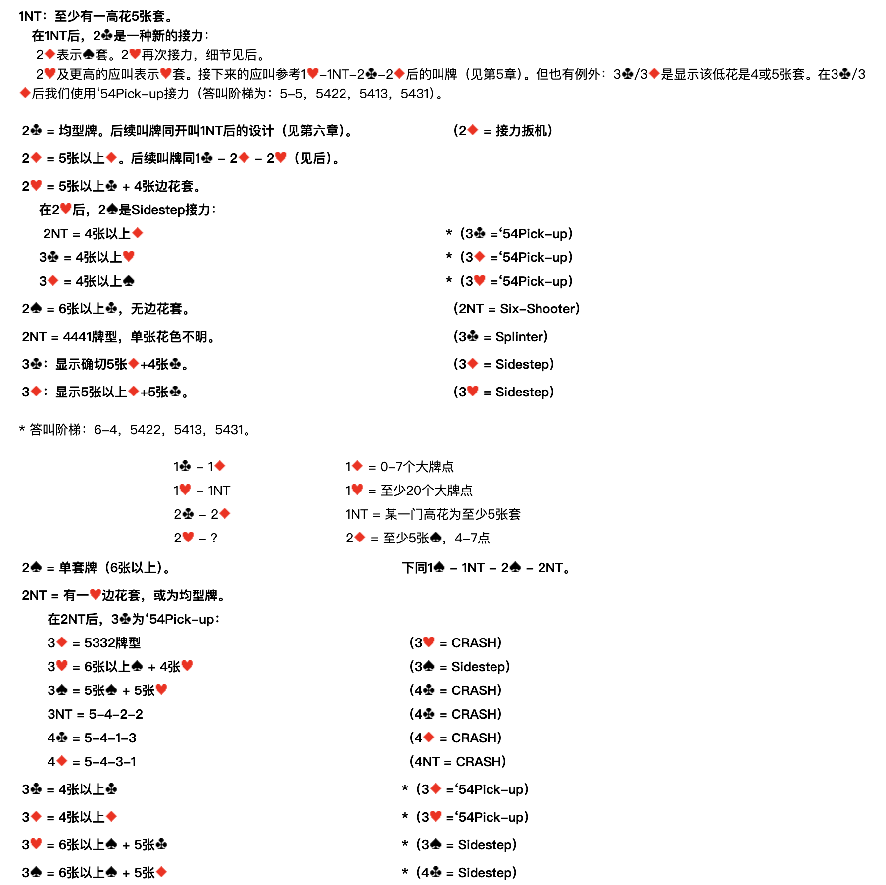

**在 1NT 後，2♣ 是一種新的接力：**

- 2♦ 表示♠套。2♥ 再次接力，細節見後。
- 2♥ 及更高的應叫表示♥套。接下來的應叫參考 1♥–1NT–2♣–2♦ 後的叫牌（見第五章）。但也有例外：3♣／3♦ 是顯示該低花是4或5張套。在 3♣／3♦ 後我們使用 '54Pick-up 接力（答叫階梯為：5-5，5422，5413，5431）。

### 應叫者在 1♣ – 1♦ – 1♥ 後的其餘叫品

| 應叫者叫品 | 含義 | 開叫者接力 |
| --- | --- | --- |
| **2♣** | 均型牌。後續叫牌同開叫 1NT 後的設計（見第六章）。 | 2♦ = 接力扳機 |
| **2♦** | 5張以上♦。後續叫牌同 1♣ – 2♦ – 2♥（見後）。 | — |
| **2♥** | **5張以上♣ + 4張邊花套。** | 2♠ = Sidestep 接力 |
| 　2NT | 4張以上♦ | ＊3♣ = '54Pick-up |
| 　3♣ | 4張以上♥ | ＊3♦ = '54Pick-up |
| 　3♦ | 4張以上♠ | ＊3♥ = '54Pick-up |
| **2♠** | 6張以上♣，無邊花套。 | 2NT = Six-Shooter |
| **2NT** | 4441牌型，單張花色不明。 | 3♣ = Splinter |
| **3♣** | 顯示確切5張♦ + 4張♣。 | 3♦ = Sidestep |
| **3♦** | 顯示5張以上♦ + 5張♣。 | 3♥ = Sidestep |

＊ 答叫階梯：6-4，5422，5413，5431。

### 顯示♠套後的續問

**1♣ – 1♦；1♥ – 1NT；2♣ – 2♦；2♥ – ？**

> 1♦ = 0-7個大牌點　　1♥ = 至少20個大牌點
> 1NT = 某一門高花為至少5張套　　2♦ = 至少5張♠，4-7點

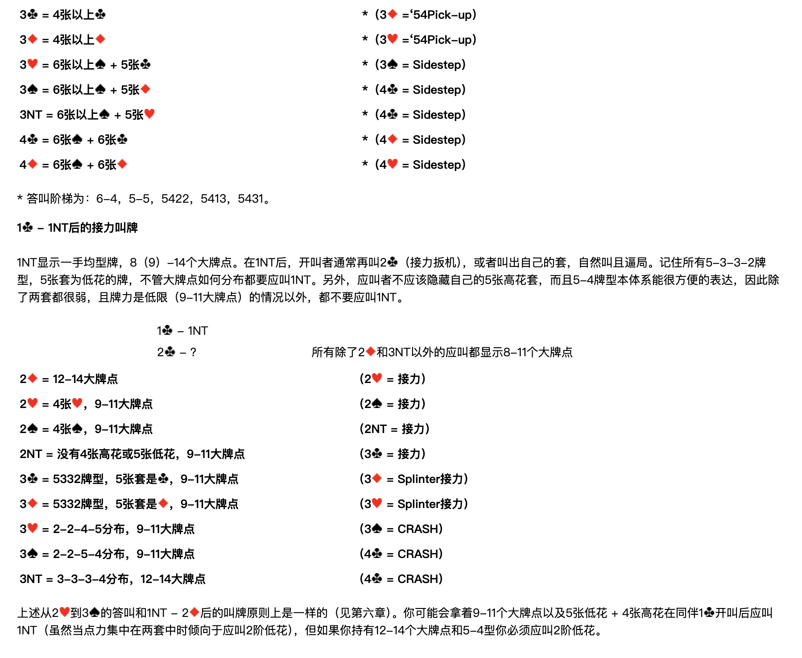

| 應叫者再叫 | 含義 | 開叫者接力 |
| --- | --- | --- |
| **2♠** | 單套牌（6張以上）。 | 下同 1♠ – 1NT – 2♠ – 2NT |
| **2NT** | **有一♥邊花套，或為均型牌。** | 3♣ = '54Pick-up |
| 　3♦ | 5332牌型 | 3♥ = CRASH |
| 　3♥ | 6張以上♠ + 4張♥ | 3♠ = Sidestep |
| 　3♠ | 5張♠ + 5張♥ | 4♣ = CRASH |
| 　3NT | 5-4-2-2 | 4♣ = CRASH |
| 　4♣ | 5-4-1-3 | 4♦ = CRASH |
| 　4♦ | 5-4-3-1 | 4NT = CRASH |
| **3♣** | 4張以上♣ | ＊3♦ = '54Pick-up |
| **3♦** | 4張以上♦ | ＊3♥ = '54Pick-up |
| **3♥** | 6張以上♠ + 5張♣ | ＊3♠ = Sidestep |
| **3♠** | 6張以上♠ + 5張♦ | ＊4♣ = Sidestep |
| **3NT** | 6張以上♠ + 5張♥ | ＊4♣ = Sidestep |
| **4♣** | 6張♠ + 6張♣ | ＊4♦ = Sidestep |
| **4♦** | 6張♠ + 6張♦ | ＊4♥ = Sidestep |

＊ 答叫階梯為：6-4，5-5，5422，5413，5431。

---

## 1♣ – 1NT 後的接力叫牌

1NT 顯示一手均型牌，8（9）-14個大牌點。在 1NT 後，開叫者通常再叫 2♣（接力扳機），或者叫出自己的套，自然叫且逼局。記住所有 5-3-3-2 牌型、5張套為低花的牌，不管大牌點如何分佈都要應叫 1NT。另外，應叫者不應該隱藏自己的5張高花套，而且5-4牌型本體系能很方便地表達，因此除了兩套都很弱、且牌力是低限（9-11大牌點）的情況以外，都不要應叫 1NT。

**1♣ – 1NT；2♣ – ？　所有除了 2♦ 和 3NT 以外的應叫都顯示8-11個大牌點**

| 應叫者再叫 | 含義 | 開叫者接力 |
| --- | --- | --- |
| 2♦ | 12-14大牌點 | 2♥ = 接力 |
| 2♥ | 4張♥，9-11大牌點 | 2♠ = 接力 |
| 2♠ | 4張♠，9-11大牌點 | 2NT = 接力 |
| 2NT | 沒有4張高花或5張低花，9-11大牌點 | 3♣ = 接力 |
| 3♣ | 5332牌型，5張套是♣，9-11大牌點 | 3♦ = Splinter接力 |
| 3♦ | 5332牌型，5張套是♦，9-11大牌點 | 3♥ = Splinter接力 |
| 3♥ | 2-2-4-5分佈，9-11大牌點 | 3♠ = CRASH |
| 3♠ | 2-2-5-4分佈，9-11大牌點 | 4♣ = CRASH |
| 3NT | 3-3-3-4分佈，12-14大牌點 | 4♣ = CRASH |

上述從 2♥ 到 3♠ 的答叫和 1NT – 2♦ 後的叫牌原則上是一樣的（見第六章）。你可能會拿著9-11個大牌點以及5張低花 + 4張高花在同伴 1♣ 開叫後應叫 1NT（雖然當點力集中在兩套中時傾向於應叫2階低花），但如果你持有12-14個大牌點和5-4型你必須應叫2階低花。

### 第二次接力後的叫牌

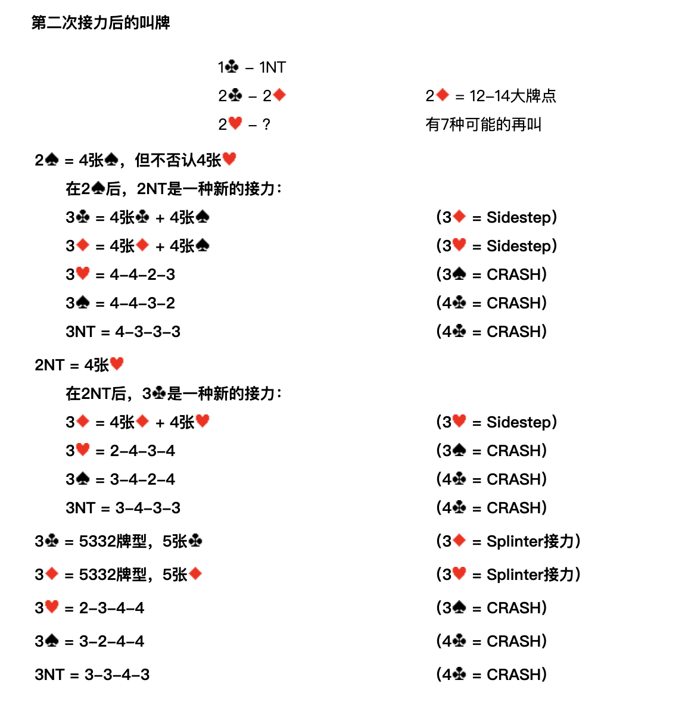

**1♣ – 1NT；2♣ – 2♦；2♥ – ？　（2♦ = 12-14大牌點，有7種可能的再叫）**

| 應叫者再叫 | 含義 | 開叫者接力 |
| --- | --- | --- |
| **2♠** | **4張♠，但不否認4張♥** | 2NT = 一種新的接力 |
| 　3♣ | 4張♣ + 4張♠ | 3♦ = Sidestep |
| 　3♦ | 4張♦ + 4張♠ | 3♥ = Sidestep |
| 　3♥ | 4-4-2-3 | 3♠ = CRASH |
| 　3♠ | 4-4-3-2 | 4♣ = CRASH |
| 　3NT | 4-3-3-3 | 4♣ = CRASH |
| **2NT** | **4張♥** | 3♣ = 一種新的接力 |
| 　3♦ | 4張♦ + 4張♥ | 3♥ = Sidestep |
| 　3♥ | 2-4-3-4 | 3♠ = CRASH |
| 　3♠ | 3-4-2-4 | 4♣ = CRASH |
| 　3NT | 3-4-3-3 | 4♣ = CRASH |
| **3♣** | 5332牌型，5張♣ | 3♦ = Splinter接力 |
| **3♦** | 5332牌型，5張♦ | 3♥ = Splinter接力 |
| **3♥** | 2-3-4-4 | 3♠ = CRASH |
| **3♠** | 3-2-4-4 | 4♣ = CRASH |
| **3NT** | 3-3-4-3 | 4♣ = CRASH |

---

## 1♣ – 2♣ 後的接力叫牌

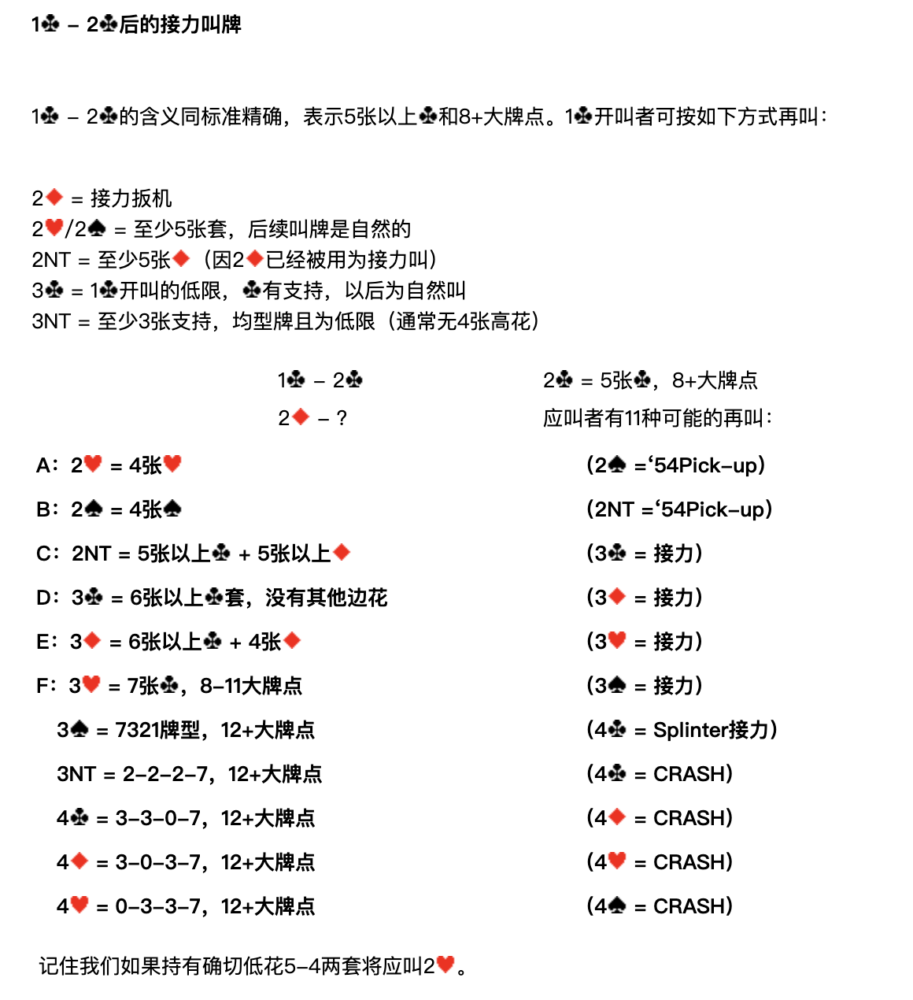

1♣ – 2♣ 的含義同標準精確，表示5張以上♣和8+大牌點。1♣ 開叫者可按如下方式再叫：

| 開叫者再叫 | 含義 |
| --- | --- |
| 2♦ | 接力扳機 |
| 2♥／2♠ | 至少5張套，後續叫牌是自然的 |
| 2NT | 至少5張♦（因 2♦ 已經被用為接力叫） |
| 3♣ | 1♣ 開叫的低限，♣有支持，以後為自然叫 |
| 3NT | 至少3張♣支持，均型牌且為低限（通常無4張高花） |

**1♣ – 2♣；2♦ – ？　（2♣ = 5張♣，8+大牌點。應叫者有11種可能的再叫）**

| 代號 | 應叫者再叫 | 含義 | 開叫者接力 |
| --- | --- | --- | --- |
| **A** | 2♥ | 4張♥ | 2♠ = '54Pick-up |
| **B** | 2♠ | 4張♠ | 2NT = '54Pick-up |
| **C** | 2NT | 5張以上♣ + 5張以上♦ | 3♣ = 接力 |
| **D** | 3♣ | 6張以上♣套，沒有其他邊花 | 3♦ = 接力 |
| **E** | 3♦ | 6張以上♣ + 4張♦ | 3♥ = 接力 |
| **F** | 3♥ | 7張♣，8-11大牌點 | 3♠ = 接力 |
|  | 3♠ | 7321牌型，12+大牌點 | 4♣ = Splinter接力 |
|  | 3NT | 2-2-2-7，12+大牌點 | 4♣ = CRASH |
|  | 4♣ | 3-3-0-7，12+大牌點 | 4♦ = CRASH |
|  | 4♦ | 3-0-3-7，12+大牌點 | 4♥ = CRASH |
|  | 4♥ | 0-3-3-7，12+大牌點 | 4♠ = CRASH |

記住我們如果持有確切低花5-4兩套將應叫 2♥。

### 第二次接力後的叫牌

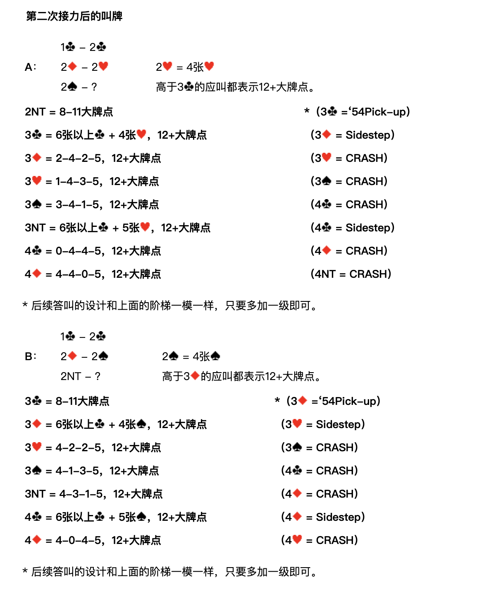

#### A：1♣ – 2♣；2♦ – 2♥；2♠ – ？

**2♥ = 4張♥。高於 3♣ 的應叫都表示12+大牌點。**

| 應叫者再叫 | 含義 | 開叫者接力 |
| --- | --- | --- |
| 2NT | 8-11大牌點 | ＊3♣ = '54Pick-up |
| 3♣ | 6張以上♣ + 4張♥，12+大牌點 | 3♦ = Sidestep |
| 3♦ | 2-4-2-5，12+大牌點 | 3♥ = CRASH |
| 3♥ | 1-4-3-5，12+大牌點 | 3♠ = CRASH |
| 3♠ | 3-4-1-5，12+大牌點 | 4♣ = CRASH |
| 3NT | 6張以上♣ + 5張♥，12+大牌點 | 4♣ = Sidestep |
| 4♣ | 0-4-4-5，12+大牌點 | 4♦ = CRASH |
| 4♦ | 4-4-0-5，12+大牌點 | 4NT = CRASH |

＊ 後續答叫的設計和上面的階梯一模一樣，只要多加一級即可。

#### B：1♣ – 2♣；2♦ – 2♠；2NT – ？

**2♠ = 4張♠。高於 3♦ 的應叫都表示12+大牌點。**

| 應叫者再叫 | 含義 | 開叫者接力 |
| --- | --- | --- |
| 3♣ | 8-11大牌點 | ＊3♦ = '54Pick-up |
| 3♦ | 6張以上♣ + 4張♠，12+大牌點 | 3♥ = Sidestep |
| 3♥ | 4-2-2-5，12+大牌點 | 3♠ = CRASH |
| 3♠ | 4-1-3-5，12+大牌點 | 4♣ = CRASH |
| 3NT | 4-3-1-5，12+大牌點 | 4♦ = CRASH |
| 4♣ | 6張以上♣ + 5張♠，12+大牌點 | 4♦ = Sidestep |
| 4♦ | 4-0-4-5，12+大牌點 | 4♥ = CRASH |

＊ 後續答叫的設計和上面的階梯一模一樣，只要多加一級即可。

#### C：1♣ – 2♣；2♦ – 2NT；3♣ – ？

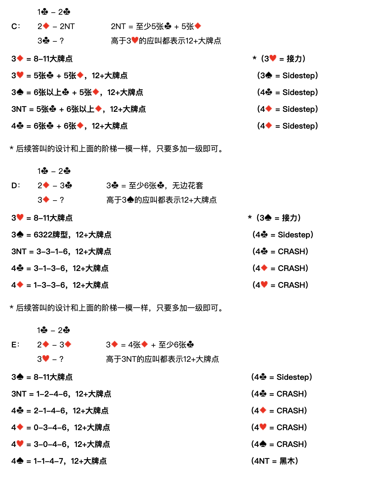

**2NT = 至少5張♣ + 5張♦。高於 3♥ 的應叫都表示12+大牌點。**

| 應叫者再叫 | 含義 | 開叫者接力 |
| --- | --- | --- |
| 3♦ | 8-11大牌點 | ＊3♥ = 接力 |
| 3♥ | 5張♣ + 5張♦，12+大牌點 | 3♠ = Sidestep |
| 3♠ | 6張以上♣ + 5張♦，12+大牌點 | 4♣ = Sidestep |
| 3NT | 5張♣ + 6張以上♦，12+大牌點 | 4♦ = Sidestep |
| 4♣ | 6張♣ + 6張♦，12+大牌點 | 4♦ = Sidestep |

＊ 後續答叫的設計和上面的階梯一模一樣，只要多加一級即可。

#### D：1♣ – 2♣；2♦ – 3♣；3♦ – ？

**3♣ = 至少6張♣，無邊花套。高於 3♠ 的應叫都表示12+大牌點。**

| 應叫者再叫 | 含義 | 開叫者接力 |
| --- | --- | --- |
| 3♥ | 8-11大牌點 | ＊3♠ = 接力 |
| 3♠ | 6322牌型，12+大牌點 | 4♣ = Sidestep |
| 3NT | 3-3-1-6，12+大牌點 | 4♣ = CRASH |
| 4♣ | 3-1-3-6，12+大牌點 | 4♦ = CRASH |
| 4♦ | 1-3-3-6，12+大牌點 | 4♥ = CRASH |

＊ 後續答叫的設計和上面的階梯一模一樣，只要多加一級即可。

#### E：1♣ – 2♣；2♦ – 3♦；3♥ – ？

**3♦ = 4張♦ + 至少6張♣。高於 3NT 的應叫都表示12+大牌點。**

| 應叫者再叫 | 含義 | 開叫者接力 |
| --- | --- | --- |
| 3♠ | 8-11大牌點 | 4♣ = Sidestep |
| 3NT | 1-2-4-6，12+大牌點 | 4♣ = CRASH |
| 4♣ | 2-1-4-6，12+大牌點 | 4♦ = CRASH |
| 4♦ | 0-3-4-6，12+大牌點 | 4♥ = CRASH |
| 4♥ | 3-0-4-6，12+大牌點 | 4♠ = CRASH |
| 4♠ | 1-1-4-7，12+大牌點 | 4NT = 黑木 |

#### F：1♣ – 2♣；2♦ – 3♥；3♠ – ？

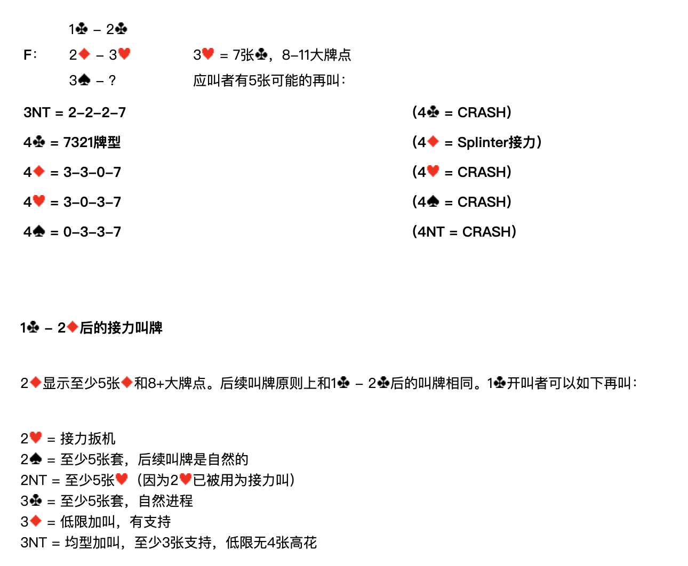

**3♥ = 7張♣，8-11大牌點。應叫者有5種可能的再叫：**

| 應叫者再叫 | 含義 | 開叫者接力 |
| --- | --- | --- |
| 3NT | 2-2-2-7 | 4♣ = CRASH |
| 4♣ | 7321牌型 | 4♦ = Splinter接力 |
| 4♦ | 3-3-0-7 | 4♥ = CRASH |
| 4♥ | 3-0-3-7 | 4♠ = CRASH |
| 4♠ | 0-3-3-7 | 4NT = CRASH |

---

## 1♣ – 2♦ 後的接力叫牌

2♦ 顯示至少5張♦和8+大牌點。後續叫牌原則上和 1♣ – 2♣ 後的叫牌相同。1♣ 開叫者可以如下再叫：

| 開叫者再叫 | 含義 |
| --- | --- |
| 2♥ | 接力扳機 |
| 2♠ | 至少5張套，後續叫牌是自然的 |
| 2NT | 至少5張♥（因為 2♥ 已被用為接力叫） |
| 3♣ | 至少5張套，自然進程 |
| 3♦ | 低限加叫，♦有支持 |
| 3NT | 均型加叫，至少3張♦支持，低限無4張高花 |

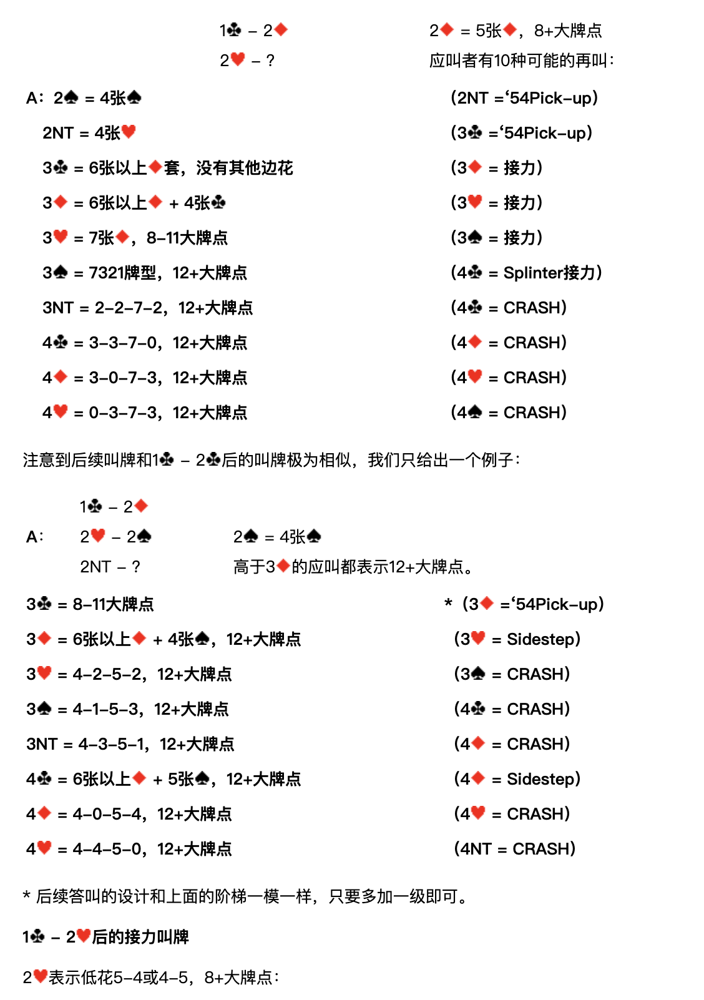

**1♣ – 2♦；2♥ – ？　（2♦ = 5張♦，8+大牌點。應叫者有10種可能的再叫）**

| 代號 | 應叫者再叫 | 含義 | 開叫者接力 |
| --- | --- | --- | --- |
| **A** | 2♠ | 4張♠ | 2NT = '54Pick-up |
|  | 2NT | 4張♥ | 3♣ = '54Pick-up |
|  | 3♣ | 6張以上♦套，沒有其他邊花 | 3♦ = 接力 |
|  | 3♦ | 6張以上♦ + 4張♣ | 3♥ = 接力 |
|  | 3♥ | 7張♦，8-11大牌點 | 3♠ = 接力 |
|  | 3♠ | 7321牌型，12+大牌點 | 4♣ = Splinter接力 |
|  | 3NT | 2-2-7-2，12+大牌點 | 4♣ = CRASH |
|  | 4♣ | 3-3-7-0，12+大牌點 | 4♦ = CRASH |
|  | 4♦ | 3-0-7-3，12+大牌點 | 4♥ = CRASH |
|  | 4♥ | 0-3-7-3，12+大牌點 | 4♠ = CRASH |

注意到後續叫牌和 1♣ – 2♣ 後的叫牌極為相似，我們只給出一個例子：

#### A：1♣ – 2♦；2♥ – 2♠；2NT – ？

**2♠ = 4張♠。高於 3♦ 的應叫都表示12+大牌點。**

| 應叫者再叫 | 含義 | 開叫者接力 |
| --- | --- | --- |
| 3♣ | 8-11大牌點 | ＊3♦ = '54Pick-up |
| 3♦ | 6張以上♦ + 4張♠，12+大牌點 | 3♥ = Sidestep |
| 3♥ | 4-2-5-2，12+大牌點 | 3♠ = CRASH |
| 3♠ | 4-1-5-3，12+大牌點 | 4♣ = CRASH |
| 3NT | 4-3-5-1，12+大牌點 | 4♦ = CRASH |
| 4♣ | 6張以上♦ + 5張♠，12+大牌點 | 4♦ = Sidestep |
| 4♦ | 4-0-5-4，12+大牌點 | 4♥ = CRASH |
| 4♥ | 4-4-5-0，12+大牌點 | 4NT = CRASH |

＊ 後續答叫的設計和上面的階梯一模一樣，只要多加一級即可。

---

## 1♣ – 2♥ 後的接力叫牌

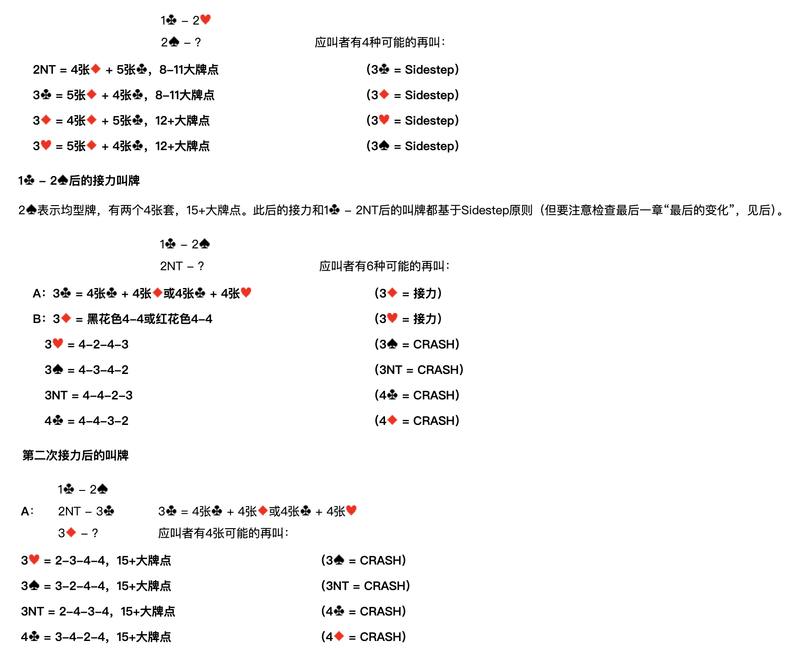

2♥ 表示低花5-4或4-5，8+大牌點：

**1♣ – 2♥；2♠ – ？　（應叫者有4種可能的再叫）**

| 應叫者再叫 | 含義 | 開叫者接力 |
| --- | --- | --- |
| 2NT | 4張♦ + 5張♣，8-11大牌點 | 3♣ = Sidestep |
| 3♣ | 5張♦ + 4張♣，8-11大牌點 | 3♦ = Sidestep |
| 3♦ | 4張♦ + 5張♣，12+大牌點 | 3♥ = Sidestep |
| 3♥ | 5張♦ + 4張♣，12+大牌點 | 3♠ = Sidestep |

---

## 1♣ – 2♠ 後的接力叫牌

2♠ 表示均型牌，有兩個4張套，15+大牌點。此後的接力和 1♣ – 2NT 後的叫牌都基於 Sidestep 原則（但要注意檢查最後一章「最後的變化」，見後）。

**1♣ – 2♠；2NT – ？　（應叫者有6種可能的再叫）**

| 代號 | 應叫者再叫 | 含義 | 開叫者接力 |
| --- | --- | --- | --- |
| **A** | 3♣ | 4張♣ + 4張♦ 或 4張♣ + 4張♥ | 3♦ = 接力 |
| **B** | 3♦ | 黑花色4-4 或 紅花色4-4 | 3♥ = 接力 |
|  | 3♥ | 4-2-4-3 | 3♠ = CRASH |
|  | 3♠ | 4-3-4-2 | 3NT = CRASH |
|  | 3NT | 4-4-2-3 | 4♣ = CRASH |
|  | 4♣ | 4-4-3-2 | 4♦ = CRASH |

### 第二次接力後的叫牌

#### A：1♣ – 2♠；2NT – 3♣；3♦ – ？

**3♣ = 4張♣ + 4張♦ 或 4張♣ + 4張♥。應叫者有4種可能的再叫：**

| 應叫者再叫 | 含義 | 開叫者接力 |
| --- | --- | --- |
| 3♥ | 2-3-4-4，15+大牌點 | 3♠ = CRASH |
| 3♠ | 3-2-4-4，15+大牌點 | 3NT = CRASH |
| 3NT | 2-4-3-4，15+大牌點 | 4♣ = CRASH |
| 4♣ | 3-4-2-4，15+大牌點 | 4♦ = CRASH |

#### B：1♣ – 2♠；2NT – 3♦；3♥ – ？

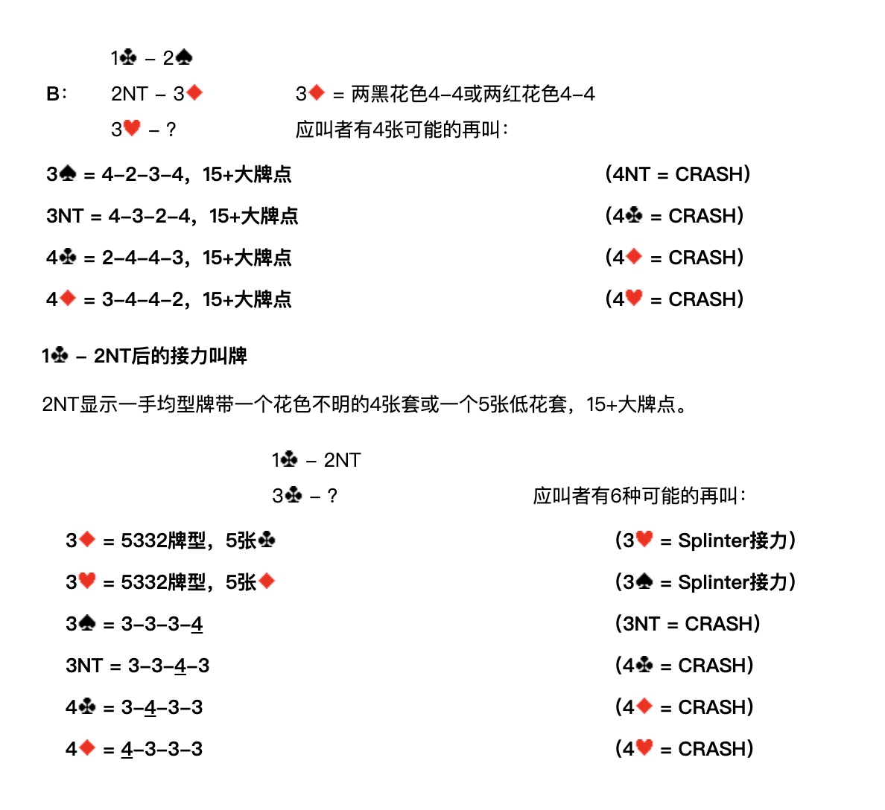

**3♦ = 兩黑花色4-4 或 兩紅花色4-4。應叫者有4種可能的再叫：**

| 應叫者再叫 | 含義 | 開叫者接力 |
| --- | --- | --- |
| 3♠ | 4-2-3-4，15+大牌點 | 4NT = CRASH |
| 3NT | 4-3-2-4，15+大牌點 | 4♣ = CRASH |
| 4♣ | 2-4-4-3，15+大牌點 | 4♦ = CRASH |
| 4♦ | 3-4-4-2，15+大牌點 | 4♥ = CRASH |

---

## 1♣ – 2NT 後的接力叫牌

2NT 顯示一手均型牌帶一個花色不明的4張套或一個5張低花套，15+大牌點。

**1♣ – 2NT；3♣ – ？　（應叫者有6種可能的再叫）**

| 應叫者再叫 | 含義 | 開叫者接力 |
| --- | --- | --- |
| 3♦ | 5332牌型，5張♣ | 3♥ = Splinter接力 |
| 3♥ | 5332牌型，5張♦ | 3♠ = Splinter接力 |
| 3♠ | 3-3-3-**4** | 3NT = CRASH |
| 3NT | 3-3-**4**-3 | 4♣ = CRASH |
| 4♣ | 3-**4**-3-3 | 4♦ = CRASH |
| 4♦ | **4**-3-3-3 | 4♥ = CRASH |
