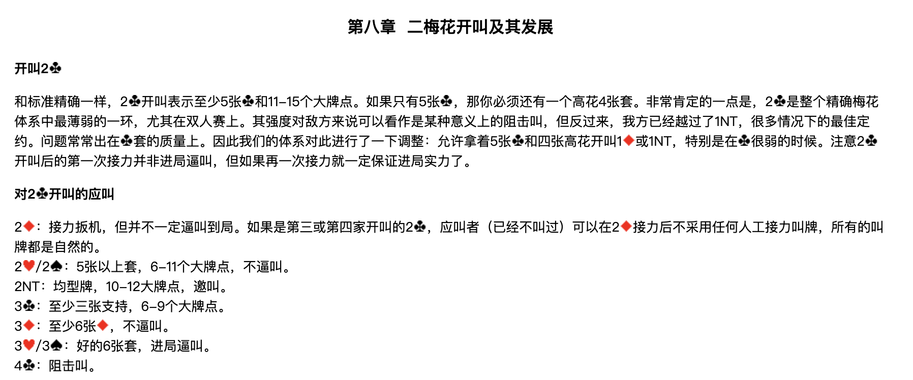
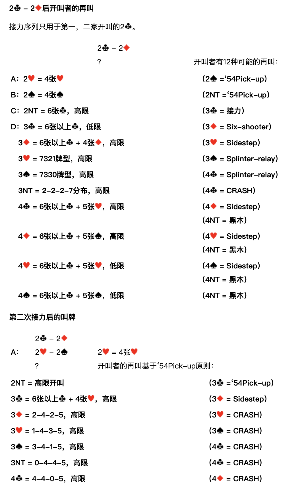
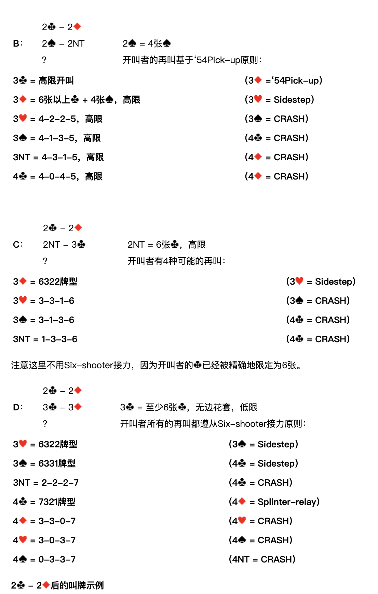
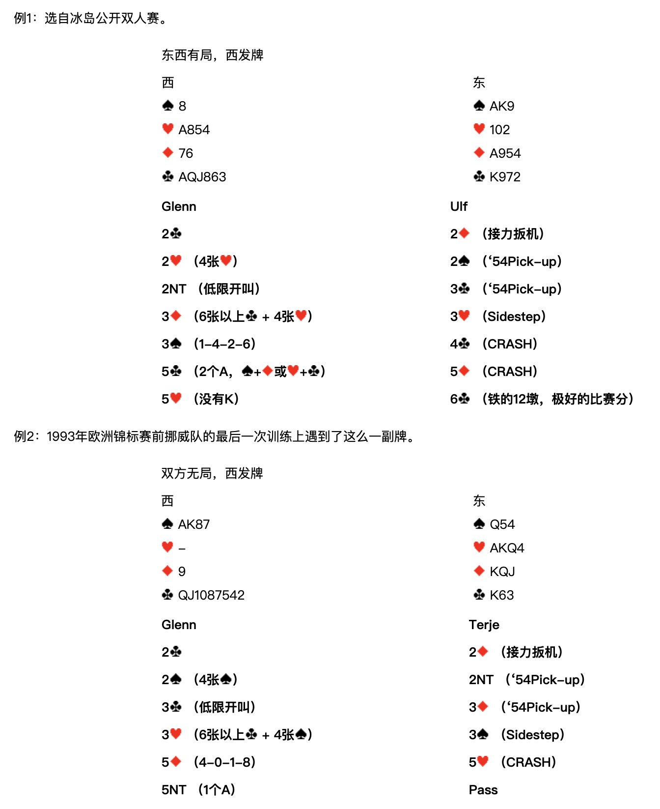
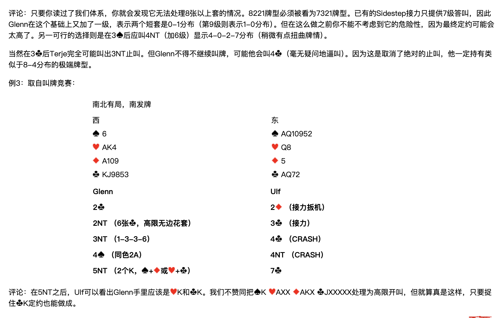

> **整理說明**：原始剪藏在轉存時遺失了全部花色符號（♠♥♦♣）與部分表格結構。
> 本檔已依同資料夾的 5 張截圖逐頁比對還原，嵌入對應截圖，並將內文由簡體翻譯為繁體。
> 各接力工具（Sidestep／Splinter-relay／54Pick-up／Six-shooter／CRASH）的正式定義見 `../3基本準則/第三章.md`。
> **牌型數字一律按 ♠-♥-♦-♣ 順序排列。**

**北歐接力精確體系**

| [第一章 總論](https://walsson.org/articles/03-jptx/03-jptx-048/03-jptx-048-01.htm) | [第四章 一方塊開叫及其發展](https://walsson.org/articles/03-jptx/03-jptx-048/03-jptx-048-04.htm) | [第七章 一梅花開叫及其發展](https://walsson.org/articles/03-jptx/03-jptx-048/03-jptx-048-07.htm) | [第十章 超級接力](https://walsson.org/articles/03-jptx/03-jptx-048/03-jptx-048-10.htm) |
| --- | --- | --- | --- |
| [第二章 基本滿貫叫牌技巧](https://walsson.org/articles/03-jptx/03-jptx-048/03-jptx-048-02.htm) | [第五章 一階高花開叫及其發展](https://walsson.org/articles/03-jptx/03-jptx-048/03-jptx-048-05.htm) | [第八章 二梅花開叫及其發展](https://walsson.org/articles/03-jptx/03-jptx-048/03-jptx-048-08.htm) | [第十一章 最後的改動](https://walsson.org/articles/03-jptx/03-jptx-048/03-jptx-048-11.htm) |
| [第三章 北歐梅花的問叫和基本準則](https://walsson.org/articles/03-jptx/03-jptx-048/03-jptx-048-03.htm) | [第六章 一無將開叫及其發展](https://walsson.org/articles/03-jptx/03-jptx-048/03-jptx-048-06.htm) | [第九章 二方塊到四黑桃開叫](https://walsson.org/articles/03-jptx/03-jptx-048/03-jptx-048-09.htm) |  |

---

## 第八章 二梅花開叫及其發展

### 開叫 2♣

和標準精確一樣，2♣ 開叫表示至少5張♣和11-15個大牌點。如果只有5張♣，那你必須還有一個高花4張套。

非常肯定的一點是，**2♣ 是整個精確梅花體系中最薄弱的一環**，尤其在雙人賽上。其強度對敵方來說可以看作是某種意義上的阻擊叫，但反過來，我方已經越過了 1NT——很多情況下的最佳定約。問題常常出在♣套的質量上。因此我們的體系對此進行了一下調整：允許拿著5張♣和四張高花開叫 1♦ 或 1NT，特別是在♣很弱的時候。

注意 2♣ 開叫後的**第一次接力並非進局逼叫**，但如果再一次接力就一定保證進局實力了。

### 對 2♣ 開叫的應叫

| 應叫 | 含義 |
| --- | --- |
| **2♦** | 接力扳機，但並不一定逼叫到局。如果是第三或第四家開叫的 2♣，應叫者（已經不叫過）可以在 2♦ 接力後不採用任何人工接力叫牌，所有的叫牌都是自然的。 |
| **2♥／2♠** | 5張以上套，6-11個大牌點，不逼叫。 |
| **2NT** | 均型牌，10-12大牌點，邀叫。 |
| **3♣** | 至少三張♣支持，6-9個大牌點。 |
| **3♦** | 至少6張♦，不逼叫。 |
| **3♥／3♠** | 好的6張套，進局逼叫。 |
| **4♣** | 阻擊叫。 |

---

## 2♣ – 2♦ 後開叫者的再叫

接力序列只用於第一、二家開叫的 2♣。

**2♣ – 2♦；？　開叫者有 12 種可能的再叫：**

| 代號 | 開叫者再叫 | 含義 | 應叫者接力 |
| --- | --- | --- | --- |
| **A** | 2♥ | 4張♥ | 2♠ = '54Pick-up |
| **B** | 2♠ | 4張♠ | 2NT = '54Pick-up |
| **C** | 2NT | 6張♣，高限 | 3♣ = 接力 |
| **D** | 3♣ | 6張以上♣，低限 | 3♦ = Six-shooter |
|  | 3♦ | 6張以上♣ + 4張♦，高限 | 3♥ = Sidestep |
|  | 3♥ | 7321牌型，高限 | 3♠ = Splinter-relay |
|  | 3♠ | 7330牌型，高限 | 4♣ = Splinter-relay |
|  | 3NT | 2-2-2-7分佈，高限 | 4♣ = CRASH |
|  | 4♣ | 6張以上♣ + 5張♥，高限 | 4♦ = Sidestep／4NT = 黑木 |
|  | 4♦ | 6張以上♣ + 5張♠，高限 | 4♥ = Sidestep／4NT = 黑木 |
|  | 4♥ | 6張以上♣ + 5張♥，低限 | 4♠ = Sidestep／4NT = 黑木 |
|  | 4♠ | 6張以上♣ + 5張♠，低限 | 4NT = 黑木 |

---

## 第二次接力後的叫牌

### A：2♣ – 2♦；2♥ – 2♠；？

**2♥ = 4張♥。開叫者的再叫基於 '54Pick-up 原則：**

| 開叫者再叫 | 含義 | 應叫者接力 |
| --- | --- | --- |
| 2NT | 高限開叫 | 3♣ = '54Pick-up |
| 3♣ | 6張以上♣ + 4張♥，高限 | 3♦ = Sidestep |
| 3♦ | 2-4-2-5，高限 | 3♥ = CRASH |
| 3♥ | 1-4-3-5，高限 | 3♠ = CRASH |
| 3♠ | 3-4-1-5，高限 | 4♣ = CRASH |
| 3NT | 0-4-4-5，高限 | 4♣ = CRASH |
| 4♣ | 4-4-0-5，高限 | 4♦ = CRASH |

### B：2♣ – 2♦；2♠ – 2NT；？

**2♠ = 4張♠。開叫者的再叫基於 '54Pick-up 原則：**

| 開叫者再叫 | 含義 | 應叫者接力 |
| --- | --- | --- |
| 3♣ | 高限開叫 | 3♦ = '54Pick-up |
| 3♦ | 6張以上♣ + 4張♠，高限 | 3♥ = Sidestep |
| 3♥ | 4-2-2-5，高限 | 3♠ = CRASH |
| 3♠ | 4-1-3-5，高限 | 4♣ = CRASH |
| 3NT | 4-3-1-5，高限 | 4♦ = CRASH |
| 4♣ | 4-0-4-5，高限 | 4♦ = CRASH |

### C：2♣ – 2♦；2NT – 3♣；？

**2NT = 6張♣，高限。開叫者有 4 種可能的再叫：**

| 開叫者再叫 | 含義 | 應叫者接力 |
| --- | --- | --- |
| 3♦ | 6322牌型 | 3♥ = Sidestep |
| 3♥ | 3-3-1-6 | 3♠ = CRASH |
| 3♠ | 3-1-3-6 | 4♣ = CRASH |
| 3NT | 1-3-3-6 | 4♣ = CRASH |

注意這裡不用 Six-shooter 接力，因為開叫者的♣已經被精確地限定為6張。

### D：2♣ – 2♦；3♣ – 3♦；？

**3♣ = 至少6張♣，無邊花套，低限。開叫者所有的再叫都遵從 Six-shooter 接力原則：**

| 開叫者再叫 | 含義 | 應叫者接力 |
| --- | --- | --- |
| 3♥ | 6322牌型 | 3♠ = Sidestep |
| 3♠ | 6331牌型 | 4♣ = Sidestep |
| 3NT | 2-2-2-7 | 4♣ = CRASH |
| 4♣ | 7321牌型 | 4♦ = Splinter-relay |
| 4♦ | 3-3-0-7 | 4♥ = CRASH |
| 4♥ | 3-0-3-7 | 4♠ = CRASH |
| 4♠ | 0-3-3-7 | 4NT = CRASH |

---

## 2♣ – 2♦ 後的叫牌示例

### 例1

選自冰島公開雙人賽。

**東西有局，西發牌**

| 西 | 東 |
| --- | --- |
| ♠8　♥A854　♦76　♣AQJ863 | ♠AK9　♥102　♦A954　♣K972 |

| Glenn（西） | Ulf（東） |
| --- | --- |
| 2♣ | 2♦（接力扳機） |
| 2♥（4張♥） | 2♠（'54Pick-up） |
| 2NT（低限開叫） | 3♣（'54Pick-up） |
| 3♦（6張以上♣ + 4張♥） | 3♥（Sidestep） |
| 3♠（1-4-2-6） | 4♣（CRASH） |
| 5♣（2個A，♠+♦ 或 ♥+♣） | 5♦（CRASH） |
| 5♥（沒有K） | 6♣（鐵的12墩，極好的比賽分） |

### 例2

1993年歐洲錦標賽前挪威隊的最後一次訓練上遇到了這麼一副牌。

**雙方無局，西發牌**

| 西 | 東 |
| --- | --- |
| ♠AK87　♥—　♦9　♣QJ1087542 | ♠Q54　♥AKQ4　♦KQJ　♣K63 |

| Glenn（西） | Terje（東） |
| --- | --- |
| 2♣ | 2♦（接力扳機） |
| 2♠（4張♠） | 2NT（'54Pick-up） |
| 3♣（低限開叫） | 3♦（'54Pick-up） |
| 3♥（6張以上♣ + 4張♠） | 3♠（Sidestep） |
| 5♦（4-0-1-8） | 5♥（CRASH） |
| 5NT（1個A） | Pass |

**評論**：只要你讀過了我們體系，你就會發現**它無法處理8張以上套的情況**。8221牌型必須被看為7321牌型。已有的 Sidestep 接力只提供7級答叫，因此 Glenn 在這個基礎上又加了一級，表示兩個短套是 0-1 分佈（第9級則表示 1-0 分佈）。但在這麼做之前你不能不考慮到它的危險性，因為最終定約可能會太高了。另一可行的選擇則是在 3♠ 後應叫 4NT（加6級）顯示 4-0-2-7 分佈（稍微有點扭曲牌情）。

當然在 3♣ 後 Terje 完全可能叫出 3NT 止叫。但 Glenn 不得不繼續叫牌，可能他會叫 4♣（毫無疑問地逼叫）。因為這是取消了絕對的止叫，他一定持有類似於 8-4 分佈的極端牌型。

### 例3

取自叫牌競賽：

**南北有局，南發牌**

| 西 | 東 |
| --- | --- |
| ♠6　♥AK4　♦A109　♣KJ9853 | ♠AQ10952　♥Q8　♦5　♣AQ72 |

| Glenn（西） | Ulf（東） |
| --- | --- |
| 2♣ | 2♦（接力扳機） |
| 2NT（6張♣，高限無邊花套） | 3♣（接力） |
| 3NT（1-3-3-6） | 4♣（CRASH） |
| 4♠（同色2A） | 4NT（CRASH） |
| 5NT（2個K，♠+♦ 或 ♥+♣） | 7♣ |

**評論**：在 5NT 之後，Ulf 可以看出 Glenn 手裡應該是♥K和♣K。我們不贊同把 ♠K ♥AXX ♦AKX ♣JXXXXX 處理為高限開叫，但就算真是這樣，只要捉住♣K定約也能做成。
